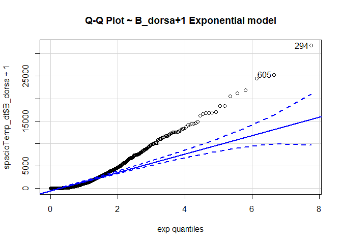
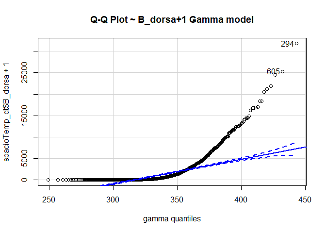
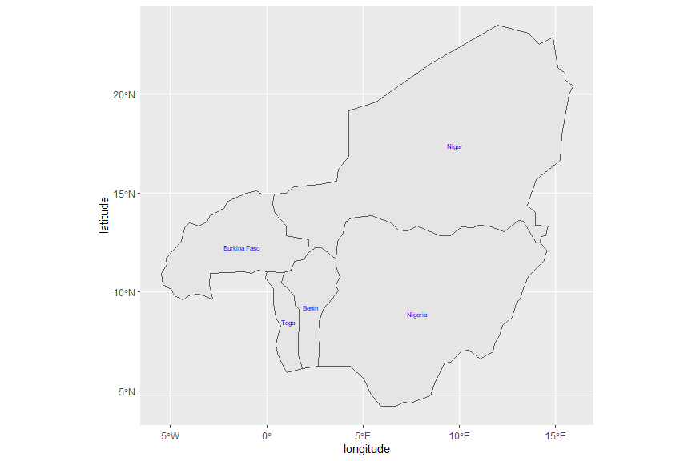
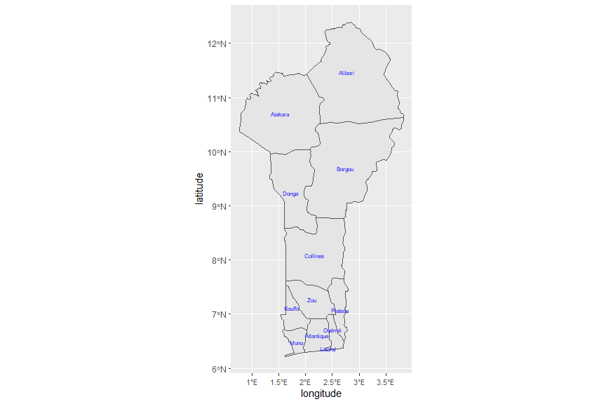
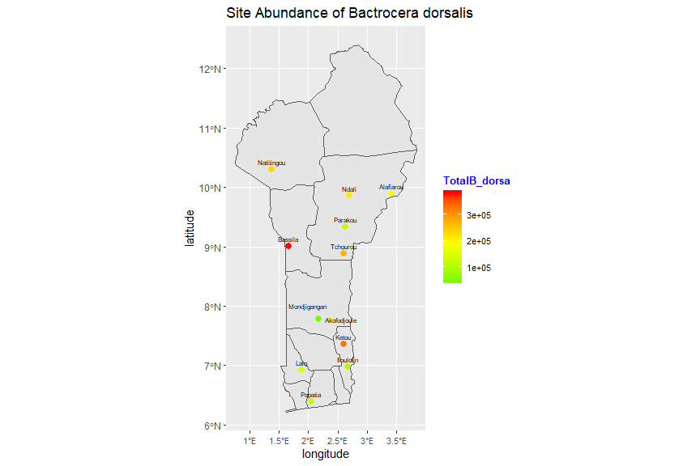
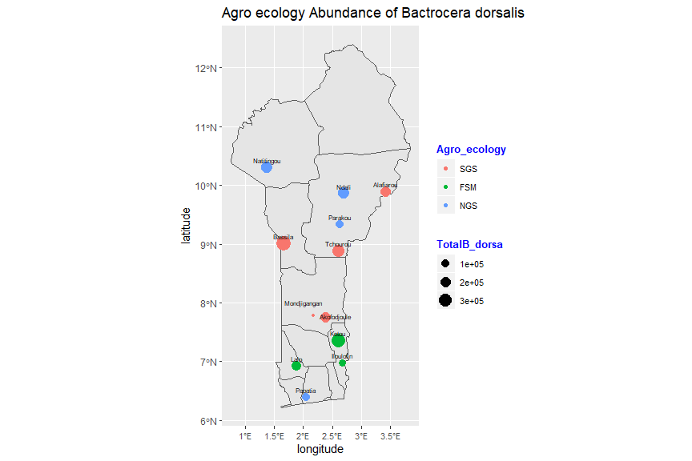
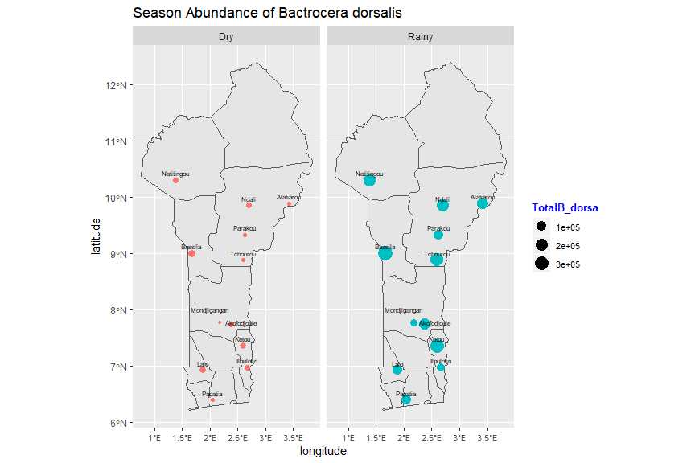
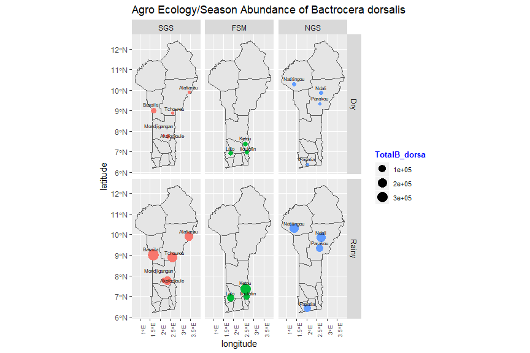

# R Programming: Spatio-Temporal_patterns_Bactrocera-dorsalis


## loading Relevant packages and Data Set


```r
#Import relevant packages

library(stats)
library(psych)
library(ggplot2)
```

```
## 
## Attaching package: 'ggplot2'
```

```
## The following objects are masked from 'package:psych':
## 
##     %+%, alpha
```

```r
library(tidyverse)
```

```
## -- Attaching packages ------------------------------------------------------------------ tidyverse 1.3.0 --
```

```
## v tibble  2.1.3     v dplyr   0.8.3
## v tidyr   1.0.0     v stringr 1.4.0
## v readr   1.3.1     v forcats 0.4.0
## v purrr   0.3.3
```

```
## -- Conflicts --------------------------------------------------------------------- tidyverse_conflicts() --
## x ggplot2::%+%()   masks psych::%+%()
## x ggplot2::alpha() masks psych::alpha()
## x dplyr::filter()  masks stats::filter()
## x dplyr::lag()     masks stats::lag()
```

```r
# Reading our dataset
setwd('E:/Documents/Reinp/GitHub Respositories/Spatio-Temporal_patterns_Bactrocera-dorsalis')

spacioTemp_dt<-read.table('Male_lures.csv', header=TRUE,sep=",")
View(spacioTemp_dt)
attach(spacioTemp_dt)
```


```r
#Add tempeaturemean, humididy mean and Season columns
#apply() function
spacioTemp_dt$Tempmean <- apply(spacioTemp_dt[,c('TempMaxi',
                          'TempMini')], 1, function(x) round(mean(x), 1))
spacioTemp_dt$RHmean <- apply(spacioTemp_dt[,c('RHMaxi', 'RHMini')], 1,
                              function(x) round(mean(x), 1))

spacioTemp_dt$Season <- spacioTemp_dt$Month == "May" | spacioTemp_dt$Month == "June" | 
  spacioTemp_dt$Month == "July" |  spacioTemp_dt$Month == "August" |  
  spacioTemp_dt$Month == "September"

spacioTemp_dt$Season <- factor(spacioTemp_dt$Season, levels = c("TRUE","FALSE"), 
                               labels = c("Rainy","Dry"))                          
```


## Structure of the Data


```r
head(spacioTemp_dt)
```

```
##   Agro_ecology        Site     Month Year TempMaxi TempMini RHMaxi RHMini
## 1          SGS Akofodjoule   October 2008     33.0     22.7   94.0   56.5
## 2          SGS Akofodjoule   October 2008     33.0     22.7   94.0   56.5
## 3          SGS Akofodjoule September 2005     30.6     22.3   97.0   67.0
## 4          FSM       Ketou      July 2008     29.8     22.6   96.5   67.1
## 5          FSM       Ketou      July 2008     29.8     22.6   96.5   67.1
## 6          FSM        Lalo      July 2008     29.8     22.6   96.5   67.1
##   Rainfall Attractant Trap B_dorsa latitude longitude Tempmean RHmean Season
## 1    121.8         ME    1     130 7.750000  2.382899     27.9   75.2    Dry
## 2    121.8         ME    2      80 7.750000  2.382899     27.9   75.2    Dry
## 3    136.5         ME    1     497 7.750000  2.382899     26.5   82.0  Rainy
## 4      0.0         ME    1    7758 7.363320  2.599780     26.2   81.8  Rainy
## 5      0.0         ME    2    5867 7.363320  2.599780     26.2   81.8  Rainy
## 6      0.0         ME    1    1136 6.930065  1.878530     26.2   81.8  Rainy
```

```r
tail(spacioTemp_dt)
```

```
##      Agro_ecology       Site    Month Year TempMaxi TempMini RHMaxi RHMini
## 1161          NGS Natitingou   August 2006     29.7     22.1   29.7   22.1
## 1162          NGS Natitingou   August 2006     29.7     22.1   29.7   22.1
## 1163          FSM      Ketou November 2008     34.4     24.1   25.7   47.4
## 1164          FSM      Ketou November 2008     34.4     24.1   25.7   47.4
## 1165          FSM       Lalo November 2008     34.4     24.1   25.7   47.4
## 1166          FSM       Lalo November 2008     34.4     24.1   25.7   47.4
##      Rainfall Attractant Trap B_dorsa  latitude longitude Tempmean RHmean
## 1161    253.0         ME    1    2973 10.304160   1.37962     25.9   25.9
## 1162    253.0         ME    2    2787 10.304160   1.37962     25.9   25.9
## 1163      0.0         ME    1     176  7.363320   2.59978     29.2   36.5
## 1164      0.0         ME    2     174  7.363320   2.59978     29.2   36.5
## 1165      7.5         ME    1     159  6.930065   1.87853     29.2   36.5
## 1166      7.5         ME    2      90  6.930065   1.87853     29.2   36.5
##      Season
## 1161  Rainy
## 1162  Rainy
## 1163    Dry
## 1164    Dry
## 1165    Dry
## 1166    Dry
```

```r
# How many variables and observations are there?
ncol(spacioTemp_dt)
```

```
## [1] 17
```

```r
nrow(spacioTemp_dt)
```

```
## [1] 1166
```

```r
#learn more about the dataset
help(spacioTemp_dt)
```

```
## No documentation for 'spacioTemp_dt' in specified packages and libraries:
## you could try '??spacioTemp_dt'
```

```r
??spacioTemp_dt
```

```
## starting httpd help server ... done
```

```r
str(spacioTemp_dt)
```

```
## 'data.frame':	1166 obs. of  17 variables:
##  $ Agro_ecology: Factor w/ 3 levels "FSM","NGS","SGS": 3 3 3 1 1 1 1 2 2 2 ...
##  $ Site        : Factor w/ 14 levels "Akofodjoule",..: 1 1 1 6 6 7 7 9 9 9 ...
##  $ Month       : Factor w/ 12 levels "April","August",..: 11 11 12 6 6 6 6 2 2 2 ...
##  $ Year        : int  2008 2008 2005 2008 2008 2008 2008 2008 2008 2008 ...
##  $ TempMaxi    : num  33 33 30.6 29.8 29.8 29.8 29.8 29.4 29.4 29.4 ...
##  $ TempMini    : num  22.7 22.7 22.3 22.6 22.6 22.6 22.6 21.3 21.3 21.3 ...
##  $ RHMaxi      : num  94 94 97 96.5 96.5 96.5 96.5 96.1 96.1 96.1 ...
##  $ RHMini      : num  56.5 56.5 67 67.1 67.1 67.1 67.1 70.8 70.8 70.8 ...
##  $ Rainfall    : num  122 122 136 0 0 ...
##  $ Attractant  : Factor w/ 1 level "ME": 1 1 1 1 1 1 1 1 1 1 ...
##  $ Trap        : int  1 2 1 1 2 1 2 1 2 3 ...
##  $ B_dorsa     : int  130 80 497 7758 5867 1136 1623 9587 5175 6520 ...
##  $ latitude    : num  7.75 7.75 7.75 7.36 7.36 ...
##  $ longitude   : num  2.38 2.38 2.38 2.6 2.6 ...
##  $ Tempmean    : num  27.9 27.9 26.5 26.2 26.2 26.2 26.2 25.4 25.4 25.4 ...
##  $ RHmean      : num  75.2 75.2 82 81.8 81.8 81.8 81.8 83.4 83.4 83.4 ...
##  $ Season      : Factor w/ 2 levels "Rainy","Dry": 2 2 1 1 1 1 1 1 1 1 ...
```

```r
class(spacioTemp_dt)
```

```
## [1] "data.frame"
```

```r
typeof(spacioTemp_dt) 
```

```
## [1] "list"
```

```r
length(spacioTemp_dt)
```

```
## [1] 17
```

```r
names(spacioTemp_dt) #display variable names
```

```
##  [1] "Agro_ecology" "Site"         "Month"        "Year"         "TempMaxi"    
##  [6] "TempMini"     "RHMaxi"       "RHMini"       "Rainfall"     "Attractant"  
## [11] "Trap"         "B_dorsa"      "latitude"     "longitude"    "Tempmean"    
## [16] "RHmean"       "Season"
```

```r
#attributes(spacioTemp_dt) names(spacioTemp_dt), class(spacioTemp_dt), row.names(spacioTemp_dt)
```

## Missing data and Outliers


```r
which(!complete.cases(spacioTemp_dt))
```

```
## integer(0)
```

```r
which(is.na(spacioTemp_dt$B_dorsa)) #check for missing values
```

```
## integer(0)
```

```r
#We use boxplot to visualize for any outliers

boxplot(spacioTemp_dt [, c("TempMaxi", "TempMini", "Tempmean")], main="Temp boxplot",
xlab="variables",
ylab="abundance of Bactrocera dorsalis",
col="orange",
border="brown", las = 2, cex.axis = 0.6, col.axis = 'blue', col.lab = 'red')
```

<!-- -->

```r
boxplot(spacioTemp_dt [, c("RHMaxi",
"RHMini", "RHmean")], main="RH boxplot",
xlab="variables",
ylab="abundance of Bactrocera dorsalis",
col="orange",
border="brown", las = 2, cex.axis = 0.6, col.axis = 'blue', col.lab = 'red')
```

<!-- -->

```r
boxplot(spacioTemp_dt [, c("B_dorsa")], main="B_dorsa boxplot",
xlab="variables",
ylab="abundance of Bactrocera dorsalis",
col="orange",
border="brown", las = 2, cex.axis = 0.6, col.axis = 'blue', col.lab = 'red')
```

<!-- -->

```r
boxplot(spacioTemp_dt [, c("Rainfall")], main="Rainfall boxplot",
xlab="variables",
ylab="abundance of Bactrocera dorsalis",
col="orange",
border="brown", las = 2, cex.axis = 0.6, col.axis = 'blue', col.lab = 'red')
```

<!-- -->


## Descriptive Statistics


```r
#distribution of categorical input variables
#Dolar sign Syntax
table(spacioTemp_dt$Agro_ecology) #Formula syntax tally(~Agro_ecology, data=spacioTemp_dt)
```

```
## 
## FSM NGS SGS 
## 195 482 489
```

```r
table(spacioTemp_dt$Site)
```

```
## 
##  Akofodjoule   Alafiarou1   Alafiarou2      Bassila    Iloulofin        Ketou 
##          129           50           50          145           15           98 
##         Lalo Mondjigangan   Natitingou        Ndali      Papatia      Parakou 
##           82           15          145          157           82           98 
##    Tchourou1    Tchourou2 
##           50           50
```

```r
table(spacioTemp_dt$Month)
```

```
## 
##     April    August  December  February   January      July      June     March 
##       102       116        85        89        85       116       115        91 
##       May  November   October September 
##       115        84        84        84
```

```r
table(spacioTemp_dt$Year)
```

```
## 
## 2004 2005 2006 2007 2008 2009 2010 
##    1   34   81  185  228  372  265
```

```r
table(spacioTemp_dt$Trap)
```

```
## 
##   1   2   3 
## 483 430 253
```

```r
table(spacioTemp_dt$Season)
```

```
## 
## Rainy   Dry 
##   546   620
```

```r
summary(spacioTemp_dt$TempMaxi)
```

```
##    Min. 1st Qu.  Median    Mean 3rd Qu.    Max. 
##   28.70   30.90   33.40   33.65   36.30   39.80
```

```r
summary(spacioTemp_dt$TempMini)
```

```
##    Min. 1st Qu.  Median    Mean 3rd Qu.    Max. 
##   16.10   21.60   22.40   22.42   23.40   25.70
```

```r
summary(spacioTemp_dt$RHMaxi)
```

```
##    Min. 1st Qu.  Median    Mean 3rd Qu.    Max. 
##   25.70   77.00   92.00   84.11   95.00   97.00
```

```r
summary(spacioTemp_dt$RHMini)
```

```
##    Min. 1st Qu.  Median    Mean 3rd Qu.    Max. 
##   12.90   33.00   55.00   48.16   64.00   72.20
```

```r
summary(spacioTemp_dt$Rainfall)
```

```
##    Min. 1st Qu.  Median    Mean 3rd Qu.    Max. 
##     0.0     0.0    88.4   100.3   168.7   349.7
```

```r
summary(spacioTemp_dt$B_dorsa)
```

```
##    Min. 1st Qu.  Median    Mean 3rd Qu.    Max. 
##       0      67     416    1988    2315   31769
```

```r
summary(spacioTemp_dt$Tempmean)
```

```
##    Min. 1st Qu.  Median    Mean 3rd Qu.    Max. 
##   24.90   26.50   27.80   28.04   29.40   31.90
```

```r
summary(spacioTemp_dt$RHmean)
```

```
##    Min. 1st Qu.  Median    Mean 3rd Qu.    Max. 
##   22.10   53.00   73.00   66.13   79.50   83.60
```

```r
#FormulaSyntax
library(mosaic) 
```

```
## Loading required package: lattice
```

```
## Loading required package: ggformula
```

```
## Loading required package: ggstance
```

```
## 
## Attaching package: 'ggstance'
```

```
## The following objects are masked from 'package:ggplot2':
## 
##     geom_errorbarh, GeomErrorbarh
```

```
## 
## New to ggformula?  Try the tutorials: 
## 	learnr::run_tutorial("introduction", package = "ggformula")
## 	learnr::run_tutorial("refining", package = "ggformula")
```

```
## Loading required package: mosaicData
```

```
## Loading required package: Matrix
```

```
## 
## Attaching package: 'Matrix'
```

```
## The following objects are masked from 'package:tidyr':
## 
##     expand, pack, unpack
```

```
## Registered S3 method overwritten by 'mosaic':
##   method                           from   
##   fortify.SpatialPolygonsDataFrame ggplot2
```

```
## 
## The 'mosaic' package masks several functions from core packages in order to add 
## additional features.  The original behavior of these functions should not be affected by this.
## 
## Note: If you use the Matrix package, be sure to load it BEFORE loading mosaic.
```

```
## 
## Attaching package: 'mosaic'
```

```
## The following object is masked from 'package:Matrix':
## 
##     mean
```

```
## The following objects are masked from 'package:dplyr':
## 
##     count, do, tally
```

```
## The following object is masked from 'package:purrr':
## 
##     cross
```

```
## The following object is masked from 'package:ggplot2':
## 
##     stat
```

```
## The following objects are masked from 'package:psych':
## 
##     logit, rescale
```

```
## The following objects are masked from 'package:stats':
## 
##     binom.test, cor, cor.test, cov, fivenum, IQR, median, prop.test,
##     quantile, sd, t.test, var
```

```
## The following objects are masked from 'package:base':
## 
##     max, mean, min, prod, range, sample, sum
```

```r
##one continous variable
#mean(~TempMaxi, data=spacioTemp_dt)
#median(~TempMaxi, data=spacioTemp_dt)
#sd(~TempMaxi, data=spacioTemp_dt)
#max(~TempMaxi, data=spacioTemp_dt)
#min(~TempMaxi, data=spacioTemp_dt)


favstats(~TempMaxi, data=spacioTemp_dt)
```

```
##   min   Q1 median   Q3  max     mean      sd    n missing
##  28.7 30.9   33.4 36.3 39.8 33.65034 3.01906 1166       0
```

```r
favstats(~TempMini, data=spacioTemp_dt)
```

```
##   min   Q1 median   Q3  max     mean       sd    n missing
##  16.1 21.6   22.4 23.4 25.7 22.42376 1.544874 1166       0
```

```r
favstats(~RHMaxi, data=spacioTemp_dt)
```

```
##   min Q1 median Q3 max     mean       sd    n missing
##  25.7 77     92 95  97 84.11184 16.22618 1166       0
```

```r
favstats(~RHMini, data=spacioTemp_dt)
```

```
##   min Q1 median Q3  max     mean       sd    n missing
##  12.9 33     55 64 72.2 48.15789 17.70513 1166       0
```

```r
favstats(~Rainfall, data=spacioTemp_dt)
```

```
##  min Q1 median    Q3   max     mean       sd    n missing
##    0  0   88.4 168.7 349.7 100.3017 96.08016 1166       0
```

```r
favstats(~B_dorsa, data=spacioTemp_dt)
```

```
##  min Q1 median   Q3   max     mean       sd    n missing
##    0 67    416 2315 31769 1988.296 3521.782 1166       0
```

```r
favstats(~Tempmean, data=spacioTemp_dt)
```

```
##   min   Q1 median   Q3  max     mean       sd    n missing
##  24.9 26.5   27.8 29.4 31.9 28.03559 1.823846 1166       0
```

```r
favstats(~RHmean, data=spacioTemp_dt)
```

```
##   min Q1 median   Q3  max     mean       sd    n missing
##  22.1 53     73 79.5 83.6 66.13362 16.03771 1166       0
```

```r
##one continous one categorical

#mean(TempMaxi~Agro_ecology, data=spacioTemp_dt)

favstats(TempMaxi~ Agro_ecology, data=spacioTemp_dt) #Min, 1st Qu, Medin, Mean,3rd Qu, 
```

```
##   Agro_ecology  min   Q1 median   Q3  max     mean       sd   n missing
## 1          FSM 29.1 30.5   32.9 35.0 37.5 32.86154 2.366041 195       0
## 2          NGS 28.7 31.3   33.6 36.5 39.8 33.95747 3.098735 482       0
## 3          SGS 28.8 30.7   33.4 36.4 39.8 33.66217 3.118924 489       0
```

```r
#Max, sd, n and missing data. Avoids tedious process of typing each individualy.
favstats(TempMaxi~Site, data=spacioTemp_dt)
```

```
##            Site  min     Q1 median     Q3  max     mean       sd   n missing
## 1   Akofodjoule 29.1 31.400   34.1 36.600 39.1 34.04264 2.842748 129       0
## 2    Alafiarou1 28.8 30.300   32.5 35.900 38.3 32.85400 3.190497  50       0
## 3    Alafiarou2 28.8 30.300   32.5 35.900 38.3 32.85400 3.190497  50       0
## 4       Bassila 28.9 31.600   34.4 36.900 39.8 34.53586 3.085442 145       0
## 5     Iloulofin 29.8 30.400   32.1 33.400 35.0 32.14000 1.978744  15       0
## 6         Ketou 29.1 30.575   33.1 35.000 37.5 32.98878 2.459481  98       0
## 7          Lalo 29.1 30.800   32.9 35.000 37.1 32.84146 2.317510  82       0
## 8  Mondjigangan 30.2 30.600   32.9 33.600 36.3 32.72000 2.289791  15       0
## 9    Natitingou 28.7 31.400   33.5 36.500 38.9 33.96552 2.997276 145       0
## 10        Ndali 28.8 31.300   34.1 36.700 39.8 34.14331 3.202488 157       0
## 11      Papatia 28.8 31.500   33.2 36.275 38.9 33.87317 2.989035  82       0
## 12      Parakou 28.8 30.900   33.5 36.400 39.4 33.71837 3.194336  98       0
## 13    Tchourou1 28.8 30.300   32.5 35.900 38.3 32.85400 3.190497  50       0
## 14    Tchourou2 28.8 30.300   32.5 35.900 38.3 32.85400 3.190497  50       0
```

```r
favstats(TempMaxi~Month, data=spacioTemp_dt)
```

```
##        Month  min   Q1 median     Q3  max     mean        sd   n missing
## 1      April 30.2 35.0   35.9 36.400 38.8 35.64118 1.5073650 102       0
## 2     August 28.7 28.9   29.4 29.900 36.9 29.67845 1.4144476 116       0
## 3   December 33.7 35.0   36.0 36.500 39.8 35.99294 1.1988872  85       0
## 4   February 33.6 37.2   38.3 38.700 39.8 37.79663 1.2551213  89       0
## 5    January 33.1 35.4   36.4 36.700 38.8 36.13176 1.2882446  85       0
## 6       July 29.1 29.5   29.9 30.600 33.5 30.12500 0.8809950 116       0
## 7       June 30.2 31.3   31.5 32.250 33.2 31.76000 0.6276942 115       0
## 8      March 31.3 35.6   37.9 38.850 39.8 37.16154 2.2268947  91       0
## 9        May 29.7 32.6   33.6 33.700 37.0 33.36087 1.0981400 115       0
## 10  November 33.4 33.5   34.6 36.300 38.8 35.04405 1.4637262  84       0
## 11   October 30.7 31.5   32.6 33.125 37.3 32.61190 1.4878143  84       0
## 12 September 30.3 30.3   30.9 31.400 37.2 31.13690 1.3801327  84       0
```

```r
favstats(TempMaxi~Year, data=spacioTemp_dt)
```

```
##   Year  min     Q1 median    Q3  max     mean       sd   n missing
## 1 2004 35.7 35.700   35.7 35.70 35.7 35.70000       NA   1       0
## 2 2005 28.7 30.725   33.2 36.45 37.9 33.24412 2.857864  34       0
## 3 2006 29.7 32.000   34.1 37.30 38.8 34.51111 3.042367  81       0
## 4 2007 28.8 31.000   33.1 35.30 39.8 33.25514 2.760570 185       0
## 5 2008 29.4 31.200   34.4 36.30 39.4 34.07544 2.865627 228       0
## 6 2009 28.9 30.675   33.4 35.40 39.8 33.21156 2.909192 372       0
## 7 2010 28.8 31.400   33.6 37.20 39.4 33.95774 3.351756 265       0
```

```r
favstats(TempMaxi~Season, data=spacioTemp_dt)
```

```
##   Season  min   Q1 median   Q3  max     mean       sd   n missing
## 1  Rainy 28.7 29.9   30.9 32.5 37.2 31.21172 1.732435 546       0
## 2    Dry 30.2 34.4   36.0 37.3 39.8 35.79790 2.155688 620       0
```

```r
favstats(TempMini~Agro_ecology, data=spacioTemp_dt)
```

```
##   Agro_ecology  min    Q1 median     Q3  max     mean        sd   n missing
## 1          FSM 21.4 22.85   23.5 24.300 25.7 23.60667 0.9285876 195       0
## 2          NGS 16.1 21.20   21.8 22.975 25.0 21.81390 1.6606469 482       0
## 3          SGS 18.2 21.70   22.4 23.400 25.4 22.55317 1.3012900 489       0
```

```r
favstats(TempMini~Site, data=spacioTemp_dt)
```

```
##            Site  min     Q1 median   Q3  max     mean        sd   n missing
## 1   Akofodjoule 20.1 22.400  23.00 23.8 25.4 23.08605 1.0752721 129       0
## 2    Alafiarou1 20.3 21.700  22.40 23.4 24.9 22.45800 1.2366990  50       0
## 3    Alafiarou2 20.3 21.700  22.40 23.4 24.9 22.45800 1.2366990  50       0
## 4       Bassila 18.2 21.500  22.10 23.1 24.9 22.10414 1.4004402 145       0
## 5     Iloulofin 22.8 22.900  24.10 24.6 25.3 23.94000 1.0027106  15       0
## 6         Ketou 21.4 22.900  23.50 24.3 25.7 23.63878 0.9739528  98       0
## 7          Lalo 21.4 22.700  23.50 24.1 24.9 23.50732 0.8506759  82       0
## 8  Mondjigangan 22.4 22.700  23.80 24.1 24.9 23.58000 0.9518403  15       0
## 9    Natitingou 16.1 20.800  21.40 22.7 25.0 21.41517 1.8828661 145       0
## 10        Ndali 18.2 21.400  22.00 23.3 24.9 22.15541 1.3965339 157       0
## 11      Papatia 17.8 20.375  21.40 22.3 25.0 21.37195 1.8004989  82       0
## 12      Parakou 18.2 21.425  21.95 23.3 24.9 22.22653 1.3434492  98       0
## 13    Tchourou1 20.3 21.700  22.40 23.4 24.9 22.45800 1.2366990  50       0
## 14    Tchourou2 20.3 21.700  22.40 23.4 24.9 22.45800 1.2366990  50       0
```

```r
favstats(TempMini~Month, data=spacioTemp_dt)
```

```
##        Month  min   Q1 median     Q3  max     mean        sd   n missing
## 1      April 21.5 23.5  24.15 24.500 25.3 24.05882 0.7234889 102       0
## 2     August 20.5 21.6  21.85 22.300 22.9 21.92069 0.4663489 116       0
## 3   December 16.1 19.4  20.30 23.200 24.5 20.98588 2.0765787  85       0
## 4   February 21.1 22.3  23.40 24.200 25.6 23.20674 1.1948562  89       0
## 5    January 17.8 18.9  20.60 22.000 24.6 20.68941 1.9572225  85       0
## 6       July 21.2 21.7  21.90 22.400 22.9 22.02931 0.4677452 116       0
## 7       June 20.9 22.2  22.40 23.000 24.1 22.61391 0.7135145 115       0
## 8      March 21.8 24.1  24.50 24.900 25.7 24.42967 0.7806684  91       0
## 9        May 21.4 23.0  23.40 23.600 24.6 23.32348 0.6031104 115       0
## 10  November 18.1 20.5  21.30 22.225 24.1 21.41905 1.5956625  84       0
## 11   October 18.2 21.8  22.25 22.525 23.4 22.10119 0.8647716  84       0
## 12 September 19.0 21.3  21.70 22.200 22.9 21.72024 0.6532181  84       0
```

```r
favstats(TempMini~Year, data=spacioTemp_dt)
```

```
##   Year  min     Q1 median     Q3  max     mean       sd   n missing
## 1 2004 23.5 23.500   23.5 23.500 23.5 23.50000       NA   1       0
## 2 2005 19.2 21.425   22.1 22.825 24.8 22.09706 1.245473  34       0
## 3 2006 16.1 21.600   22.3 22.900 24.8 22.18395 1.775560  81       0
## 4 2007 18.9 21.400   22.2 23.000 24.9 22.13514 1.331519 185       0
## 5 2008 17.8 21.200   21.8 23.300 24.8 22.02588 1.690525 228       0
## 6 2009 18.2 21.700   22.4 23.400 24.9 22.32285 1.353577 372       0
## 7 2010 18.5 22.300   23.3 24.500 25.7 23.22038 1.494219 265       0
```

```r
favstats(TempMini~Season, data=spacioTemp_dt)
```

```
##   Season  min   Q1 median   Q3  max     mean        sd   n missing
## 1  Rainy 19.0 21.7   22.3 22.9 24.6 22.35440 0.8224984 546       0
## 2    Dry 16.1 21.1   23.0 24.1 25.7 22.48484 1.9718526 620       0
```

```r
favstats(RHMaxi~Agro_ecology, data=spacioTemp_dt)
```

```
##   Agro_ecology  min Q1 median Q3  max     mean       sd   n missing
## 1          FSM 25.7 93     95 96 96.5 91.02256 13.43158 195       0
## 2          NGS 29.7 68     89 94 96.1 79.52531 19.02907 482       0
## 3          SGS 31.0 82     92 94 97.0 85.87689 12.52736 489       0
```

```r
favstats(RHMaxi~Site, data=spacioTemp_dt)
```

```
##            Site  min     Q1 median Q3  max     mean        sd   n missing
## 1   Akofodjoule 56.0 88.000   92.0 94 97.0 90.21860  6.939366 129       0
## 2    Alafiarou1 60.0 77.000   92.0 94 96.0 85.80000 11.235875  50       0
## 3    Alafiarou2 60.0 77.000   92.0 94 96.0 85.80000 11.235875  50       0
## 4       Bassila 31.0 76.000   89.0 94 96.0 81.52828 16.661765 145       0
## 5     Iloulofin 44.0 95.000   95.0 95 96.0 85.00000 21.223303  15       0
## 6         Ketou 25.7 93.000   95.0 96 96.5 91.05306 13.415749  98       0
## 7          Lalo 25.7 93.000   95.0 96 96.5 92.08780 11.438255  82       0
## 8  Mondjigangan 90.0 90.000   92.0 92 94.0 91.60000  1.549193  15       0
## 9    Natitingou 29.7 56.900   82.1 94 96.1 72.43586 23.610093 145       0
## 10        Ndali 31.0 77.000   90.0 94 96.0 82.47261 15.843350 157       0
## 11      Papatia 31.2 68.250   89.7 95 96.1 81.24390 16.940259  82       0
## 12      Parakou 31.0 77.625   90.5 94 96.0 83.85510 14.632383  98       0
## 13    Tchourou1 60.0 77.000   92.0 94 96.0 85.80000 11.235875  50       0
## 14    Tchourou2 60.0 77.000   92.0 94 96.0 85.80000 11.235875  50       0
```

```r
favstats(RHMaxi~Month, data=spacioTemp_dt)
```

```
##        Month  min    Q1 median     Q3  max     mean        sd   n missing
## 1      April 38.2 87.00   88.0 90.750 95.1 85.24314 12.935051 102       0
## 2     August 29.7 94.00   95.2 96.000 96.1 93.19828  9.222581 116       0
## 3   December 31.0 65.00   66.0 84.800 95.0 70.82000 15.199763  85       0
## 4   February 31.2 64.00   71.0 89.000 93.0 71.58764 18.046586  89       0
## 5    January 31.0 59.00   60.0 76.000 93.0 62.14118 17.118956  85       0
## 6       July 31.0 92.00   94.0 95.025 96.5 92.85776  8.417912 116       0
## 7       June 32.8 93.00   94.0 95.000 96.0 92.63304  8.126000 115       0
## 8      March 38.6 76.00   80.3 88.000 94.0 79.52637 11.377344  91       0
## 9        May 33.5 90.00   92.2 93.700 96.0 91.36696  8.022301 115       0
## 10  November 25.7 76.00   79.5 87.000 96.0 76.12738 17.358546  84       0
## 11   October 31.0 93.75   94.5 95.000 96.0 90.48810 13.940220  84       0
## 12 September 30.3 95.00   95.0 95.700 97.0 92.04167 12.324803  84       0
```

```r
favstats(RHMaxi~Year, data=spacioTemp_dt)
```

```
##   Year  min     Q1 median     Q3  max     mean       sd   n missing
## 1 2004 91.0 91.000     91 91.000 91.0 91.00000       NA   1       0
## 2 2005 53.0 90.250     94 95.000 97.0 88.85294 11.67264  34       0
## 3 2006 29.7 38.200     80 93.000 96.0 70.69383 25.61122  81       0
## 4 2007 39.0 88.000     93 95.000 96.0 85.80378 15.65228 185       0
## 5 2008 25.7 78.875     91 94.825 96.5 81.18246 20.16303 228       0
## 6 2009 31.0 86.000     92 95.000 96.0 87.30941 10.71523 372       0
## 7 2010 41.0 77.000     92 94.000 96.0 84.42943 13.49622 265       0
```

```r
favstats(RHMaxi~Season, data=spacioTemp_dt)
```

```
##   Season  min Q1 median   Q3 max     mean        sd   n missing
## 1  Rainy 29.7 92   94.0 95.4  97 92.44322  9.151085 546       0
## 2    Dry 25.7 66   82.1 92.0  96 76.77484 17.511478 620       0
```

```r
favstats(RHMini~Agro_ecology, data=spacioTemp_dt)
```

```
##   Agro_ecology  min    Q1 median Q3  max     mean       sd   n missing
## 1          FSM 22.6 47.40   60.0 65 71.0 55.85744 11.81355 195       0
## 2          NGS 12.9 24.85   49.9 65 72.2 45.70456 18.99700 482       0
## 3          SGS 13.3 32.00   53.0 64 71.0 47.50573 17.52426 489       0
```

```r
favstats(RHMini~Site, data=spacioTemp_dt)
```

```
##            Site  min   Q1 median Q3  max     mean        sd   n missing
## 1   Akofodjoule 21.1 37.0   53.0 62 71.0 49.76124 14.324429 129       0
## 2    Alafiarou1 17.0 35.0   58.0 65 70.0 48.90000 18.212185  50       0
## 3    Alafiarou2 17.0 35.0   58.0 65 70.0 48.90000 18.212185  50       0
## 4       Bassila 13.3 23.7   47.0 61 68.0 42.53172 18.957916 145       0
## 5     Iloulofin 54.0 59.0   61.0 65 68.0 61.40000  5.011416  15       0
## 6         Ketou 22.6 47.0   59.5 65 71.0 55.46531 11.971953  98       0
## 7          Lalo 22.6 47.4   60.0 65 71.0 55.31220 12.332837  82       0
## 8  Mondjigangan 46.0 57.0   57.0 62 66.0 57.60000  6.946736  15       0
## 9    Natitingou 12.9 24.3   42.0 65 72.2 45.00414 19.277368 145       0
## 10        Ndali 13.3 23.7   50.0 63 70.0 43.86752 19.260369 157       0
## 11      Papatia 12.9 35.0   58.0 66 72.2 50.93902 17.093142  82       0
## 12      Parakou 13.3 23.7   50.3 64 70.0 45.30408 19.177290  98       0
## 13    Tchourou1 17.0 35.0   58.0 65 70.0 48.90000 18.212185  50       0
## 14    Tchourou2 17.0 35.0   58.0 65 70.0 48.90000 18.212185  50       0
```

```r
favstats(RHMini~Month, data=spacioTemp_dt)
```

```
##        Month  min   Q1 median    Q3  max     mean        sd   n missing
## 1      April 24.8 39.7   46.0 53.00 65.1 46.48137  8.127081 102       0
## 2     August 22.1 66.0   68.0 70.00 71.0 66.11293  9.756733 116       0
## 3   December 13.5 22.0   23.8 34.60 47.0 27.92706  8.645221  85       0
## 4   February 12.9 21.0   23.0 35.00 55.0 27.14382 10.209576  89       0
## 5    January 13.3 17.0   22.6 30.00 47.0 24.65412  9.749622  85       0
## 6       July 22.3 65.0   65.1 67.00 72.2 64.62931  6.448000 116       0
## 7       June 22.9 58.0   61.0 63.50 66.0 60.17217  5.817827 115       0
## 8      March 17.0 27.0   30.0 40.00 59.0 33.60110 11.045607  91       0
## 9        May 22.7 51.4   58.0 59.00 68.0 55.82435  6.423321 115       0
## 10  November 13.3 32.5   35.0 41.25 65.0 36.74643 11.659336  84       0
## 11   October 13.5 56.0   58.0 65.00 65.0 55.77262 12.499006  84       0
## 12 September 18.0 64.0   64.0 66.00 69.5 61.79524 11.664113  84       0
```

```r
favstats(RHMini~Year, data=spacioTemp_dt)
```

```
##   Year  min   Q1 median   Q3  max     mean       sd   n missing
## 1 2004 40.0 40.0   40.0 40.0 40.0 40.00000       NA   1       0
## 2 2005 18.0 41.0   56.5 64.0 71.0 50.82353 16.82075  34       0
## 3 2006 16.1 22.7   30.0 58.0 71.0 38.67407 18.16561  81       0
## 4 2007 14.0 38.0   58.0 64.0 71.0 50.96757 17.31603 185       0
## 5 2008 12.9 28.0   49.8 63.5 72.2 45.83596 18.84515 228       0
## 6 2009 13.5 38.0   58.0 65.0 71.0 50.67043 16.14949 372       0
## 7 2010 13.3 30.0   54.0 61.0 71.0 47.25472 17.84441 265       0
```

```r
favstats(RHMini~Season, data=spacioTemp_dt)
```

```
##   Season  min Q1 median    Q3  max     mean        sd   n missing
## 1  Rainy 18.0 58     64 66.85 72.2 61.71520  8.890424 546       0
## 2    Dry 12.9 23     35 47.00 65.1 36.21871 14.679426 620       0
```

```r
favstats(Rainfall~Agro_ecology, data=spacioTemp_dt)
```

```
##   Agro_ecology min   Q1 median     Q3   max      mean        sd   n missing
## 1          FSM   0 28.1   79.9 139.65 340.9  92.17128  78.98237 195       0
## 2          NGS   0  2.1   89.6 206.70 344.2 109.67303 108.00409 482       0
## 3          SGS   0  0.0   92.3 155.90 349.7  94.30675  88.94601 489       0
```

```r
favstats(Rainfall~Site, data=spacioTemp_dt)
```

```
##            Site   min    Q1 median     Q3   max      mean        sd   n missing
## 1   Akofodjoule   0.0   0.0   73.1 149.80 271.2  87.16822  83.32596 129       0
## 2    Alafiarou1   0.0   0.0  124.3 168.70 312.1 112.11400  91.15060  50       0
## 3    Alafiarou2   0.0   0.0  124.3 168.70 312.1 112.11400  91.15060  50       0
## 4       Bassila   0.0   0.0    9.4 117.20 349.7  69.33931  86.94463 145       0
## 5     Iloulofin  28.3 129.7  216.3 216.50 236.7 165.50000  80.65344  15       0
## 6         Ketou   0.0  28.3   76.7 131.10 340.9  96.06633  86.22759  98       0
## 7          Lalo   0.0   3.5   78.4 110.60 192.6  74.10244  59.73346  82       0
## 8  Mondjigangan 105.8 123.1  143.4 208.00 217.8 159.62000  46.79498  15       0
## 9    Natitingou   0.0   1.1   89.6 180.90 344.2 108.80069 111.58467 145       0
## 10        Ndali   0.0   4.0   85.4 191.70 304.3 103.59108 101.79352 157       0
## 11      Papatia   0.0   1.1   89.6 229.50 344.2 118.24146 116.89314  82       0
## 12      Parakou   0.0   7.0   94.5 214.75 304.3 113.53776 105.57642  98       0
## 13    Tchourou1   0.0   0.0  124.3 168.70 312.1 112.11400  91.15060  50       0
## 14    Tchourou2   0.0   0.0  124.3 168.70 312.1 112.11400  91.15060  50       0
```

```r
favstats(Rainfall~Month, data=spacioTemp_dt)
```

```
##        Month min      Q1 median      Q3   max       mean       sd   n missing
## 1      April   0  73.000 106.70 130.400 231.7 103.652941 45.24484 102       0
## 2     August   0 129.000 183.30 237.100 344.2 184.388793 91.15303 116       0
## 3   December   0   0.000   0.00   4.500  67.7   4.742353 11.02096  85       0
## 4   February   0   0.000   0.00   7.600 235.2  16.771910 42.33126  89       0
## 5    January   0   0.000   0.00   0.000 163.7   4.924706 22.42121  85       0
## 6       July   0 135.000 205.60 233.250 312.1 185.988793 85.85150 116       0
## 7       June   0 137.950 150.40 180.900 349.7 157.550435 84.14692 115       0
## 8      March   0   9.200  25.80  62.700 236.3  37.554945 44.47252  91       0
## 9        May   0  67.500 131.10 191.700 249.1 123.301739 76.30312 115       0
## 10  November   0   0.000   1.10  12.825  73.9  13.236905 22.55921  84       0
## 11   October   0  81.575  92.30 120.000 215.3 100.783333 49.79941  84       0
## 12 September   0 124.300 224.65 259.800 349.7 188.188095 92.65417  84       0
```

```r
favstats(Rainfall~Year, data=spacioTemp_dt)
```

```
##   Year min  Q1 median      Q3   max      mean        sd   n missing
## 1 2004   0 0.0   0.00   0.000   0.0   0.00000        NA   1       0
## 2 2005   0 0.0  61.75 137.325 300.5  83.02353  89.40461  34       0
## 3 2006   0 0.0  37.60 132.500 295.5  72.76296  83.03142  81       0
## 4 2007   0 5.4 103.80 169.400 340.0 109.74216  94.84712 185       0
## 5 2008   0 0.0  72.00 180.900 349.7 100.58816 106.02800 228       0
## 6 2009   0 7.0  90.40 164.300 349.7 105.18522  97.39755 372       0
## 7 2010   0 0.0  92.00 168.700 280.1  97.62226  89.26795 265       0
```

```r
favstats(Rainfall~Season, data=spacioTemp_dt)
```

```
##   Season min      Q1 median     Q3   max      mean       sd   n missing
## 1  Rainy   0 111.225  168.7 231.15 349.7 166.79414 89.14523 546       0
## 2    Dry   0   0.000    9.2  80.90 236.3  41.74548 55.16398 620       0
```

```r
favstats(B_dorsa~Agro_ecology, data=spacioTemp_dt)
```

```
##   Agro_ecology min    Q1 median     Q3   max     mean       sd   n missing
## 1          FSM  21 175.0 1286.0 3782.5 24471 2918.313 4054.897 195       0
## 2          NGS   0  29.5  246.5 1353.0 21848 1403.251 2678.075 482       0
## 3          SGS   0  70.0  407.0 2627.0 31769 2194.100 3908.672 489       0
```

```r
favstats(B_dorsa~Site, data=spacioTemp_dt)
```

```
##            Site  min      Q1 median      Q3   max     mean       sd   n missing
## 1   Akofodjoule    2   45.00  279.0 1580.00 16792 1519.256 2952.502 129       0
## 2    Alafiarou1    2   52.50  319.5 1938.75 12872 1473.060 2643.783  50       0
## 3    Alafiarou2    1   72.00  461.5 2315.00 12474 2127.540 3272.129  50       0
## 4       Bassila   12  135.00  680.0 2627.00 31769 2631.552 4674.439 145       0
## 5     Iloulofin 1362 3063.00 5547.0 8767.50 14370 6234.667 4015.391  15       0
## 6         Ketou   27  174.50 1316.5 4385.00 24471 3344.857 4660.645  98       0
## 7          Lalo   21  115.50  991.5 2145.25 14370 1801.890 2657.516  82       0
## 8  Mondjigangan   52 1058.00 2920.0 4313.50  7456 2989.267 2358.658  15       0
## 9    Natitingou    0   19.00  341.0 1884.00 12521 1599.924 2678.115 145       0
## 10        Ndali    0   55.00  312.0 1394.00 16963 1361.185 2488.413 157       0
## 11      Papatia    0   16.25  116.0  996.00 21848 1372.110 3404.966  82       0
## 12      Parakou    3   37.25  131.5 1121.75 10953 1205.704 2275.125  98       0
## 13    Tchourou1    8   61.25  323.0 4303.00 20479 2794.340 4640.922  50       0
## 14    Tchourou2    0   36.00  187.5 3361.25 18354 2615.400 4615.401  50       0
```

```r
favstats(B_dorsa~Month, data=spacioTemp_dt)
```

```
##        Month min      Q1 median      Q3   max       mean         sd   n missing
## 1      April   0   36.25  158.0  503.50  7553  830.98039 1757.25867 102       0
## 2     August  94  843.75 1378.0 2314.00 12521 2016.00000 2019.52008 116       0
## 3   December  12   56.00  100.0  156.00  1303  148.54118  199.64734  85       0
## 4   February   0    3.00   17.0   60.00   590   58.16854  104.55221  89       0
## 5    January   0   15.00   42.0   80.00   407   59.97647   67.45086  85       0
## 6       July 636 2782.00 3945.0 6112.50 16963 4838.37931 3245.46371 116       0
## 7       June 302 2734.00 5140.0 9154.00 31769 6721.66087 5509.27848 115       0
## 8      March   0    6.00   23.0  124.50  2753  176.68132  459.28555  91       0
## 9        May   6  593.00 2165.0 5535.00 24471 4154.01739 5041.18560 115       0
## 10  November   0   65.75  131.5  189.75  1443  220.00000  286.72980  84       0
## 11   October   8   88.25  354.5  741.75  3603  524.97619  586.75271  84       0
## 12 September  29  323.25  702.5 1356.25  6767 1026.48810 1051.34775  84       0
```

```r
favstats(B_dorsa~Year, data=spacioTemp_dt)
```

```
##   Year min     Q1 median      Q3   max     mean       sd   n missing
## 1 2004  67  67.00   67.0   67.00    67   67.000       NA   1       0
## 2 2005   4 177.00  734.5 2850.25 11230 2025.529 2807.298  34       0
## 3 2006   4 125.00  446.0 1666.00 16792 1775.519 3094.821  81       0
## 4 2007   0  86.00  822.0 3254.00 31769 3160.649 5383.932 185       0
## 5 2008   0  50.50  210.5 1861.25  9716 1279.228 2006.707 228       0
## 6 2009   0  79.75  328.5 1792.50 16930 1617.290 2871.748 372       0
## 7 2010   0  24.00  475.0 3537.00 20479 2368.245 3718.350 265       0
```

```r
favstats(B_dorsa~Season, data=spacioTemp_dt)
```

```
##   Season min  Q1 median      Q3   max      mean        sd   n missing
## 1  Rainy   6 979 2370.5 5147.50 31769 3904.8278 4338.8243 546       0
## 2    Dry   0  23   80.0  202.25  7553  300.5113  821.6993 620       0
```

```r
favstats(Tempmean~Agro_ecology, data=spacioTemp_dt)
```

```
##   Agro_ecology  min   Q1 median     Q3  max     mean       sd   n missing
## 1          FSM 25.8 26.6   28.4 29.500 31.4 28.22256 1.551522 195       0
## 2          NGS 24.9 26.4   27.6 28.975 31.9 27.88548 1.854073 482       0
## 3          SGS 25.2 26.5   27.8 29.700 31.9 28.10900 1.885275 489       0
```

```r
favstats(Tempmean~Site, data=spacioTemp_dt)
```

```
##            Site  min     Q1 median   Q3  max     mean       sd   n missing
## 1   Akofodjoule 25.2 26.900   28.4 30.2 31.9 28.57054 1.783711 129       0
## 2    Alafiarou1 25.3 26.000   27.4 28.7 31.4 27.65600 1.910141  50       0
## 3    Alafiarou2 25.3 26.000   27.4 28.7 31.4 27.65600 1.910141  50       0
## 4       Bassila 25.5 26.900   28.2 29.7 31.9 28.31793 1.863117 145       0
## 5     Iloulofin 26.4 26.600   28.1 29.0 30.1 28.04000 1.458865  15       0
## 6         Ketou 25.8 26.675   28.4 29.6 31.4 28.30408 1.613725  98       0
## 7          Lalo 25.8 26.900   28.4 29.5 30.8 28.15854 1.503572  82       0
## 8  Mondjigangan 26.3 26.600   28.4 28.9 30.6 28.16000 1.633489  15       0
## 9    Natitingou 24.9 26.300   27.2 29.0 31.6 27.69034 1.813389 145       0
## 10        Ndali 25.3 26.500   27.6 29.7 31.9 28.14777 1.918820 157       0
## 11      Papatia 25.0 26.400   27.3 28.6 31.6 27.62317 1.684299  82       0
## 12      Parakou 25.3 26.400   27.6 28.9 31.8 27.97347 1.907854  98       0
## 13    Tchourou1 25.3 26.000   27.4 28.7 31.4 27.65600 1.910141  50       0
## 14    Tchourou2 25.3 26.000   27.4 28.7 31.4 27.65600 1.910141  50       0
```

```r
favstats(Tempmean~Month, data=spacioTemp_dt)
```

```
##        Month  min    Q1 median   Q3  max     mean        sd   n missing
## 1      April 26.1 29.40  30.00 30.2 31.7 29.84510 0.9791517 102       0
## 2     August 25.0 25.40  25.70 25.9 29.2 25.80086 0.6886023 116       0
## 3   December 24.9 27.60  28.00 29.1 31.9 28.48706 1.2793961  85       0
## 4   February 28.4 30.10  30.70 30.8 31.9 30.48764 0.8216973  89       0
## 5    January 25.5 27.90  28.70 29.5 31.7 28.41882 1.3743825  85       0
## 6       July 25.5 25.60  26.10 26.4 27.6 26.06121 0.5438624 116       0
## 7       June 26.2 26.90  27.20 27.4 28.4 27.19913 0.4717447 115       0
## 8      March 26.9 30.35  31.40 31.6 31.9 30.79231 1.2130064  91       0
## 9        May 25.6 28.10  28.40 28.6 30.3 28.34522 0.7078809 115       0
## 10  November 26.6 27.40  28.35 28.9 31.2 28.23571 0.9844138  84       0
## 11   October 26.5 27.05  27.40 27.6 30.0 27.34405 0.6342344  84       0
## 12 September 25.6 26.00  26.40 26.6 29.1 26.43452 0.6331208  84       0
```

```r
favstats(Tempmean~Year, data=spacioTemp_dt)
```

```
##   Year  min     Q1 median     Q3  max     mean       sd   n missing
## 1 2004 29.6 29.600   29.6 29.600 29.6 29.60000       NA   1       0
## 2 2005 25.0 26.275   27.6 29.050 31.4 27.67059 1.606715  34       0
## 3 2006 24.9 26.900   28.0 30.000 31.7 28.34321 1.999496  81       0
## 4 2007 25.0 26.400   27.4 28.600 31.9 27.69514 1.575329 185       0
## 5 2008 25.4 26.600   27.8 29.400 31.8 28.04912 1.782254 228       0
## 6 2009 25.5 26.400   27.4 28.825 31.9 27.76478 1.718654 372       0
## 7 2010 25.3 27.200   28.7 30.500 31.9 28.58868 1.996442 265       0
```

```r
favstats(Tempmean~Season, data=spacioTemp_dt)
```

```
##   Season  min   Q1 median   Q3  max     mean       sd   n missing
## 1  Rainy 25.0 25.9   26.5 27.6 30.3 26.78407 1.123078 546       0
## 2    Dry 24.9 27.6   29.0 30.6 31.9 29.13774 1.597411 620       0
```

```r
favstats(RHmean~Agro_ecology, data=spacioTemp_dt)
```

```
##   Agro_ecology  min    Q1 median   Q3  max     mean       sd   n missing
## 1          FSM 36.5 69.15   78.0 80.5 83.5 73.44205 10.22157 195       0
## 2          NGS 22.1 49.50   70.0 79.0 83.6 62.61266 18.25550 482       0
## 3          SGS 22.2 55.50   72.5 79.0 83.5 66.68978 14.49535 489       0
```

```r
favstats(RHmean~Site, data=spacioTemp_dt)
```

```
##            Site  min   Q1 median     Q3  max     mean        sd   n missing
## 1   Akofodjoule 40.0 63.0   72.5 78.500 83.5 69.98837 10.043325 129       0
## 2    Alafiarou1 38.5 55.5   75.5 79.000 83.0 67.35000 14.541724  50       0
## 3    Alafiarou2 38.5 55.5   75.5 79.000 83.0 67.35000 14.541724  50       0
## 4       Bassila 22.2 51.0   68.0 76.500 81.5 62.02621 17.153616 145       0
## 5     Iloulofin 49.0 77.0   78.0 80.500 81.5 73.20000 12.637529  15       0
## 6         Ketou 36.5 68.8   77.5 80.500 83.5 73.26122 10.208261  98       0
## 7          Lalo 36.5 69.7   78.0 80.500 83.5 73.70244  9.885430  82       0
## 8  Mondjigangan 68.0 74.5   74.5 76.000 80.0 74.60000  4.000893  15       0
## 9    Natitingou 22.1 40.4   61.1 78.000 83.6 58.71931 21.076696 145       0
## 10        Ndali 22.2 51.0   70.0 78.500 83.0 63.16624 16.895393 157       0
## 11      Papatia 22.1 50.5   74.5 80.375 83.6 66.09146 16.711674  82       0
## 12      Parakou 22.2 52.0   70.9 78.875 83.0 64.57551 16.233598  98       0
## 13    Tchourou1 38.5 55.5   75.5 79.000 83.0 67.35000 14.541724  50       0
## 14    Tchourou2 38.5 55.5   75.5 79.000 83.0 67.35000 14.541724  50       0
```

```r
favstats(RHmean~Month, data=spacioTemp_dt)
```

```
##        Month  min   Q1 median    Q3  max     mean        sd   n missing
## 1      April 31.5 63.0  65.50 72.10 80.1 65.86569  8.218989 102       0
## 2     August 25.9 80.0  81.50 83.00 83.5 79.65086  9.071623 116       0
## 3   December 22.2 43.0  45.10 58.50 71.0 49.37412 11.461583  85       0
## 4   February 22.1 46.0  49.50 58.60 73.0 49.36629 13.154259  89       0
## 5    January 22.2 38.5  39.50 53.00 68.0 43.39647 12.306391  85       0
## 6       July 26.6 78.5  80.50 81.00 83.6 78.74397  7.262127 116       0
## 7       June 27.8 75.5  77.50 78.25 80.5 76.40000  6.754557 115       0
## 8      March 31.5 50.5  52.00 63.00 76.5 56.56044 10.007718  91       0
## 9        May 28.1 71.7  74.50 77.00 81.5 73.59304  6.871116 115       0
## 10  November 26.6 51.3  55.50 64.00 79.5 56.43333 12.246222  84       0
## 11   October 22.2 75.0  76.25 80.00 80.0 73.12976 12.814748  84       0
## 12 September 25.6 79.5  79.50 81.00 82.5 76.91786 11.773343  84       0
```

```r
favstats(RHmean~Year, data=spacioTemp_dt)
```

```
##   Year  min     Q1 median   Q3  max     mean       sd   n missing
## 1 2004 65.5 65.500  65.50 65.5 65.5 65.50000       NA   1       0
## 2 2005 35.5 66.500  75.75 79.5 83.0 69.83824 13.75859  34       0
## 3 2006 24.9 31.500  55.00 76.0 83.5 54.68272 20.97266  81       0
## 4 2007 26.5 64.000  75.50 79.5 83.5 68.38649 16.02082 185       0
## 5 2008 22.1 51.400  69.70 79.0 83.6 63.50351 18.38831 228       0
## 6 2009 22.2 59.875  75.00 79.5 83.0 68.98952 12.76279 372       0
## 7 2010 27.1 52.000  71.50 78.0 83.0 65.84189 14.71157 265       0
```

```r
favstats(RHmean~Season, data=spacioTemp_dt)
```

```
##   Season  min   Q1 median     Q3  max     mean        sd   n missing
## 1  Rainy 25.6 75.5  79.00 80.725 83.6 77.07711  8.584003 546       0
## 2    Dry 22.1 46.0  56.25 68.000 80.1 56.49629 14.850663 620       0
```

```r
favstats(B_dorsa~Season+Agro_ecology, data=spacioTemp_dt)
```

```
##   Season.Agro_ecology min      Q1 median      Q3   max      mean        sd   n
## 1           Rainy.FSM 704 1629.00   3198 7521.00 24471 5080.4330 4601.2830  97
## 2             Dry.FSM  21   87.75    175  551.75  7387  778.2551 1621.4253  98
## 3           Rainy.NGS   6  700.75   1816 3912.25 21848 2988.0189 3421.8495 212
## 4             Dry.NGS   0    7.00     54  148.00  3603  158.9148  326.4460 270
## 5           Rainy.SGS  70  860.00   2669 5643.00 31769 4243.7722 4791.0834 237
## 6             Dry.SGS   0   29.75     72  184.25  7553  266.4325  650.4289 252
##   missing
## 1       0
## 2       0
## 3       0
## 4       0
## 5       0
## 6       0
```

## finding a fitting distribution for the B_dorsa variable


```r
library(car)
```

```
## Loading required package: carData
```

```
## 
## Attaching package: 'car'
```

```
## The following objects are masked from 'package:mosaic':
## 
##     deltaMethod, logit
```

```
## The following object is masked from 'package:dplyr':
## 
##     recode
```

```
## The following object is masked from 'package:purrr':
## 
##     some
```

```
## The following object is masked from 'package:psych':
## 
##     logit
```

```r
library(MASS) #So that distributions that must be non-zero can make sense of my data
```

```
## 
## Attaching package: 'MASS'
```

```
## The following object is masked from 'package:dplyr':
## 
##     select
```

```r
qqp(spacioTemp_dt$B_dorsa+1, "norm", main="Q-Q Plot ~ B_dorsa+1 Normal model")
```

<!-- -->

```
## [1] 294 605
```

```r
qqp(spacioTemp_dt$B_dorsa+1, "lnorm", main="Q-Q Plot ~ B_dorsa+1 LogNormal model") #lnorm is lognormal
```

<!-- -->

```
## [1] 294 605
```

```r
qqp(spacioTemp_dt$B_dorsa+1, "exp", main="Q-Q Plot ~ B_dorsa+1 Exponential model")
```

<!-- -->

```
## [1] 294 605
```

```r
#qqp requires estimates of the parameters of the negative binomial, Poisson
# and gamma distributions. You can generate estimates using the fitdistr function.

#negative binomial and gamma distributions can only handle positive numbers.

#Poisson distribution can only handle positive whole numbers.

#Binomial and Poisson distributions are different from the others because they are 
#discrete rather than continuous, which means they quantify distinct,
#countable events or the probability of these events


nbinom <- fitdistr(spacioTemp_dt$B_dorsa+1, "Negative Binomial")
qqp(spacioTemp_dt$B_dorsa+1, "nbinom", size = nbinom$estimate[[1]], mu =
nbinom$estimate[[2]], main="Q-Q Plot ~ B_dorsa+1 Negative Binomial model")
```

<!-- -->

```
## [1] 294 605
```

```r
pois <- fitdistr(spacioTemp_dt$B_dorsa+1, "Poisson")
qqp(spacioTemp_dt$B_dorsa+1, "pois", lambda=pois$estimate, main="Q-Q Plot ~ B_dorsa+1 Poisson model")
```

<!-- -->

```
## [1] 294 605
```

```r
gamma <- fitdistr(spacioTemp_dt$B_dorsa+1, "gamma", 
                  list(shape = 1, rate = 0.1), lower = 0.4)
qqp(spacioTemp_dt$B_dorsa+1, "gamma", shape = gamma$estimate[[1]], rate =
gamma$estimate[[2]], main="Q-Q Plot ~ B_dorsa+1 Gamma model")
```

<!-- -->

```
## [1] 294 605
```

```r
weibull <- fitdistr(spacioTemp_dt$B_dorsa+1, "weibull")
```

```
## Warning in densfun(x, parm[1], parm[2], ...): NaNs produced

## Warning in densfun(x, parm[1], parm[2], ...): NaNs produced

## Warning in densfun(x, parm[1], parm[2], ...): NaNs produced
```

```r
qqp(spacioTemp_dt$B_dorsa+1, "weibull", shape = weibull$estimate[[1]], 
    scale=weibull$estimate[[2]], main="Q-Q Plot ~ B_dorsa+1 Weibull model")
```

<!-- -->

```
## [1] 294 605
```

```r
hist(spacioTemp_dt$B_dorsa, prob=TRUE)

# Estimate an gamma proba
paraw <- fitdistr(spacioTemp_dt$B_dorsa[spacioTemp_dt$B_dorsa!=0],densfun="gamma",
                  list(shape = 1, rate = 0.1), lower = 0.4)
curve(dgamma(x, paraw$estimate[1], paraw$estimate[2]), 0,15900, add=TRUE, col="blue")
ks.test(spacioTemp_dt$B_dorsa, "pgamma", paraw$estimate[1], paraw$estimate[2])
```

```
## Warning in ks.test(spacioTemp_dt$B_dorsa, "pgamma", paraw$estimate[1],
## paraw$estimate[2]): ties should not be present for the Kolmogorov-Smirnov test
```

```
## 
## 	One-sample Kolmogorov-Smirnov test
## 
## data:  spacioTemp_dt$B_dorsa
## D = 0.48437, p-value < 2.2e-16
## alternative hypothesis: two-sided
```

```r
# Estimate a weilbull proba
paraw <- fitdistr(spacioTemp_dt$B_dorsa[spacioTemp_dt$B_dorsa!=0],densfun="weibull")
```

```
## Warning in densfun(x, parm[1], parm[2], ...): NaNs produced

## Warning in densfun(x, parm[1], parm[2], ...): NaNs produced

## Warning in densfun(x, parm[1], parm[2], ...): NaNs produced

## Warning in densfun(x, parm[1], parm[2], ...): NaNs produced
```

```r
curve(dweibull(x, paraw$estimate[1], paraw$estimate[2]), 0,15900, add=TRUE, col="red")
```

<!-- -->

```r
ks.test(spacioTemp_dt$B_dorsa, "pweibull", paraw$estimate[1], paraw$estimate[2])
```

```
## Warning in ks.test(spacioTemp_dt$B_dorsa, "pweibull", paraw$estimate[1], : ties
## should not be present for the Kolmogorov-Smirnov test
```

```
## 
## 	One-sample Kolmogorov-Smirnov test
## 
## data:  spacioTemp_dt$B_dorsa
## D = 0.086266, p-value = 5.809e-08
## alternative hypothesis: two-sided
```

## fitting the Poison model: Quantitative Quantitative


```r
spacioTemp_dt$Agro_ecology <- factor(spacioTemp_dt$Agro_ecology, levels = c("SGS","FSM","NGS"), 
                               labels = c("1","2","3"))

spacioTemp_dt$Season <- factor(spacioTemp_dt$Season, levels = c("Dry","Rainy"), 
                               labels = c("1","2"))

#Model to be used in the modelling of seasonal abundance of Bactrocera dorsalis in Benin
#is the Poisson regression model since the abundance of 
#Bactrocera dorsalis is discrete count data. 

Dorsa.output <-glm(formula = B_dorsa ~  Rainfall + Tempmean + RHmean + Agro_ecology + 
                     Season, data = spacioTemp_dt, family = poisson)
summary(Dorsa.output)
```

```
## 
## Call:
## glm(formula = B_dorsa ~ Rainfall + Tempmean + RHmean + Agro_ecology + 
##     Season, family = poisson, data = spacioTemp_dt)
## 
## Deviance Residuals: 
##     Min       1Q   Median       3Q      Max  
## -90.493  -26.872  -15.649    2.335  269.562  
## 
## Coefficients:
##                 Estimate Std. Error z value Pr(>|z|)    
## (Intercept)    1.718e+00  2.183e-02   78.69   <2e-16 ***
## Rainfall       7.866e-04  8.536e-06   92.15   <2e-16 ***
## Tempmean       1.214e-01  6.362e-04  190.78   <2e-16 ***
## RHmean         8.459e-03  9.918e-05   85.28   <2e-16 ***
## Agro_ecology2  2.186e-01  1.702e-03  128.42   <2e-16 ***
## Agro_ecology3 -3.741e-01  1.613e-03 -231.90   <2e-16 ***
## Season2        2.590e+00  3.022e-03  857.27   <2e-16 ***
## ---
## Signif. codes:  0 '***' 0.001 '**' 0.01 '*' 0.05 '.' 0.1 ' ' 1
## 
## (Dispersion parameter for poisson family taken to be 1)
## 
##     Null deviance: 4771651  on 1165  degrees of freedom
## Residual deviance: 2429931  on 1159  degrees of freedom
## AIC: 2438795
## 
## Number of Fisher Scoring iterations: 6
```

```r
#All coefficient estimates are highly significant. 
#the Wald test results might be too optimistic due to a misspecification of the likelihood. 

#As over-dispersion is present in this data set, we re-compute the Wald tests using sandwich 
#standard errors

library(sandwich)
library(lmtest)
```

```
## Loading required package: zoo
```

```
## 
## Attaching package: 'zoo'
```

```
## The following objects are masked from 'package:base':
## 
##     as.Date, as.Date.numeric
```

```r
coeftest(Dorsa.output, vcov = sandwich)
```

```
## 
## z test of coefficients:
## 
##                 Estimate Std. Error z value  Pr(>|z|)    
## (Intercept)    1.7177993  1.2880554  1.3336 0.1823226    
## Rainfall       0.0007866  0.0005495  1.4315 0.1522947    
## Tempmean       0.1213783  0.0356976  3.4002 0.0006734 ***
## RHmean         0.0084585  0.0066979  1.2629 0.2066423    
## Agro_ecology2  0.2185991  0.1094380  1.9975 0.0457741 *  
## Agro_ecology3 -0.3740537  0.1094044 -3.4190 0.0006285 ***
## Season2        2.5904745  0.1612375 16.0662 < 2.2e-16 ***
## ---
## Signif. codes:  0 '***' 0.001 '**' 0.01 '*' 0.05 '.' 0.1 ' ' 1
```

```r
#Cameron and Trivedi (2009) recommended using robust standard errors for the parameter 
#estimates to control for mild violation of the distribution assumption that the variance 
#equals the mean. 

#We obtain the robust standard errors and calculated the p-values accordingly. Together 
#with the p-values, we can also calculate the 95% confidence interval using the parameter 
#estimates and their robust standard errors.

cov.Dorsa.output <- vcovHC(Dorsa.output, type="HC0")
std.err <- sqrt(diag(cov.Dorsa.output))
r.est <- cbind(Estimate= coef(Dorsa.output), "Robust SE" = std.err,
"Pr(>|z|)" = 2 * pnorm(abs(coef(Dorsa.output)/std.err), lower.tail=FALSE),
LL = coef(Dorsa.output) - 1.96 * std.err,
UL = coef(Dorsa.output) + 1.96 * std.err)

r.est
```

```
##                    Estimate    Robust SE     Pr(>|z|)            LL
## (Intercept)    1.7177992601 1.2880554291 1.823226e-01 -0.8067893809
## Rainfall       0.0007865995 0.0005495036 1.522947e-01 -0.0002904275
## Tempmean       0.1213783040 0.0356975664 6.734045e-04  0.0514110739
## RHmean         0.0084585138 0.0066979443 2.066423e-01 -0.0046694570
## Agro_ecology2  0.2185991105 0.1094379855 4.577413e-02  0.0041006590
## Agro_ecology3 -0.3740536891 0.1094044112 6.285171e-04 -0.5884863351
## Season2        2.5904744602 0.1612374671 4.402142e-58  2.2744490246
##                         UL
## (Intercept)    4.242387901
## Rainfall       0.001863626
## Tempmean       0.191345534
## RHmean         0.021586485
## Agro_ecology2  0.433097562
## Agro_ecology3 -0.159621043
## Season2        2.906499896
```

```r
#Tempmean, Agro_ecologyNGS, Agro_ecologySGS and SeasonDry are still significant but the standard
#errors seem to be more appropriate.

#Rainfall and RHmean are not significant
```

## Quasi-Poisson Model


```r
#Another way of dealing with over-dispersion (and excess zeros) is to use the mean regression 
#function and the variance function from the Poisson GLM but to leave the dispersion 
#parameter unrestricted.
#Thus, dispersion parameter is not assumed to be fixed at 1 but is estimated from the data. 
#This strategy leads to the same coefficient estimates as the standard Poisson model but 
#inference is adjusted for over-dispersion.

Dorsa.output1 <-glm(formula = B_dorsa ~  Rainfall + Tempmean + RHmean + Agro_ecology + 
                     Season, data = spacioTemp_dt, family = quasipoisson)
summary(Dorsa.output1)
```

```
## 
## Call:
## glm(formula = B_dorsa ~ Rainfall + Tempmean + RHmean + Agro_ecology + 
##     Season, family = quasipoisson, data = spacioTemp_dt)
## 
## Deviance Residuals: 
##     Min       1Q   Median       3Q      Max  
## -90.493  -26.872  -15.649    2.335  269.562  
## 
## Coefficients:
##                 Estimate Std. Error t value Pr(>|t|)    
## (Intercept)    1.7177993  1.2035579   1.427 0.153772    
## Rainfall       0.0007866  0.0004707   1.671 0.094933 .  
## Tempmean       0.1213783  0.0350770   3.460 0.000559 ***
## RHmean         0.0084585  0.0054684   1.547 0.122184    
## Agro_ecology2  0.2185991  0.0938506   2.329 0.020018 *  
## Agro_ecology3 -0.3740537  0.0889327  -4.206  2.8e-05 ***
## Season2        2.5904745  0.1666044  15.549  < 2e-16 ***
## ---
## Signif. codes:  0 '***' 0.001 '**' 0.01 '*' 0.05 '.' 0.1 ' ' 1
## 
## (Dispersion parameter for quasipoisson family taken to be 3039.838)
## 
##     Null deviance: 4771651  on 1165  degrees of freedom
## Residual deviance: 2429931  on 1159  degrees of freedom
## AIC: NA
## 
## Number of Fisher Scoring iterations: 6
```

```r
#The model leads to an estimated dispersion parameter of 3039.838 which is clearly larger than 1
#confirming that over-dispersion is present in the data.
```

## Negative binomial Model


```r
#If Theta is not known but to be estimated from the data, the negative binomial model is not a
#special case of the general GLMhowever, an ML fit can easily be computed re-using GLM
#methodology by iterating estimation of Beta given Theta and vice versa. This leads to ML estimates
#for both Beta and Theta which can be computed

Dorsa.output2 <-glm.nb(formula = B_dorsa ~  Rainfall + Tempmean + RHmean + Agro_ecology + 
                     Season, data = spacioTemp_dt)
summary(Dorsa.output2)
```

```
## 
## Call:
## glm.nb(formula = B_dorsa ~ Rainfall + Tempmean + RHmean + Agro_ecology + 
##     Season, data = spacioTemp_dt, init.theta = 0.6069934279, 
##     link = log)
## 
## Deviance Residuals: 
##     Min       1Q   Median       3Q      Max  
## -2.7145  -1.1299  -0.5695   0.0688   5.2142  
## 
## Coefficients:
##                 Estimate Std. Error z value Pr(>|z|)    
## (Intercept)    7.0538275  0.8674736   8.131 4.24e-16 ***
## Rainfall       0.0028047  0.0005844   4.799 1.59e-06 ***
## Tempmean      -0.0725644  0.0280024  -2.591  0.00956 ** 
## RHmean         0.0090522  0.0035435   2.555  0.01063 *  
## Agro_ecology2  0.6403894  0.1115165   5.743 9.33e-09 ***
## Agro_ecology3 -0.5885592  0.0852985  -6.900 5.20e-12 ***
## Season2        2.1573507  0.1180235  18.279  < 2e-16 ***
## ---
## Signif. codes:  0 '***' 0.001 '**' 0.01 '*' 0.05 '.' 0.1 ' ' 1
## 
## (Dispersion parameter for Negative Binomial(0.607) family taken to be 1)
## 
##     Null deviance: 2592.1  on 1165  degrees of freedom
## Residual deviance: 1430.0  on 1159  degrees of freedom
## AIC: 17926
## 
## Number of Fisher Scoring iterations: 1
## 
## 
##               Theta:  0.6070 
##           Std. Err.:  0.0218 
## 
##  2 x log-likelihood:  -17909.9430
```

```r
#over-dispersion can be confirmed by comparison of the log-likelihoods of the Poisson and
#negative binomial model


logLik(Dorsa.output)
```

```
## 'log Lik.' -1219390 (df=7)
```

```r
logLik(Dorsa.output2)
```

```
## 'log Lik.' -8954.972 (df=8)
```

```r
#LR test
lrtest(Dorsa.output, Dorsa.output2)
```

```
## Likelihood ratio test
## 
## Model 1: B_dorsa ~ Rainfall + Tempmean + RHmean + Agro_ecology + Season
## Model 2: B_dorsa ~ Rainfall + Tempmean + RHmean + Agro_ecology + Season
##   #Df   LogLik Df   Chisq Pr(>Chisq)    
## 1   7 -1219390                          
## 2   8    -8955  1 2420871  < 2.2e-16 ***
## ---
## Signif. codes:  0 '***' 0.001 '**' 0.01 '*' 0.05 '.' 0.1 ' ' 1
```

## Hurdle Negative Binomial Model


```r
#The exploratory analysis conveyed the impression that there might be more zero observations
#than explained by the basic count data distributions, hence a negative binomial hurdle model
#is fitted

# "y ~ ." is the same as "y ~ . | ."

library(pscl)
```

```
## Classes and Methods for R developed in the
## Political Science Computational Laboratory
## Department of Political Science
## Stanford University
## Simon Jackman
## hurdle and zeroinfl functions by Achim Zeileis
```

```r
Dorsa.output3 <-hurdle(formula = B_dorsa ~  Rainfall + Tempmean + RHmean + Agro_ecology + 
                     Season | Rainfall + Tempmean + RHmean + Agro_ecology + 
                     Season , data = spacioTemp_dt,  dist = "negbin")
summary(Dorsa.output3)
```

```
## 
## Call:
## hurdle(formula = B_dorsa ~ Rainfall + Tempmean + RHmean + Agro_ecology + 
##     Season | Rainfall + Tempmean + RHmean + Agro_ecology + Season, data = spacioTemp_dt, 
##     dist = "negbin")
## 
## Pearson residuals:
##      Min       1Q   Median       3Q      Max 
## -0.80426 -0.65690 -0.45030  0.06554 19.69268 
## 
## Count model coefficients (truncated negbin with log link):
##                 Estimate Std. Error z value Pr(>|z|)    
## (Intercept)    6.4741895  0.9484002   6.826 8.71e-12 ***
## Rainfall       0.0027418  0.0005498   4.987 6.14e-07 ***
## Tempmean      -0.0498779  0.0311378  -1.602  0.10919    
## RHmean         0.0076626  0.0029622   2.587  0.00969 ** 
## Agro_ecology2  0.6424159  0.1090851   5.889 3.88e-09 ***
## Agro_ecology3 -0.5091837  0.0890375  -5.719 1.07e-08 ***
## Season2        2.2007175  0.1053937  20.881  < 2e-16 ***
## Log(theta)    -0.4705474  0.0416685 -11.293  < 2e-16 ***
## Zero hurdle model coefficients (binomial with logit link):
##                 Estimate Std. Error z value Pr(>|z|)    
## (Intercept)    1.813e+01  4.042e+00   4.486 7.26e-06 ***
## Rainfall       6.358e-03  9.784e-03   0.650  0.51577    
## Tempmean      -5.405e-01  1.376e-01  -3.928 8.57e-05 ***
## RHmean         6.633e-02  2.020e-02   3.284  0.00102 ** 
## Agro_ecology2  1.417e+01  3.034e+03   0.005  0.99627    
## Agro_ecology3 -3.335e+00  1.029e+00  -3.240  0.00120 ** 
## Season2        1.497e+01  1.698e+03   0.009  0.99297    
## ---
## Signif. codes:  0 '***' 0.001 '**' 0.01 '*' 0.05 '.' 0.1 ' ' 1 
## 
## Theta: count = 0.6247
## Number of iterations in BFGS optimization: 15 
## Log-likelihood: -8921 on 15 Df
```

```r
#The increase in the log-likelihood from -8954.9715 to -8921 conveys that the model has 
#improved by including the hurdle component


Dorsa.output3h <-hurdle(formula = B_dorsa ~ Tempmean + RHmean | Tempmean + RHmean
                        , data = spacioTemp_dt,  dist = "negbin")

#comparing to the full model in a Wald test

waldtest(Dorsa.output3, Dorsa.output3h)
```

```
## Wald test
## 
## Model 1: B_dorsa ~ Rainfall + Tempmean + RHmean + Agro_ecology + Season | 
##     Rainfall + Tempmean + RHmean + Agro_ecology + Season
## Model 2: B_dorsa ~ Tempmean + RHmean | Tempmean + RHmean
##   Res.Df Df  Chisq Pr(>Chisq)    
## 1   1151                         
## 2   1159 -8 682.58  < 2.2e-16 ***
## ---
## Signif. codes:  0 '***' 0.001 '**' 0.01 '*' 0.05 '.' 0.1 ' ' 1
```

```r
#or an LR test
lrtest(Dorsa.output3, Dorsa.output3h)
```

```
## Likelihood ratio test
## 
## Model 1: B_dorsa ~ Rainfall + Tempmean + RHmean + Agro_ecology + Season | 
##     Rainfall + Tempmean + RHmean + Agro_ecology + Season
## Model 2: B_dorsa ~ Tempmean + RHmean | Tempmean + RHmean
##   #Df  LogLik Df Chisq Pr(>Chisq)    
## 1  15 -8921.1                        
## 2   7 -9184.5 -8 526.7  < 2.2e-16 ***
## ---
## Signif. codes:  0 '***' 0.001 '**' 0.01 '*' 0.05 '.' 0.1 ' ' 1
```

```r
#By omitting Rainfall, Agro_ecology and Season variables, the fit
#changes significantly.
```

## Zero-inflated Negative Binomial Model


```r
#augmenting the negative binomial count model with additional probability weight for 
#zero counts

#A simple inflation model (no regressors for zero component) where all zero counts have 
#the same probability of belonging to the zero component can by specified by the 
#formula y ~ x1 + x2 | 1

#inflation with regressors for zero component formula y ~ x1 + x2 | x1 + x2

table(spacioTemp_dt$B_dorsa > 0)
```

```
## 
## FALSE  TRUE 
##    30  1136
```

```r
Dorsa.output4 <- zeroinfl(formula = B_dorsa ~  Rainfall + Tempmean + RHmean + Agro_ecology + 
                     Season | Rainfall + Tempmean + RHmean + Agro_ecology + 
                     Season , data = spacioTemp_dt,  dist = "negbin", method="L-BFGS-B")
```

```
## Warning: glm.fit: fitted probabilities numerically 0 or 1 occurred
```

```
## Warning in optim(fn = loglikfun, gr = gradfun, par = c(start$count,
## start$zero, : method L-BFGS-B uses 'factr' (and 'pgtol') instead of 'reltol' and
## 'abstol'
```

```r
summary(Dorsa.output4)
```

```
## 
## Call:
## zeroinfl(formula = B_dorsa ~ Rainfall + Tempmean + RHmean + Agro_ecology + 
##     Season | Rainfall + Tempmean + RHmean + Agro_ecology + Season, data = spacioTemp_dt, 
##     dist = "negbin", method = "L-BFGS-B")
## 
## Pearson residuals:
##      Min       1Q   Median       3Q      Max 
## -0.81133 -0.66813 -0.45668  0.06685 20.25926 
## 
## Count model coefficients (negbin with log link):
##                 Estimate Std. Error z value Pr(>|z|)    
## (Intercept)    6.6696333  0.9237881   7.220 5.20e-13 ***
## Rainfall       0.0027254  0.0005351   5.093 3.53e-07 ***
## Tempmean      -0.0561435  0.0303130  -1.852   0.0640 .  
## RHmean         0.0077202  0.0028971   2.665   0.0077 ** 
## Agro_ecology2  0.6514245  0.1062682   6.130 8.79e-10 ***
## Agro_ecology3 -0.5005503  0.0867955  -5.767 8.07e-09 ***
## Season2        2.1656575  0.1027963  21.067  < 2e-16 ***
## Log(theta)    -0.4150762  0.0369095 -11.246  < 2e-16 ***
## 
## Zero-inflation model coefficients (binomial with logit link):
##                 Estimate Std. Error z value Pr(>|z|)    
## (Intercept)   -1.829e+01  4.838e+00  -3.779 0.000157 ***
## Rainfall      -6.303e-03  1.386e-02  -0.455 0.649207    
## Tempmean       5.485e-01  1.653e-01   3.317 0.000909 ***
## RHmean        -8.615e-02  2.562e-02  -3.363 0.000771 ***
## Agro_ecology2 -1.417e+01  5.018e+03  -0.003 0.997746    
## Agro_ecology3  3.838e+00  1.567e+00   2.449 0.014335 *  
## Season2       -1.497e+01  1.945e+03  -0.008 0.993861    
## ---
## Signif. codes:  0 '***' 0.001 '**' 0.01 '*' 0.05 '.' 0.1 ' ' 1 
## 
## Theta = 0.6603 
## Number of iterations in L-BFGS-B optimization: 901 
## Log-likelihood: -8928 on 15 Df
```

```r
Dorsa.output4h <- zeroinfl(formula = B_dorsa ~  Tempmean + RHmean | Tempmean + RHmean ,
                           data = spacioTemp_dt,  dist = "negbin", method="L-BFGS-B")
```

```
## Warning in optim(fn = loglikfun, gr = gradfun, par = c(start$count,
## start$zero, : method L-BFGS-B uses 'factr' (and 'pgtol') instead of 'reltol' and
## 'abstol'
```

```r
#comparing to the full model in a Wald test

waldtest(Dorsa.output4, Dorsa.output4h)
```

```
## Wald test
## 
## Model 1: B_dorsa ~ Rainfall + Tempmean + RHmean + Agro_ecology + Season | 
##     Rainfall + Tempmean + RHmean + Agro_ecology + Season
## Model 2: B_dorsa ~ Tempmean + RHmean | Tempmean + RHmean
##   Res.Df Df  Chisq Pr(>Chisq)    
## 1   1151                         
## 2   1159 -8 691.84  < 2.2e-16 ***
## ---
## Signif. codes:  0 '***' 0.001 '**' 0.01 '*' 0.05 '.' 0.1 ' ' 1
```

```r
#or an LR test
lrtest(Dorsa.output4, Dorsa.output4h)
```

```
## Likelihood ratio test
## 
## Model 1: B_dorsa ~ Rainfall + Tempmean + RHmean + Agro_ecology + Season | 
##     Rainfall + Tempmean + RHmean + Agro_ecology + Season
## Model 2: B_dorsa ~ Tempmean + RHmean | Tempmean + RHmean
##   #Df  LogLik Df  Chisq Pr(>Chisq)    
## 1  15 -8927.9                         
## 2   7 -9194.6 -8 533.52  < 2.2e-16 ***
## ---
## Signif. codes:  0 '***' 0.001 '**' 0.01 '*' 0.05 '.' 0.1 ' ' 1
```

```r
#By omitting Rainfall, Agro_ecology and Season variables, the fit
#changes significantly.
```

## Comparison of the Count Models


```r
#Having fitted several count data regression models to the abundance of Bactrocera-dorsalis
#in the spacioTemp data, it is of interest to understand what these models have in common 
#and what their differences are.

#1st comparison, we inspect the estimated regression coefficients in the count data models


fm <- list("Pois" = Dorsa.output, "Quasi-Pois" = Dorsa.output1, "NegBin" = Dorsa.output2,
           "Hurdle-NegBin" = Dorsa.output3, "ZI-NegBin" = Dorsa.output4)
sapply(fm, function(x) coef(x)[1:7])
```

```
##                        Pois    Quasi-Pois       NegBin Hurdle-NegBin
## (Intercept)    1.7177992601  1.7177992601  7.053827498   6.474189456
## Rainfall       0.0007865995  0.0007865995  0.002804711   0.002741802
## Tempmean       0.1213783040  0.1213783040 -0.072564393  -0.049877893
## RHmean         0.0084585138  0.0084585138  0.009052247   0.007662564
## Agro_ecology2  0.2185991105  0.2185991105  0.640389357   0.642415918
## Agro_ecology3 -0.3740536891 -0.3740536891 -0.588559195  -0.509183748
## Season2        2.5904744602  2.5904744602  2.157350684   2.200717480
##                  ZI-NegBin
## (Intercept)    6.669633258
## Rainfall       0.002725365
## Tempmean      -0.056143466
## RHmean         0.007720208
## Agro_ecology2  0.651424515
## Agro_ecology3 -0.500550306
## Season2        2.165657485
```

```r
#2nd comparison the associated estimated standard errors
cbind("Pois" = sqrt(diag(vcov(Dorsa.output))), "Adj-Pois" = sqrt(diag(sandwich(Dorsa.output))),
      sapply(fm[-1], function(x) sqrt(diag(vcov(x)))[1:7]))
```

```
##                       Pois     Adj-Pois   Quasi-Pois       NegBin Hurdle-NegBin
## (Intercept)   2.182940e-02 1.2880554291 1.2035579241 0.8674736153  0.9484002443
## Rainfall      8.536392e-06 0.0005495036 0.0004706516 0.0005843761  0.0005498209
## Tempmean      6.362045e-04 0.0356975664 0.0350769621 0.0280024308  0.0311378387
## RHmean        9.918238e-05 0.0066979443 0.0054683934 0.0035435379  0.0029622146
## Agro_ecology2 1.702204e-03 0.1094379855 0.0938505650 0.1115165411  0.1090850625
## Agro_ecology3 1.613008e-03 0.1094044112 0.0889327325 0.0852984638  0.0890375031
## Season2       3.021769e-03 0.1612374671 0.1666044080 0.1180234998  0.1053937420
##                  ZI-NegBin
## (Intercept)   0.9237880930
## Rainfall      0.0005351302
## Tempmean      0.0303129933
## RHmean        0.0028971405
## Agro_ecology2 0.1062682422
## Agro_ecology3 0.0867955224
## Season2       0.1027962763
```

```r
#3rd Comparison
#The differences of the models become obvious if not only the mean but the full likelihood is
#considered

rbind(logLik = sapply(fm, function(x) round(logLik(x), digits = 0)),
      Df = sapply(fm, function(x) attr(logLik(x), "df")))
```

```
##            Pois Quasi-Pois NegBin Hurdle-NegBin ZI-NegBin
## logLik -1219390         NA  -8955         -8921     -8928
## Df            7          7      8            15        15
```

```r
#The Poisson model is clearly inferior to all other fits. The quasi-Poisson model and the
#sandwich-adjusted Poisson model are not associated with a fitted likelihood. 
#The negative binomial already improves the fit dramatically but can in turn be improved by 
#the hurdle model. 
#The over-dispersion in the data is captured better by the negative-binomial-based models than 
#the plain Poisson model.


#4thComparison of how the zero counts are captured by the various models.
#Therefore, the observed zero counts are compared to the expected number of zero counts for
#the likelihood-based models


round(c("Obs" = sum(spacioTemp_dt$B_dorsa < 1),
"Pois" = sum(dpois(0, fitted(Dorsa.output))),
"NegBin" = sum(dnbinom(0, mu = fitted(Dorsa.output2), size = Dorsa.output2$theta)),
"Hurdle-NegBin" = sum(predict(Dorsa.output3, type = "prob")[,1]),
"ZI-NegBin" = sum(predict(Dorsa.output4, type = "prob")[,1])))
```

```
##           Obs          Pois        NegBin Hurdle-NegBin     ZI-NegBin 
##            30             0            21            30            39
```

```r
#the Poisson model is again not appropriate whereas the negative-binomial-based
#models are much better in modeling the zero counts. 
#By construction, the expected number of zero counts in the hurdle model matches the
#observed number.

#the hurdle and zero-inflation models lead to the best results (in terms of likelihood)
#on this data set.


#5thComparison 
#fitted zero components

t(sapply(fm[4:5], function(x) round(x$coefficients$zero, digits = 3)))
```

```
##               (Intercept) Rainfall Tempmean RHmean Agro_ecology2 Agro_ecology3
## Hurdle-NegBin      18.130    0.006   -0.541  0.066        14.174        -3.335
## ZI-NegBin         -18.285   -0.006    0.549 -0.086       -14.174         3.838
##               Season2
## Hurdle-NegBin  14.967
## ZI-NegBin     -14.967
```

```r
#The absolute values are rather different as they pertain to slightly different ways of 
#modeling zero counts - but the signs of the coefficients match, i.e., are just inversed. 
#For the hurdle model, the zero hurdle component describes the probability of observing a 
#positive count whereas, for the ZINB model, the zero-inflation component predicts the 
#probability of observing a zero count from the point mass component.

#Overall, both models lead to the same qualitative results and very similar model.
#the hurdle model is slightly preferable because it has the nicer interpretation
```

## Count Model Chosen

### Negative Binomial Model


```r
#The count data B_dorsa almost assumes a negative binomial distribution as shown in 
#q-q plots above.

#The negative binomial model is the best model to fit the data. 


Dorsa.output22 <-glm.nb(formula = B_dorsa ~  Rainfall + Tempmean + RHmean + Agro_ecology + 
                     Season, data = spacioTemp_dt)
summary(Dorsa.output22)
```

```
## 
## Call:
## glm.nb(formula = B_dorsa ~ Rainfall + Tempmean + RHmean + Agro_ecology + 
##     Season, data = spacioTemp_dt, init.theta = 0.6069934279, 
##     link = log)
## 
## Deviance Residuals: 
##     Min       1Q   Median       3Q      Max  
## -2.7145  -1.1299  -0.5695   0.0688   5.2142  
## 
## Coefficients:
##                 Estimate Std. Error z value Pr(>|z|)    
## (Intercept)    7.0538275  0.8674736   8.131 4.24e-16 ***
## Rainfall       0.0028047  0.0005844   4.799 1.59e-06 ***
## Tempmean      -0.0725644  0.0280024  -2.591  0.00956 ** 
## RHmean         0.0090522  0.0035435   2.555  0.01063 *  
## Agro_ecology2  0.6403894  0.1115165   5.743 9.33e-09 ***
## Agro_ecology3 -0.5885592  0.0852985  -6.900 5.20e-12 ***
## Season2        2.1573507  0.1180235  18.279  < 2e-16 ***
## ---
## Signif. codes:  0 '***' 0.001 '**' 0.01 '*' 0.05 '.' 0.1 ' ' 1
## 
## (Dispersion parameter for Negative Binomial(0.607) family taken to be 1)
## 
##     Null deviance: 2592.1  on 1165  degrees of freedom
## Residual deviance: 1430.0  on 1159  degrees of freedom
## AIC: 17926
## 
## Number of Fisher Scoring iterations: 1
## 
## 
##               Theta:  0.6070 
##           Std. Err.:  0.0218 
## 
##  2 x log-likelihood:  -17909.9430
```

```r
#The coefficient estimates for Rainfall, Tempmean RHmean, Agro_ecology2(FSM), Agro_ecology3(NGS), 
#Season 2(Rainy) are all significant.


#Estimated Negative Binomial Regression Model
#B_dorsa =  Exp(7.0538275 + 0.0028047*(Rainfall) - 0.0725644*(Tempmean) + 0.0090522*(RHmean) + 
#0.6403894*(Agro_ecology2(FSM)) - 0.5885592*(Agro_ecology3(NGS)) + 2.1573507*(Season2(Rainy)))

#For each one-unit increase in Rainfall, the difference in expected log count of the number of 
#abundance of Bactrocera dorsalis increases by 0.0028047 holding the other variables constant.

#For each one-unit increase in Tempmean, the difference in expected log count of the number of 
#abundance of Bactrocera dorsalis decreases by 0.0725644 holding the other variables constant.

#For each one-unit increase in RHmean, the difference in expected log count of the number of 
#abundance of Bactrocera dorsalis increases by 0.0090522 holding the other variables constant.

#The indicator variable shown as Agro_ecology2(FSM) is the expected difference in log count between
#group 2 and the reference group (Agro_ecology1=1). The expected log count for Agro_ecology 
#level 2(FSM) is 0.64 higher than the expected log count for level 1(SGS) holding the other 
#variables constant.

#The indicator variable shown as Agro_ecology3(NGS) is the expected difference in log count between
#group 3 and the reference group (Agro_ecology1=1). The expected log count for Agro_ecology 
#level 3(NGS) is 0.59 lower than the expected log count for level 1(SGS) holding the other 
#variables constant.

#The indicator variable shown as Season2(Rainy) is the expected difference in log count between
#group 2 and the reference group (Season1=1). The expected log count for Season level 2(Rainy) 
#of is 2.16 higher than the expected log count for level 1(Dry) holding the other 
#variables constant.


#We can get the confidence intervals for the coefficients by profiling the likelihood function.

(est <- cbind(Estimate = coef(Dorsa.output22), confint(Dorsa.output22)))
```

```
## Waiting for profiling to be done...
```

```
##                   Estimate        2.5 %       97.5 %
## (Intercept)    7.053827498  5.212912091  8.900508319
## Rainfall       0.002804711  0.001706701  0.003907246
## Tempmean      -0.072564393 -0.132946923 -0.011828997
## RHmean         0.009052247  0.003196393  0.014710456
## Agro_ecology2  0.640389357  0.426291042  0.860680279
## Agro_ecology3 -0.588559195 -0.763327445 -0.413838181
## Season2        2.157350684  1.949219327  2.365072170
```

```r
#We can be interested in looking at incident rate ratios rather than coefficients. To do this, we
#exponentiate our model coefficients. The same applies to the confidence intervals.

exp(est)
```

```
##                   Estimate       2.5 %       97.5 %
## (Intercept)   1157.2797627 183.6280218 7335.7014681
## Rainfall         1.0028086   1.0017082    1.0039149
## Tempmean         0.9300059   0.8755116    0.9882407
## RHmean           1.0090933   1.0032015    1.0148192
## Agro_ecology2    1.8972194   1.5315665    2.3647689
## Agro_ecology3    0.5551265   0.4661129    0.6611079
## Season2          8.6481955   7.0232026   10.6448070
```

```r
#For every unit increase in Rainfall, the incident rate for the abundance of 
#Bactrocera dorsalis increases by factor of 1.003 holding the other variables constant.

#For every unit increase in Tempmean, the incident rate for the abundance of 
#Bactrocera dorsalis decreases by factor of 0.93 holding the other variables constant.

#For every unit increase in RHmean, the incident rate for the abundance of 
#Bactrocera dorsalis increases by factor of 1.009 holding the other variables constant.

# The incident rate for Agro_ecology level 2(FSM) is 1.897 times the incident rate for the 
#reference group Agro_ecology level 1(SGS) while holding all other variables in the model constant.

#The incident rate for Agro_ecology level 3(NGS) is 0.555 times the incident rate for the
#reference group Agro_ecology level 1(SGS) while holding all other variables in the model constant.

#The incident rate for Season level 2(Rainy) is 8.648 times the incident rate for the 
#reference group Season level 1(Dry) while holding all other variables in the model constant.
```

### Overall significance for Agro_ecology and Season


```r
#The reason it is important to fit separate models, is that unless we do, the overdispersion 
#parameter is held constant.


Dorsa.output22A <- update(Dorsa.output22, . ~ . - Agro_ecology)
anova(Dorsa.output22, Dorsa.output22A)
```

```
## Likelihood ratio tests of Negative Binomial Models
## 
## Response: B_dorsa
##                                                  Model     theta Resid. df
## 1                Rainfall + Tempmean + RHmean + Season 0.5643720      1161
## 2 Rainfall + Tempmean + RHmean + Agro_ecology + Season 0.6069934      1159
##      2 x log-lik.   Test    df LR stat. Pr(Chi)
## 1       -18024.19                              
## 2       -17909.94 1 vs 2     2 114.2461       0
```

```r
waldtest(Dorsa.output22, Dorsa.output22A)
```

```
## Wald test
## 
## Model 1: B_dorsa ~ Rainfall + Tempmean + RHmean + Agro_ecology + Season
## Model 2: B_dorsa ~ Rainfall + Tempmean + RHmean + Season
##   Res.Df Df      F    Pr(>F)    
## 1   1159                        
## 2   1161 -2 57.788 < 2.2e-16 ***
## ---
## Signif. codes:  0 '***' 0.001 '**' 0.01 '*' 0.05 '.' 0.1 ' ' 1
```

```r
lrtest(Dorsa.output22, Dorsa.output22A)
```

```
## Likelihood ratio test
## 
## Model 1: B_dorsa ~ Rainfall + Tempmean + RHmean + Agro_ecology + Season
## Model 2: B_dorsa ~ Rainfall + Tempmean + RHmean + Season
##   #Df  LogLik Df  Chisq Pr(>Chisq)    
## 1   8 -8955.0                         
## 2   6 -9012.1 -2 114.25  < 2.2e-16 ***
## ---
## Signif. codes:  0 '***' 0.001 '**' 0.01 '*' 0.05 '.' 0.1 ' ' 1
```

```r
#The two degree-of-freedom chi-square test indicates that Agro_ecology is a statistically 
#significant predictor of B_dorsa.


Dorsa.output22S <- update(Dorsa.output22, . ~ . - Season)
```

```
## Warning: glm.fit: algorithm did not converge
```

```r
anova(Dorsa.output22, Dorsa.output22S)
```

```
## Likelihood ratio tests of Negative Binomial Models
## 
## Response: B_dorsa
##                                                  Model     theta Resid. df
## 1          Rainfall + Tempmean + RHmean + Agro_ecology 0.4859519      1160
## 2 Rainfall + Tempmean + RHmean + Agro_ecology + Season 0.6069934      1159
##      2 x log-lik.   Test    df LR stat. Pr(Chi)
## 1       -18264.31                              
## 2       -17909.94 1 vs 2     1 354.3671       0
```

```r
waldtest(Dorsa.output22, Dorsa.output22S)
```

```
## Wald test
## 
## Model 1: B_dorsa ~ Rainfall + Tempmean + RHmean + Agro_ecology + Season
## Model 2: B_dorsa ~ Rainfall + Tempmean + RHmean + Agro_ecology
##   Res.Df Df      F    Pr(>F)    
## 1   1159                        
## 2   1160 -1 334.12 < 2.2e-16 ***
## ---
## Signif. codes:  0 '***' 0.001 '**' 0.01 '*' 0.05 '.' 0.1 ' ' 1
```

```r
lrtest(Dorsa.output22, Dorsa.output22S)
```

```
## Likelihood ratio test
## 
## Model 1: B_dorsa ~ Rainfall + Tempmean + RHmean + Agro_ecology + Season
## Model 2: B_dorsa ~ Rainfall + Tempmean + RHmean + Agro_ecology
##   #Df  LogLik Df  Chisq Pr(>Chisq)    
## 1   8 -8955.0                         
## 2   7 -9132.2 -1 354.37  < 2.2e-16 ***
## ---
## Signif. codes:  0 '***' 0.001 '**' 0.01 '*' 0.05 '.' 0.1 ' ' 1
```

```r
#The one degree-of-freedom chi-square test indicates that Season is a statistically 
#significant predictor of B_dorsa.
```

### Checking Model Assumption


```r
#Negative binomial models assume the conditional means are not equal to the conditional variances. 
#This inequality is captured by estimating a dispersion parameter (not shown in the output) that is 
#held constant in a Poisson model. Thus, the Poisson model is actually nested in the negative binomial 
#model. We can then use a likelihood ratio test to compare these two and test this model assumption.


Dorsa.output0 <-glm(formula = B_dorsa ~  Rainfall + Tempmean + RHmean + Agro_ecology + 
                     Season, data = spacioTemp_dt, family = poisson)
pchisq(2 * (logLik(Dorsa.output22) - logLik(Dorsa.output0)), df = 1, lower.tail = FALSE)
```

```
## 'log Lik.' 0 (df=8)
```

```r
#the associated chi-squared value estimated from 2*(logLik(m1)  logLik(m3)) is 2420871 with one 
#degree of freedom. This strongly suggests the negative binomial model, estimating the dispersion 
#parameter, is more appropriate than the Poisson model.

#or an LR test
lrtest(Dorsa.output22, Dorsa.output0)
```

```
## Warning in modelUpdate(objects[[i - 1]], objects[[i]]): original model was of
## class "negbin", updated model is of class "glm"
```

```
## Likelihood ratio test
## 
## Model 1: B_dorsa ~ Rainfall + Tempmean + RHmean + Agro_ecology + Season
## Model 2: B_dorsa ~ Rainfall + Tempmean + RHmean + Agro_ecology + Season
##   #Df   LogLik Df   Chisq Pr(>Chisq)    
## 1   8    -8955                          
## 2   7 -1219390 -1 2420871  < 2.2e-16 ***
## ---
## Signif. codes:  0 '***' 0.001 '**' 0.01 '*' 0.05 '.' 0.1 ' ' 1
```

### Prediction of Negative Binomial Model


```r
#Observed value in data is 7758

lapply(df, levels)
```

```
## $x
## NULL
## 
## $df1
## NULL
## 
## $df2
## NULL
## 
## $ncp
## NULL
## 
## $log
## NULL
## 
## [[6]]
## NULL
```

```r
#The Negative Binomial model
newdata <- data.frame(Agro_ecology = "2" , Rainfall =0, Tempmean=26.2, RHmean=81.8, Season = "2" )


NB <- predict(Dorsa.output22, newdata, type = "response")
NB
```

```
##        1 
## 5948.261
```

```r
spacioTemp_dt$PredictB_dorsa <- round(predict(Dorsa.output22, spacioTemp_dt, type = "response"),0)
```


## Mapping the Abundance of B_Dorsa

```r
#library(devtools)
#install_github("ropensci/rnaturalearthhires")

spacioTemp_dtnew <- spacioTemp_dt
spacioTemp_dtnew$Site <- gsub("Alafiarou1", "Alafiarou", spacioTemp_dtnew$Site)
spacioTemp_dtnew$Site <- gsub("Alafiarou2", "Alafiarou", spacioTemp_dtnew$Site)
spacioTemp_dtnew$Site <- gsub("Tchourou1", "Tchourou", spacioTemp_dtnew$Site)
spacioTemp_dtnew$Site <- gsub("Tchourou2", "Tchourou", spacioTemp_dtnew$Site)

spacioTemp_dtnew$Agro_ecology <- factor(spacioTemp_dtnew$Agro_ecology, levels = c("1","2","3"), 
                               labels = c("SGS","FSM","NGS"))

spacioTemp_dtnew$Season <- factor(spacioTemp_dtnew$Season, levels = c("1","2"), 
                               labels = c("Dry","Rainy"))


spacioTemp_dt1 <- spacioTemp_dtnew[,c('Agro_ecology', 'Site', 'Season', 'latitude' , 'longitude')]
spacioTemp_dt1$TotalB_dorsa <- ave(spacioTemp_dtnew$B_dorsa,spacioTemp_dt1,FUN=sum)
spacioTemp_dt1 <- spacioTemp_dt1[!duplicated(spacioTemp_dt1),]


spacioTemp_dt2 <- spacioTemp_dtnew[,c('Agro_ecology', 'Site', 'latitude' , 'longitude')]
spacioTemp_dt2$TotalB_dorsa <- ave(spacioTemp_dtnew$B_dorsa,spacioTemp_dt2,FUN=sum)
spacioTemp_dt2 <- spacioTemp_dt2[!duplicated(spacioTemp_dt2),]


spacioTemp_dt3 <- spacioTemp_dtnew[,c('Site', 'latitude' , 'longitude')]
spacioTemp_dt3$TotalB_dorsa <- ave(spacioTemp_dtnew$B_dorsa,spacioTemp_dt3,FUN=sum)
spacioTemp_dt3 <- spacioTemp_dt3[!duplicated(spacioTemp_dt3),]

spacioTemp_dt4 <- spacioTemp_dtnew[,c('Site', 'Season', 'latitude' , 'longitude')]
spacioTemp_dt4$TotalB_dorsa <- ave(spacioTemp_dtnew$B_dorsa,spacioTemp_dt4,FUN=sum)
spacioTemp_dt4 <- spacioTemp_dt4[!duplicated(spacioTemp_dt4),]


library(rnaturalearth)
```

```
## Warning: package 'rnaturalearth' was built under R version 3.6.3
```

```r
library(rnaturalearthdata)
```

```
## Warning: package 'rnaturalearthdata' was built under R version 3.6.3
```

```r
library(rnaturalearthhires)
library(sf)
```

```
## Warning: package 'sf' was built under R version 3.6.3
```

```
## Linking to GEOS 3.6.1, GDAL 2.2.3, PROJ 4.9.3
```

```r
library(sp)
```

```
## Warning: package 'sp' was built under R version 3.6.3
```

```r
library(ggrepel)

beninNESW <- ne_countries(country = c("Benin", "Nigeria", "Niger", "Togo", "Burkina Faso" ), returnclass = "sf") 
class(beninNESW)
```

```
## [1] "sf"         "data.frame"
```

```r
ggplot(data = beninNESW) +
geom_sf()+
geom_sf_text(aes(label = name), size = 2, color = "blue")
```

```
## Warning in st_point_on_surface.sfc(sf::st_zm(x)): st_point_on_surface may not
## give correct results for longitude/latitude data
```

<!-- -->

```r
benin1 <- ne_states(country = "Benin", returnclass = "sf") 
class(benin1)
```

```
## [1] "sf"         "data.frame"
```

```r
ggplot(data = benin1) +
geom_sf()+
geom_sf_text(aes(label = name), size = 2, color = "blue") 
```

```
## Warning in st_point_on_surface.sfc(sf::st_zm(x)): st_point_on_surface may not
## give correct results for longitude/latitude data
```

<!-- -->

```r
benin <- ne_states(country = "Benin", returnclass = "sf") 
class(benin)
```

```
## [1] "sf"         "data.frame"
```

```r
ggplot(data = benin) +
geom_sf()+
ggtitle("Site Abundance of Bactrocera dorsalis") +
geom_point(data=spacioTemp_dt3, aes(x=longitude, y=latitude, colour=TotalB_dorsa), size=2.5) +
theme(legend.position = "right", legend.box = "vertical", legend.text = element_text(size=8),
legend.title = element_text(colour="blue", size=10, face="bold"))+
scale_colour_gradient2(low="green", mid="yellow", high="red", midpoint=191000)+
  geom_text_repel(data=spacioTemp_dt3, aes(x=longitude, y=latitude,label=Site, vjust = -0.8),
                  size=2.2, point.padding = NA)
```

<!-- -->

```r
ggplot(data = benin) +
geom_sf()+
ggtitle("Site Abundance of Bactrocera dorsalis") +
geom_point(data=spacioTemp_dt3, aes(x=longitude, y=latitude, size=TotalB_dorsa), colour="red")+
theme(legend.position = "right", legend.box = "vertical", legend.text = element_text(size=8),
legend.title = element_text(colour="blue", size=10, face="bold"))+
  geom_text_repel(data=spacioTemp_dt3, aes(x=longitude, y=latitude,label=Site, vjust = -0.8),
                  size=2.2, point.padding = NA)
```

<!-- -->

```r
ggplot(data = benin) +
geom_sf()+
ggtitle("Agro ecology Abundance of Bactrocera dorsalis") +
geom_point(data=spacioTemp_dt2, aes(x=longitude, y=latitude, size=TotalB_dorsa, colour=Agro_ecology))+
theme(legend.position = "right", legend.box = "vertical", legend.text = element_text(size=8),
legend.title = element_text(colour="blue", size=10, face="bold"))+
  geom_text_repel(data=spacioTemp_dt2, aes(x=longitude, y=latitude,label=Site, vjust = -0.8),
                  size=2.2, point.padding = NA)
```

<!-- -->

```r
ggplot(data = benin) +
geom_sf()+
ggtitle("Agro ecology Abundance of Bactrocera dorsalis") +
geom_point(data=spacioTemp_dt2, aes(x=longitude, y=latitude, size=TotalB_dorsa, colour=Agro_ecology))+
  facet_wrap(~Agro_ecology) +
theme(legend.position = "right", legend.box = "vertical", legend.text = element_text(size=8),
legend.title = element_text(colour="blue", size=10, face="bold"))+ 
  guides(color = FALSE)+
  geom_text_repel(data=spacioTemp_dt2, aes(x=longitude, y=latitude,label=Site, vjust = -0.8),
                  size=2.2, point.padding = NA)
```

<!-- -->

```r
ggplot(data = benin) +
geom_sf()+
ggtitle("Season Abundance of Bactrocera dorsalis") +
geom_point(data=spacioTemp_dt4, aes(x=longitude, y=latitude, size=TotalB_dorsa, colour=Season))+ 
  facet_wrap(~Season) +
theme(legend.position = "right", legend.box = "vertical", legend.text = element_text(size=8),
legend.title = element_text(colour="blue", size=10, face="bold"))+
  guides(color = FALSE)+
  geom_text_repel(data=spacioTemp_dt4, aes(x=longitude, y=latitude,label=Site, vjust = -0.8),
                  size=2.2, point.padding = NA)
```

<!-- -->

```r
ggplot(data = benin) +
geom_sf()+
ggtitle("Agro Ecology/Season Abundance of Bactrocera dorsalis") +
geom_point(data=spacioTemp_dt1, aes(x=longitude, y=latitude, size=TotalB_dorsa, colour=Agro_ecology))+ 
  facet_grid(Season~Agro_ecology) +
theme(legend.position = "right", legend.box = "vertical", legend.text = element_text(size=8),
legend.title = element_text(colour="blue", size=10, face="bold"), axis.text.x = element_text(angle = 90, size = 7))+
  guides(color = FALSE)+
  geom_text_repel(data=spacioTemp_dt1, aes(x=longitude, y=latitude,label=Site, vjust = -0.8),
                  size=2.2, point.padding = NA)
```

<!-- -->


