# R Programming


## Set chunk requirements

```r
knitr::opts_chunk$set(echo = TRUE, message = FALSE, warning = FALSE)
#echo=FALSE indicates that the code will not be shown in the final document 
#(though any results/output would still be displayed).

#include=FALSE to have the chunk evaluated, but neither the code nor its output displayed

# warning=FALSE and message=FALSE suppress any R warnings or messages from being included 
#in the final document
```


## loading Relevant packages and Data Set


```r
#Import relevant packages

library(stats)
library(psych)
library(ggplot2)
library(tidyverse)

# Reading our dataset
setwd('F:/Documents/Reinp/GitHub Respositories/Spatio-Temporal_patterns_Bactrocera-dorsalis')

spacioTemp_dt_raw <- read_csv('Male_lures.csv')
View(spacioTemp_dt_raw)
```


```r
#Add tempeaturemean, humididy mean and Season columns

spacioTemp_dt <- spacioTemp_dt_raw%>%
 mutate(Tempmean = round((TempMaxi + TempMini)/2,1))%>%
 mutate(RHmean = round((RHMaxi + RHMini)/2,1))%>%
 mutate(Season = if_else(Month == "May" | Month == "June" | Month == "July" | 
                          Month == "August" |  Month == "September", "Rainy","Dry")) 
```


## Structure of the Data


```r
head(spacioTemp_dt)
```

```
## # A tibble: 6 x 17
##   Agro_ecology Site  Month  Year TempMaxi TempMini RHMaxi RHMini Rainfall
##   <chr>        <chr> <chr> <dbl>    <dbl>    <dbl>  <dbl>  <dbl>    <dbl>
## 1 SGS          Akof~ Octo~  2008     33       22.7   94     56.5     122.
## 2 SGS          Akof~ Octo~  2008     33       22.7   94     56.5     122.
## 3 SGS          Akof~ Sept~  2005     30.6     22.3   97     67       136.
## 4 FSM          Ketou July   2008     29.8     22.6   96.5   67.1       0 
## 5 FSM          Ketou July   2008     29.8     22.6   96.5   67.1       0 
## 6 FSM          Lalo  July   2008     29.8     22.6   96.5   67.1       0 
## # ... with 8 more variables: Attractant <chr>, Trap <dbl>, B_dorsa <dbl>,
## #   latitude <dbl>, longitude <dbl>, Tempmean <dbl>, RHmean <dbl>, Season <chr>
```

```r
tail(spacioTemp_dt)
```

```
## # A tibble: 6 x 17
##   Agro_ecology Site  Month  Year TempMaxi TempMini RHMaxi RHMini Rainfall
##   <chr>        <chr> <chr> <dbl>    <dbl>    <dbl>  <dbl>  <dbl>    <dbl>
## 1 NGS          Nati~ Augu~  2006     29.7     22.1   29.7   22.1    253  
## 2 NGS          Nati~ Augu~  2006     29.7     22.1   29.7   22.1    253  
## 3 FSM          Ketou Nove~  2008     34.4     24.1   25.7   47.4      0  
## 4 FSM          Ketou Nove~  2008     34.4     24.1   25.7   47.4      0  
## 5 FSM          Lalo  Nove~  2008     34.4     24.1   25.7   47.4      7.5
## 6 FSM          Lalo  Nove~  2008     34.4     24.1   25.7   47.4      7.5
## # ... with 8 more variables: Attractant <chr>, Trap <dbl>, B_dorsa <dbl>,
## #   latitude <dbl>, longitude <dbl>, Tempmean <dbl>, RHmean <dbl>, Season <chr>
```

```r
# How many variables and observations are there?
ncol(spacioTemp_dt)
```

```
## [1] 17
```

```r
nrow(spacioTemp_dt)
```

```
## [1] 1166
```

```r
#learn more about the dataset
help(spacioTemp_dt)
```

```
## No documentation for 'spacioTemp_dt' in specified packages and libraries:
## you could try '??spacioTemp_dt'
```

```r
??spacioTemp_dt


str(spacioTemp_dt)
```

```
## tibble [1,166 x 17] (S3: spec_tbl_df/tbl_df/tbl/data.frame)
##  $ Agro_ecology: chr [1:1166] "SGS" "SGS" "SGS" "FSM" ...
##  $ Site        : chr [1:1166] "Akofodjoule" "Akofodjoule" "Akofodjoule" "Ketou" ...
##  $ Month       : chr [1:1166] "October" "October" "September" "July" ...
##  $ Year        : num [1:1166] 2008 2008 2005 2008 2008 ...
##  $ TempMaxi    : num [1:1166] 33 33 30.6 29.8 29.8 29.8 29.8 29.4 29.4 29.4 ...
##  $ TempMini    : num [1:1166] 22.7 22.7 22.3 22.6 22.6 22.6 22.6 21.3 21.3 21.3 ...
##  $ RHMaxi      : num [1:1166] 94 94 97 96.5 96.5 96.5 96.5 96.1 96.1 96.1 ...
##  $ RHMini      : num [1:1166] 56.5 56.5 67 67.1 67.1 67.1 67.1 70.8 70.8 70.8 ...
##  $ Rainfall    : num [1:1166] 122 122 136 0 0 ...
##  $ Attractant  : chr [1:1166] "ME" "ME" "ME" "ME" ...
##  $ Trap        : num [1:1166] 1 2 1 1 2 1 2 1 2 3 ...
##  $ B_dorsa     : num [1:1166] 130 80 497 7758 5867 ...
##  $ latitude    : num [1:1166] 7.75 7.75 7.75 7.36 7.36 ...
##  $ longitude   : num [1:1166] 2.38 2.38 2.38 2.6 2.6 ...
##  $ Tempmean    : num [1:1166] 27.9 27.9 26.5 26.2 26.2 26.2 26.2 25.4 25.4 25.4 ...
##  $ RHmean      : num [1:1166] 75.2 75.2 82 81.8 81.8 81.8 81.8 83.4 83.4 83.4 ...
##  $ Season      : chr [1:1166] "Dry" "Dry" "Rainy" "Rainy" ...
##  - attr(*, "spec")=
##   .. cols(
##   ..   Agro_ecology = col_character(),
##   ..   Site = col_character(),
##   ..   Month = col_character(),
##   ..   Year = col_double(),
##   ..   TempMaxi = col_double(),
##   ..   TempMini = col_double(),
##   ..   RHMaxi = col_double(),
##   ..   RHMini = col_double(),
##   ..   Rainfall = col_double(),
##   ..   Attractant = col_character(),
##   ..   Trap = col_double(),
##   ..   B_dorsa = col_double(),
##   ..   latitude = col_double(),
##   ..   longitude = col_double()
##   .. )
```

```r
class(spacioTemp_dt)
```

```
## [1] "spec_tbl_df" "tbl_df"      "tbl"         "data.frame"
```

```r
typeof(spacioTemp_dt) 
```

```
## [1] "list"
```

```r
length(spacioTemp_dt)
```

```
## [1] 17
```

```r
names(spacioTemp_dt) #display variable names
```

```
##  [1] "Agro_ecology" "Site"         "Month"        "Year"         "TempMaxi"    
##  [6] "TempMini"     "RHMaxi"       "RHMini"       "Rainfall"     "Attractant"  
## [11] "Trap"         "B_dorsa"      "latitude"     "longitude"    "Tempmean"    
## [16] "RHmean"       "Season"
```

```r
#attributes(spacioTemp_dt) names(spacioTemp_dt), class(spacioTemp_dt), row.names(spacioTemp_dt)
```

## Missing data and Outliers


```r
which(!complete.cases(spacioTemp_dt))
```

```
## integer(0)
```

```r
which(is.na(spacioTemp_dt$B_dorsa)) #check for missing values
```

```
## integer(0)
```

```r
#We use boxplot to visualize for any outliers

boxplot(spacioTemp_dt [, c("TempMaxi", "TempMini", "Tempmean")], main="Temp boxplot",
xlab="variables",
ylab="abundance of Bactrocera dorsalis",
col="orange",
border="brown", las = 2, cex.axis = 0.6, col.axis = 'blue', col.lab = 'red')
```

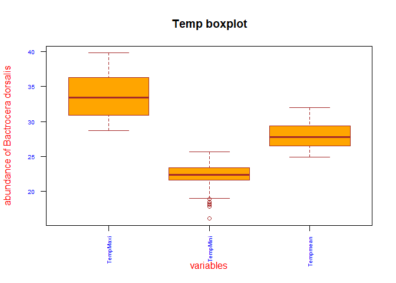<!-- -->

```r
boxplot(spacioTemp_dt [, c("RHMaxi",
"RHMini", "RHmean")], main="RH boxplot",
xlab="variables",
ylab="abundance of Bactrocera dorsalis",
col="orange",
border="brown", las = 2, cex.axis = 0.6, col.axis = 'blue', col.lab = 'red')
```

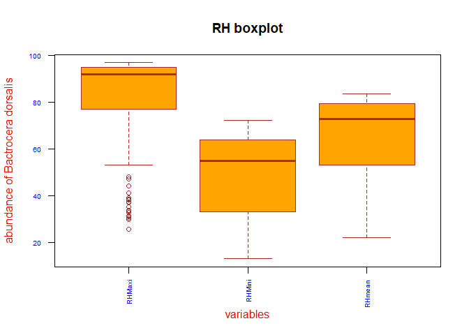<!-- -->

```r
boxplot(spacioTemp_dt [, c("B_dorsa")], main="B_dorsa boxplot",
xlab="variables",
ylab="abundance of Bactrocera dorsalis",
col="orange",
border="brown", las = 2, cex.axis = 0.6, col.axis = 'blue', col.lab = 'red')
```

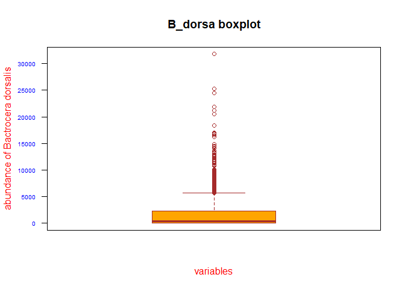<!-- -->

```r
boxplot(spacioTemp_dt [, c("Rainfall")], main="Rainfall boxplot",
xlab="variables",
ylab="abundance of Bactrocera dorsalis",
col="orange",
border="brown", las = 2, cex.axis = 0.6, col.axis = 'blue', col.lab = 'red')
```

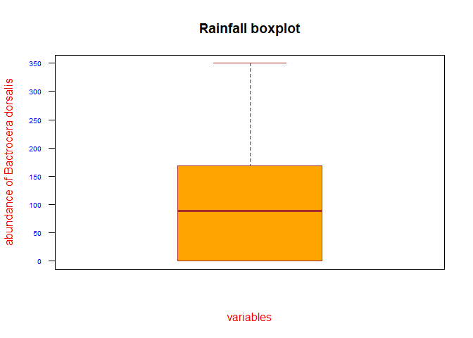<!-- -->


## Descriptive Statistics


```r
#distribution of categorical input variables
#Dolar sign Syntax
table(spacioTemp_dt$Agro_ecology) #Formula syntax tally(~Agro_ecology, data=spacioTemp_dt)
```

```
## 
## FSM NGS SGS 
## 195 482 489
```

```r
table(spacioTemp_dt$Site)
```

```
## 
##  Akofodjoule   Alafiarou1   Alafiarou2      Bassila    Iloulofin        Ketou 
##          129           50           50          145           15           98 
##         Lalo Mondjigangan   Natitingou        Ndali      Papatia      Parakou 
##           82           15          145          157           82           98 
##    Tchourou1    Tchourou2 
##           50           50
```

```r
table(spacioTemp_dt$Month)
```

```
## 
##     April    August  December  February   January      July      June     March 
##       102       116        85        89        85       116       115        91 
##       May  November   October September 
##       115        84        84        84
```

```r
table(spacioTemp_dt$Year)
```

```
## 
## 2004 2005 2006 2007 2008 2009 2010 
##    1   34   81  185  228  372  265
```

```r
table(spacioTemp_dt$Trap)
```

```
## 
##   1   2   3 
## 483 430 253
```

```r
table(spacioTemp_dt$Season)
```

```
## 
##   Dry Rainy 
##   620   546
```

```r
summary(spacioTemp_dt$TempMaxi)
```

```
##    Min. 1st Qu.  Median    Mean 3rd Qu.    Max. 
##   28.70   30.90   33.40   33.65   36.30   39.80
```

```r
summary(spacioTemp_dt$TempMini)
```

```
##    Min. 1st Qu.  Median    Mean 3rd Qu.    Max. 
##   16.10   21.60   22.40   22.42   23.40   25.70
```

```r
summary(spacioTemp_dt$RHMaxi)
```

```
##    Min. 1st Qu.  Median    Mean 3rd Qu.    Max. 
##   25.70   77.00   92.00   84.11   95.00   97.00
```

```r
summary(spacioTemp_dt$RHMini)
```

```
##    Min. 1st Qu.  Median    Mean 3rd Qu.    Max. 
##   12.90   33.00   55.00   48.16   64.00   72.20
```

```r
summary(spacioTemp_dt$Rainfall)
```

```
##    Min. 1st Qu.  Median    Mean 3rd Qu.    Max. 
##     0.0     0.0    88.4   100.3   168.7   349.7
```

```r
summary(spacioTemp_dt$B_dorsa)
```

```
##    Min. 1st Qu.  Median    Mean 3rd Qu.    Max. 
##       0      67     416    1988    2315   31769
```

```r
summary(spacioTemp_dt$Tempmean)
```

```
##    Min. 1st Qu.  Median    Mean 3rd Qu.    Max. 
##   24.90   26.50   27.80   28.04   29.40   32.00
```

```r
summary(spacioTemp_dt$RHmean)
```

```
##    Min. 1st Qu.  Median    Mean 3rd Qu.    Max. 
##   22.00   53.00   73.00   66.13   79.40   83.60
```

```r
#FormulaSyntax
library(mosaic) 

##one continous variable
#mean(~TempMaxi, data=spacioTemp_dt)
#median(~TempMaxi, data=spacioTemp_dt)
#sd(~TempMaxi, data=spacioTemp_dt)
#max(~TempMaxi, data=spacioTemp_dt)
#min(~TempMaxi, data=spacioTemp_dt)


favstats(~TempMaxi, data=spacioTemp_dt)
```

```
##   min   Q1 median   Q3  max     mean      sd    n missing
##  28.7 30.9   33.4 36.3 39.8 33.65034 3.01906 1166       0
```

```r
favstats(~TempMini, data=spacioTemp_dt)
```

```
##   min   Q1 median   Q3  max     mean       sd    n missing
##  16.1 21.6   22.4 23.4 25.7 22.42376 1.544874 1166       0
```

```r
favstats(~RHMaxi, data=spacioTemp_dt)
```

```
##   min Q1 median Q3 max     mean       sd    n missing
##  25.7 77     92 95  97 84.11184 16.22618 1166       0
```

```r
favstats(~RHMini, data=spacioTemp_dt)
```

```
##   min Q1 median Q3  max     mean       sd    n missing
##  12.9 33     55 64 72.2 48.15789 17.70513 1166       0
```

```r
favstats(~Rainfall, data=spacioTemp_dt)
```

```
##  min Q1 median    Q3   max     mean       sd    n missing
##    0  0   88.4 168.7 349.7 100.3017 96.08016 1166       0
```

```r
favstats(~B_dorsa, data=spacioTemp_dt)
```

```
##  min Q1 median   Q3   max     mean       sd    n missing
##    0 67    416 2315 31769 1988.296 3521.782 1166       0
```

```r
favstats(~Tempmean, data=spacioTemp_dt)
```

```
##   min   Q1 median   Q3 max     mean      sd    n missing
##  24.9 26.5   27.8 29.4  32 28.03628 1.82443 1166       0
```

```r
favstats(~RHmean, data=spacioTemp_dt)
```

```
##  min Q1 median   Q3  max     mean       sd    n missing
##   22 53     73 79.4 83.6 66.13216 16.03956 1166       0
```

```r
##one continous one categorical

#mean(TempMaxi~Agro_ecology, data=spacioTemp_dt)

favstats(TempMaxi~ Agro_ecology, data=spacioTemp_dt) #Min, 1st Qu, Medin, Mean,3rd Qu, 
```

```
##   Agro_ecology  min   Q1 median   Q3  max     mean       sd   n missing
## 1          FSM 29.1 30.5   32.9 35.0 37.5 32.86154 2.366041 195       0
## 2          NGS 28.7 31.3   33.6 36.5 39.8 33.95747 3.098735 482       0
## 3          SGS 28.8 30.7   33.4 36.4 39.8 33.66217 3.118924 489       0
```

```r
#Max, sd, n and missing data. Avoids tedious process of typing each individualy.
favstats(TempMaxi~Site, data=spacioTemp_dt)
```

```
##            Site  min     Q1 median     Q3  max     mean       sd   n missing
## 1   Akofodjoule 29.1 31.400   34.1 36.600 39.1 34.04264 2.842748 129       0
## 2    Alafiarou1 28.8 30.300   32.5 35.900 38.3 32.85400 3.190497  50       0
## 3    Alafiarou2 28.8 30.300   32.5 35.900 38.3 32.85400 3.190497  50       0
## 4       Bassila 28.9 31.600   34.4 36.900 39.8 34.53586 3.085442 145       0
## 5     Iloulofin 29.8 30.400   32.1 33.400 35.0 32.14000 1.978744  15       0
## 6         Ketou 29.1 30.575   33.1 35.000 37.5 32.98878 2.459481  98       0
## 7          Lalo 29.1 30.800   32.9 35.000 37.1 32.84146 2.317510  82       0
## 8  Mondjigangan 30.2 30.600   32.9 33.600 36.3 32.72000 2.289791  15       0
## 9    Natitingou 28.7 31.400   33.5 36.500 38.9 33.96552 2.997276 145       0
## 10        Ndali 28.8 31.300   34.1 36.700 39.8 34.14331 3.202488 157       0
## 11      Papatia 28.8 31.500   33.2 36.275 38.9 33.87317 2.989035  82       0
## 12      Parakou 28.8 30.900   33.5 36.400 39.4 33.71837 3.194336  98       0
## 13    Tchourou1 28.8 30.300   32.5 35.900 38.3 32.85400 3.190497  50       0
## 14    Tchourou2 28.8 30.300   32.5 35.900 38.3 32.85400 3.190497  50       0
```

```r
favstats(TempMaxi~Month, data=spacioTemp_dt)
```

```
##        Month  min   Q1 median     Q3  max     mean        sd   n missing
## 1      April 30.2 35.0   35.9 36.400 38.8 35.64118 1.5073650 102       0
## 2     August 28.7 28.9   29.4 29.900 36.9 29.67845 1.4144476 116       0
## 3   December 33.7 35.0   36.0 36.500 39.8 35.99294 1.1988872  85       0
## 4   February 33.6 37.2   38.3 38.700 39.8 37.79663 1.2551213  89       0
## 5    January 33.1 35.4   36.4 36.700 38.8 36.13176 1.2882446  85       0
## 6       July 29.1 29.5   29.9 30.600 33.5 30.12500 0.8809950 116       0
## 7       June 30.2 31.3   31.5 32.250 33.2 31.76000 0.6276942 115       0
## 8      March 31.3 35.6   37.9 38.850 39.8 37.16154 2.2268947  91       0
## 9        May 29.7 32.6   33.6 33.700 37.0 33.36087 1.0981400 115       0
## 10  November 33.4 33.5   34.6 36.300 38.8 35.04405 1.4637262  84       0
## 11   October 30.7 31.5   32.6 33.125 37.3 32.61190 1.4878143  84       0
## 12 September 30.3 30.3   30.9 31.400 37.2 31.13690 1.3801327  84       0
```

```r
favstats(TempMaxi~Year, data=spacioTemp_dt)
```

```
##   Year  min     Q1 median    Q3  max     mean       sd   n missing
## 1 2004 35.7 35.700   35.7 35.70 35.7 35.70000       NA   1       0
## 2 2005 28.7 30.725   33.2 36.45 37.9 33.24412 2.857864  34       0
## 3 2006 29.7 32.000   34.1 37.30 38.8 34.51111 3.042367  81       0
## 4 2007 28.8 31.000   33.1 35.30 39.8 33.25514 2.760570 185       0
## 5 2008 29.4 31.200   34.4 36.30 39.4 34.07544 2.865627 228       0
## 6 2009 28.9 30.675   33.4 35.40 39.8 33.21156 2.909192 372       0
## 7 2010 28.8 31.400   33.6 37.20 39.4 33.95774 3.351756 265       0
```

```r
favstats(TempMaxi~Season, data=spacioTemp_dt)
```

```
##   Season  min   Q1 median   Q3  max     mean       sd   n missing
## 1    Dry 30.2 34.4   36.0 37.3 39.8 35.79790 2.155688 620       0
## 2  Rainy 28.7 29.9   30.9 32.5 37.2 31.21172 1.732435 546       0
```

```r
favstats(TempMini~Agro_ecology, data=spacioTemp_dt)
```

```
##   Agro_ecology  min    Q1 median     Q3  max     mean        sd   n missing
## 1          FSM 21.4 22.85   23.5 24.300 25.7 23.60667 0.9285876 195       0
## 2          NGS 16.1 21.20   21.8 22.975 25.0 21.81390 1.6606469 482       0
## 3          SGS 18.2 21.70   22.4 23.400 25.4 22.55317 1.3012900 489       0
```

```r
favstats(TempMini~Site, data=spacioTemp_dt)
```

```
##            Site  min     Q1 median   Q3  max     mean        sd   n missing
## 1   Akofodjoule 20.1 22.400  23.00 23.8 25.4 23.08605 1.0752721 129       0
## 2    Alafiarou1 20.3 21.700  22.40 23.4 24.9 22.45800 1.2366990  50       0
## 3    Alafiarou2 20.3 21.700  22.40 23.4 24.9 22.45800 1.2366990  50       0
## 4       Bassila 18.2 21.500  22.10 23.1 24.9 22.10414 1.4004402 145       0
## 5     Iloulofin 22.8 22.900  24.10 24.6 25.3 23.94000 1.0027106  15       0
## 6         Ketou 21.4 22.900  23.50 24.3 25.7 23.63878 0.9739528  98       0
## 7          Lalo 21.4 22.700  23.50 24.1 24.9 23.50732 0.8506759  82       0
## 8  Mondjigangan 22.4 22.700  23.80 24.1 24.9 23.58000 0.9518403  15       0
## 9    Natitingou 16.1 20.800  21.40 22.7 25.0 21.41517 1.8828661 145       0
## 10        Ndali 18.2 21.400  22.00 23.3 24.9 22.15541 1.3965339 157       0
## 11      Papatia 17.8 20.375  21.40 22.3 25.0 21.37195 1.8004989  82       0
## 12      Parakou 18.2 21.425  21.95 23.3 24.9 22.22653 1.3434492  98       0
## 13    Tchourou1 20.3 21.700  22.40 23.4 24.9 22.45800 1.2366990  50       0
## 14    Tchourou2 20.3 21.700  22.40 23.4 24.9 22.45800 1.2366990  50       0
```

```r
favstats(TempMini~Month, data=spacioTemp_dt)
```

```
##        Month  min   Q1 median     Q3  max     mean        sd   n missing
## 1      April 21.5 23.5  24.15 24.500 25.3 24.05882 0.7234889 102       0
## 2     August 20.5 21.6  21.85 22.300 22.9 21.92069 0.4663489 116       0
## 3   December 16.1 19.4  20.30 23.200 24.5 20.98588 2.0765787  85       0
## 4   February 21.1 22.3  23.40 24.200 25.6 23.20674 1.1948562  89       0
## 5    January 17.8 18.9  20.60 22.000 24.6 20.68941 1.9572225  85       0
## 6       July 21.2 21.7  21.90 22.400 22.9 22.02931 0.4677452 116       0
## 7       June 20.9 22.2  22.40 23.000 24.1 22.61391 0.7135145 115       0
## 8      March 21.8 24.1  24.50 24.900 25.7 24.42967 0.7806684  91       0
## 9        May 21.4 23.0  23.40 23.600 24.6 23.32348 0.6031104 115       0
## 10  November 18.1 20.5  21.30 22.225 24.1 21.41905 1.5956625  84       0
## 11   October 18.2 21.8  22.25 22.525 23.4 22.10119 0.8647716  84       0
## 12 September 19.0 21.3  21.70 22.200 22.9 21.72024 0.6532181  84       0
```

```r
favstats(TempMini~Year, data=spacioTemp_dt)
```

```
##   Year  min     Q1 median     Q3  max     mean       sd   n missing
## 1 2004 23.5 23.500   23.5 23.500 23.5 23.50000       NA   1       0
## 2 2005 19.2 21.425   22.1 22.825 24.8 22.09706 1.245473  34       0
## 3 2006 16.1 21.600   22.3 22.900 24.8 22.18395 1.775560  81       0
## 4 2007 18.9 21.400   22.2 23.000 24.9 22.13514 1.331519 185       0
## 5 2008 17.8 21.200   21.8 23.300 24.8 22.02588 1.690525 228       0
## 6 2009 18.2 21.700   22.4 23.400 24.9 22.32285 1.353577 372       0
## 7 2010 18.5 22.300   23.3 24.500 25.7 23.22038 1.494219 265       0
```

```r
favstats(TempMini~Season, data=spacioTemp_dt)
```

```
##   Season  min   Q1 median   Q3  max     mean        sd   n missing
## 1    Dry 16.1 21.1   23.0 24.1 25.7 22.48484 1.9718526 620       0
## 2  Rainy 19.0 21.7   22.3 22.9 24.6 22.35440 0.8224984 546       0
```

```r
favstats(RHMaxi~Agro_ecology, data=spacioTemp_dt)
```

```
##   Agro_ecology  min Q1 median Q3  max     mean       sd   n missing
## 1          FSM 25.7 93     95 96 96.5 91.02256 13.43158 195       0
## 2          NGS 29.7 68     89 94 96.1 79.52531 19.02907 482       0
## 3          SGS 31.0 82     92 94 97.0 85.87689 12.52736 489       0
```

```r
favstats(RHMaxi~Site, data=spacioTemp_dt)
```

```
##            Site  min     Q1 median Q3  max     mean        sd   n missing
## 1   Akofodjoule 56.0 88.000   92.0 94 97.0 90.21860  6.939366 129       0
## 2    Alafiarou1 60.0 77.000   92.0 94 96.0 85.80000 11.235875  50       0
## 3    Alafiarou2 60.0 77.000   92.0 94 96.0 85.80000 11.235875  50       0
## 4       Bassila 31.0 76.000   89.0 94 96.0 81.52828 16.661765 145       0
## 5     Iloulofin 44.0 95.000   95.0 95 96.0 85.00000 21.223303  15       0
## 6         Ketou 25.7 93.000   95.0 96 96.5 91.05306 13.415749  98       0
## 7          Lalo 25.7 93.000   95.0 96 96.5 92.08780 11.438255  82       0
## 8  Mondjigangan 90.0 90.000   92.0 92 94.0 91.60000  1.549193  15       0
## 9    Natitingou 29.7 56.900   82.1 94 96.1 72.43586 23.610093 145       0
## 10        Ndali 31.0 77.000   90.0 94 96.0 82.47261 15.843350 157       0
## 11      Papatia 31.2 68.250   89.7 95 96.1 81.24390 16.940259  82       0
## 12      Parakou 31.0 77.625   90.5 94 96.0 83.85510 14.632383  98       0
## 13    Tchourou1 60.0 77.000   92.0 94 96.0 85.80000 11.235875  50       0
## 14    Tchourou2 60.0 77.000   92.0 94 96.0 85.80000 11.235875  50       0
```

```r
favstats(RHMaxi~Month, data=spacioTemp_dt)
```

```
##        Month  min    Q1 median     Q3  max     mean        sd   n missing
## 1      April 38.2 87.00   88.0 90.750 95.1 85.24314 12.935051 102       0
## 2     August 29.7 94.00   95.2 96.000 96.1 93.19828  9.222581 116       0
## 3   December 31.0 65.00   66.0 84.800 95.0 70.82000 15.199763  85       0
## 4   February 31.2 64.00   71.0 89.000 93.0 71.58764 18.046586  89       0
## 5    January 31.0 59.00   60.0 76.000 93.0 62.14118 17.118956  85       0
## 6       July 31.0 92.00   94.0 95.025 96.5 92.85776  8.417912 116       0
## 7       June 32.8 93.00   94.0 95.000 96.0 92.63304  8.126000 115       0
## 8      March 38.6 76.00   80.3 88.000 94.0 79.52637 11.377344  91       0
## 9        May 33.5 90.00   92.2 93.700 96.0 91.36696  8.022301 115       0
## 10  November 25.7 76.00   79.5 87.000 96.0 76.12738 17.358546  84       0
## 11   October 31.0 93.75   94.5 95.000 96.0 90.48810 13.940220  84       0
## 12 September 30.3 95.00   95.0 95.700 97.0 92.04167 12.324803  84       0
```

```r
favstats(RHMaxi~Year, data=spacioTemp_dt)
```

```
##   Year  min     Q1 median     Q3  max     mean       sd   n missing
## 1 2004 91.0 91.000     91 91.000 91.0 91.00000       NA   1       0
## 2 2005 53.0 90.250     94 95.000 97.0 88.85294 11.67264  34       0
## 3 2006 29.7 38.200     80 93.000 96.0 70.69383 25.61122  81       0
## 4 2007 39.0 88.000     93 95.000 96.0 85.80378 15.65228 185       0
## 5 2008 25.7 78.875     91 94.825 96.5 81.18246 20.16303 228       0
## 6 2009 31.0 86.000     92 95.000 96.0 87.30941 10.71523 372       0
## 7 2010 41.0 77.000     92 94.000 96.0 84.42943 13.49622 265       0
```

```r
favstats(RHMaxi~Season, data=spacioTemp_dt)
```

```
##   Season  min Q1 median   Q3 max     mean        sd   n missing
## 1    Dry 25.7 66   82.1 92.0  96 76.77484 17.511478 620       0
## 2  Rainy 29.7 92   94.0 95.4  97 92.44322  9.151085 546       0
```

```r
favstats(RHMini~Agro_ecology, data=spacioTemp_dt)
```

```
##   Agro_ecology  min    Q1 median Q3  max     mean       sd   n missing
## 1          FSM 22.6 47.40   60.0 65 71.0 55.85744 11.81355 195       0
## 2          NGS 12.9 24.85   49.9 65 72.2 45.70456 18.99700 482       0
## 3          SGS 13.3 32.00   53.0 64 71.0 47.50573 17.52426 489       0
```

```r
favstats(RHMini~Site, data=spacioTemp_dt)
```

```
##            Site  min   Q1 median Q3  max     mean        sd   n missing
## 1   Akofodjoule 21.1 37.0   53.0 62 71.0 49.76124 14.324429 129       0
## 2    Alafiarou1 17.0 35.0   58.0 65 70.0 48.90000 18.212185  50       0
## 3    Alafiarou2 17.0 35.0   58.0 65 70.0 48.90000 18.212185  50       0
## 4       Bassila 13.3 23.7   47.0 61 68.0 42.53172 18.957916 145       0
## 5     Iloulofin 54.0 59.0   61.0 65 68.0 61.40000  5.011416  15       0
## 6         Ketou 22.6 47.0   59.5 65 71.0 55.46531 11.971953  98       0
## 7          Lalo 22.6 47.4   60.0 65 71.0 55.31220 12.332837  82       0
## 8  Mondjigangan 46.0 57.0   57.0 62 66.0 57.60000  6.946736  15       0
## 9    Natitingou 12.9 24.3   42.0 65 72.2 45.00414 19.277368 145       0
## 10        Ndali 13.3 23.7   50.0 63 70.0 43.86752 19.260369 157       0
## 11      Papatia 12.9 35.0   58.0 66 72.2 50.93902 17.093142  82       0
## 12      Parakou 13.3 23.7   50.3 64 70.0 45.30408 19.177290  98       0
## 13    Tchourou1 17.0 35.0   58.0 65 70.0 48.90000 18.212185  50       0
## 14    Tchourou2 17.0 35.0   58.0 65 70.0 48.90000 18.212185  50       0
```

```r
favstats(RHMini~Month, data=spacioTemp_dt)
```

```
##        Month  min   Q1 median    Q3  max     mean        sd   n missing
## 1      April 24.8 39.7   46.0 53.00 65.1 46.48137  8.127081 102       0
## 2     August 22.1 66.0   68.0 70.00 71.0 66.11293  9.756733 116       0
## 3   December 13.5 22.0   23.8 34.60 47.0 27.92706  8.645221  85       0
## 4   February 12.9 21.0   23.0 35.00 55.0 27.14382 10.209576  89       0
## 5    January 13.3 17.0   22.6 30.00 47.0 24.65412  9.749622  85       0
## 6       July 22.3 65.0   65.1 67.00 72.2 64.62931  6.448000 116       0
## 7       June 22.9 58.0   61.0 63.50 66.0 60.17217  5.817827 115       0
## 8      March 17.0 27.0   30.0 40.00 59.0 33.60110 11.045607  91       0
## 9        May 22.7 51.4   58.0 59.00 68.0 55.82435  6.423321 115       0
## 10  November 13.3 32.5   35.0 41.25 65.0 36.74643 11.659336  84       0
## 11   October 13.5 56.0   58.0 65.00 65.0 55.77262 12.499006  84       0
## 12 September 18.0 64.0   64.0 66.00 69.5 61.79524 11.664113  84       0
```

```r
favstats(RHMini~Year, data=spacioTemp_dt)
```

```
##   Year  min   Q1 median   Q3  max     mean       sd   n missing
## 1 2004 40.0 40.0   40.0 40.0 40.0 40.00000       NA   1       0
## 2 2005 18.0 41.0   56.5 64.0 71.0 50.82353 16.82075  34       0
## 3 2006 16.1 22.7   30.0 58.0 71.0 38.67407 18.16561  81       0
## 4 2007 14.0 38.0   58.0 64.0 71.0 50.96757 17.31603 185       0
## 5 2008 12.9 28.0   49.8 63.5 72.2 45.83596 18.84515 228       0
## 6 2009 13.5 38.0   58.0 65.0 71.0 50.67043 16.14949 372       0
## 7 2010 13.3 30.0   54.0 61.0 71.0 47.25472 17.84441 265       0
```

```r
favstats(RHMini~Season, data=spacioTemp_dt)
```

```
##   Season  min Q1 median    Q3  max     mean        sd   n missing
## 1    Dry 12.9 23     35 47.00 65.1 36.21871 14.679426 620       0
## 2  Rainy 18.0 58     64 66.85 72.2 61.71520  8.890424 546       0
```

```r
favstats(Rainfall~Agro_ecology, data=spacioTemp_dt)
```

```
##   Agro_ecology min   Q1 median     Q3   max      mean        sd   n missing
## 1          FSM   0 28.1   79.9 139.65 340.9  92.17128  78.98237 195       0
## 2          NGS   0  2.1   89.6 206.70 344.2 109.67303 108.00409 482       0
## 3          SGS   0  0.0   92.3 155.90 349.7  94.30675  88.94601 489       0
```

```r
favstats(Rainfall~Site, data=spacioTemp_dt)
```

```
##            Site   min    Q1 median     Q3   max      mean        sd   n missing
## 1   Akofodjoule   0.0   0.0   73.1 149.80 271.2  87.16822  83.32596 129       0
## 2    Alafiarou1   0.0   0.0  124.3 168.70 312.1 112.11400  91.15060  50       0
## 3    Alafiarou2   0.0   0.0  124.3 168.70 312.1 112.11400  91.15060  50       0
## 4       Bassila   0.0   0.0    9.4 117.20 349.7  69.33931  86.94463 145       0
## 5     Iloulofin  28.3 129.7  216.3 216.50 236.7 165.50000  80.65344  15       0
## 6         Ketou   0.0  28.3   76.7 131.10 340.9  96.06633  86.22759  98       0
## 7          Lalo   0.0   3.5   78.4 110.60 192.6  74.10244  59.73346  82       0
## 8  Mondjigangan 105.8 123.1  143.4 208.00 217.8 159.62000  46.79498  15       0
## 9    Natitingou   0.0   1.1   89.6 180.90 344.2 108.80069 111.58467 145       0
## 10        Ndali   0.0   4.0   85.4 191.70 304.3 103.59108 101.79352 157       0
## 11      Papatia   0.0   1.1   89.6 229.50 344.2 118.24146 116.89314  82       0
## 12      Parakou   0.0   7.0   94.5 214.75 304.3 113.53776 105.57642  98       0
## 13    Tchourou1   0.0   0.0  124.3 168.70 312.1 112.11400  91.15060  50       0
## 14    Tchourou2   0.0   0.0  124.3 168.70 312.1 112.11400  91.15060  50       0
```

```r
favstats(Rainfall~Month, data=spacioTemp_dt)
```

```
##        Month min      Q1 median      Q3   max       mean       sd   n missing
## 1      April   0  73.000 106.70 130.400 231.7 103.652941 45.24484 102       0
## 2     August   0 129.000 183.30 237.100 344.2 184.388793 91.15303 116       0
## 3   December   0   0.000   0.00   4.500  67.7   4.742353 11.02096  85       0
## 4   February   0   0.000   0.00   7.600 235.2  16.771910 42.33126  89       0
## 5    January   0   0.000   0.00   0.000 163.7   4.924706 22.42121  85       0
## 6       July   0 135.000 205.60 233.250 312.1 185.988793 85.85150 116       0
## 7       June   0 137.950 150.40 180.900 349.7 157.550435 84.14692 115       0
## 8      March   0   9.200  25.80  62.700 236.3  37.554945 44.47252  91       0
## 9        May   0  67.500 131.10 191.700 249.1 123.301739 76.30312 115       0
## 10  November   0   0.000   1.10  12.825  73.9  13.236905 22.55921  84       0
## 11   October   0  81.575  92.30 120.000 215.3 100.783333 49.79941  84       0
## 12 September   0 124.300 224.65 259.800 349.7 188.188095 92.65417  84       0
```

```r
favstats(Rainfall~Year, data=spacioTemp_dt)
```

```
##   Year min  Q1 median      Q3   max      mean        sd   n missing
## 1 2004   0 0.0   0.00   0.000   0.0   0.00000        NA   1       0
## 2 2005   0 0.0  61.75 137.325 300.5  83.02353  89.40461  34       0
## 3 2006   0 0.0  37.60 132.500 295.5  72.76296  83.03142  81       0
## 4 2007   0 5.4 103.80 169.400 340.0 109.74216  94.84712 185       0
## 5 2008   0 0.0  72.00 180.900 349.7 100.58816 106.02800 228       0
## 6 2009   0 7.0  90.40 164.300 349.7 105.18522  97.39755 372       0
## 7 2010   0 0.0  92.00 168.700 280.1  97.62226  89.26795 265       0
```

```r
favstats(Rainfall~Season, data=spacioTemp_dt)
```

```
##   Season min      Q1 median     Q3   max      mean       sd   n missing
## 1    Dry   0   0.000    9.2  80.90 236.3  41.74548 55.16398 620       0
## 2  Rainy   0 111.225  168.7 231.15 349.7 166.79414 89.14523 546       0
```

```r
favstats(B_dorsa~Agro_ecology, data=spacioTemp_dt)
```

```
##   Agro_ecology min    Q1 median     Q3   max     mean       sd   n missing
## 1          FSM  21 175.0 1286.0 3782.5 24471 2918.313 4054.897 195       0
## 2          NGS   0  29.5  246.5 1353.0 21848 1403.251 2678.075 482       0
## 3          SGS   0  70.0  407.0 2627.0 31769 2194.100 3908.672 489       0
```

```r
favstats(B_dorsa~Site, data=spacioTemp_dt)
```

```
##            Site  min      Q1 median      Q3   max     mean       sd   n missing
## 1   Akofodjoule    2   45.00  279.0 1580.00 16792 1519.256 2952.502 129       0
## 2    Alafiarou1    2   52.50  319.5 1938.75 12872 1473.060 2643.783  50       0
## 3    Alafiarou2    1   72.00  461.5 2315.00 12474 2127.540 3272.129  50       0
## 4       Bassila   12  135.00  680.0 2627.00 31769 2631.552 4674.439 145       0
## 5     Iloulofin 1362 3063.00 5547.0 8767.50 14370 6234.667 4015.391  15       0
## 6         Ketou   27  174.50 1316.5 4385.00 24471 3344.857 4660.645  98       0
## 7          Lalo   21  115.50  991.5 2145.25 14370 1801.890 2657.516  82       0
## 8  Mondjigangan   52 1058.00 2920.0 4313.50  7456 2989.267 2358.658  15       0
## 9    Natitingou    0   19.00  341.0 1884.00 12521 1599.924 2678.115 145       0
## 10        Ndali    0   55.00  312.0 1394.00 16963 1361.185 2488.413 157       0
## 11      Papatia    0   16.25  116.0  996.00 21848 1372.110 3404.966  82       0
## 12      Parakou    3   37.25  131.5 1121.75 10953 1205.704 2275.125  98       0
## 13    Tchourou1    8   61.25  323.0 4303.00 20479 2794.340 4640.922  50       0
## 14    Tchourou2    0   36.00  187.5 3361.25 18354 2615.400 4615.401  50       0
```

```r
favstats(B_dorsa~Month, data=spacioTemp_dt)
```

```
##        Month min      Q1 median      Q3   max       mean         sd   n missing
## 1      April   0   36.25  158.0  503.50  7553  830.98039 1757.25867 102       0
## 2     August  94  843.75 1378.0 2314.00 12521 2016.00000 2019.52008 116       0
## 3   December  12   56.00  100.0  156.00  1303  148.54118  199.64734  85       0
## 4   February   0    3.00   17.0   60.00   590   58.16854  104.55221  89       0
## 5    January   0   15.00   42.0   80.00   407   59.97647   67.45086  85       0
## 6       July 636 2782.00 3945.0 6112.50 16963 4838.37931 3245.46371 116       0
## 7       June 302 2734.00 5140.0 9154.00 31769 6721.66087 5509.27848 115       0
## 8      March   0    6.00   23.0  124.50  2753  176.68132  459.28555  91       0
## 9        May   6  593.00 2165.0 5535.00 24471 4154.01739 5041.18560 115       0
## 10  November   0   65.75  131.5  189.75  1443  220.00000  286.72980  84       0
## 11   October   8   88.25  354.5  741.75  3603  524.97619  586.75271  84       0
## 12 September  29  323.25  702.5 1356.25  6767 1026.48810 1051.34775  84       0
```

```r
favstats(B_dorsa~Year, data=spacioTemp_dt)
```

```
##   Year min     Q1 median      Q3   max     mean       sd   n missing
## 1 2004  67  67.00   67.0   67.00    67   67.000       NA   1       0
## 2 2005   4 177.00  734.5 2850.25 11230 2025.529 2807.298  34       0
## 3 2006   4 125.00  446.0 1666.00 16792 1775.519 3094.821  81       0
## 4 2007   0  86.00  822.0 3254.00 31769 3160.649 5383.932 185       0
## 5 2008   0  50.50  210.5 1861.25  9716 1279.228 2006.707 228       0
## 6 2009   0  79.75  328.5 1792.50 16930 1617.290 2871.748 372       0
## 7 2010   0  24.00  475.0 3537.00 20479 2368.245 3718.350 265       0
```

```r
favstats(B_dorsa~Season, data=spacioTemp_dt)
```

```
##   Season min  Q1 median      Q3   max      mean        sd   n missing
## 1    Dry   0  23   80.0  202.25  7553  300.5113  821.6993 620       0
## 2  Rainy   6 979 2370.5 5147.50 31769 3904.8278 4338.8243 546       0
```

```r
favstats(Tempmean~Agro_ecology, data=spacioTemp_dt)
```

```
##   Agro_ecology  min   Q1 median     Q3  max     mean       sd   n missing
## 1          FSM 25.8 26.6   28.4 29.500 31.4 28.22923 1.551327 195       0
## 2          NGS 24.9 26.4   27.6 28.975 32.0 27.88361 1.854051 482       0
## 3          SGS 25.2 26.5   27.8 29.700 32.0 28.10982 1.886260 489       0
```

```r
favstats(Tempmean~Site, data=spacioTemp_dt)
```

```
##            Site  min     Q1 median   Q3  max     mean       sd   n missing
## 1   Akofodjoule 25.2 27.000   28.4 30.2 31.9 28.57132 1.782519 129       0
## 2    Alafiarou1 25.3 26.000   27.4 28.7 31.4 27.65600 1.910141  50       0
## 3    Alafiarou2 25.3 26.000   27.4 28.7 31.4 27.65600 1.910141  50       0
## 4       Bassila 25.5 26.900   28.2 29.7 32.0 28.32000 1.867098 145       0
## 5     Iloulofin 26.4 26.600   28.1 29.0 30.1 28.04000 1.458865  15       0
## 6         Ketou 25.8 26.675   28.4 29.6 31.4 28.30918 1.611946  98       0
## 7          Lalo 25.8 26.900   28.4 29.5 30.8 28.16829 1.505453  82       0
## 8  Mondjigangan 26.3 26.600   28.4 28.9 30.6 28.16000 1.633489  15       0
## 9    Natitingou 24.9 26.300   27.2 29.0 31.6 27.68621 1.811408 145       0
## 10        Ndali 25.3 26.500   27.6 29.7 32.0 28.14904 1.921258 157       0
## 11      Papatia 25.0 26.400   27.3 28.6 31.6 27.61707 1.680521  82       0
## 12      Parakou 25.3 26.400   27.6 28.9 31.8 27.97347 1.907746  98       0
## 13    Tchourou1 25.3 26.000   27.4 28.7 31.4 27.65600 1.910141  50       0
## 14    Tchourou2 25.3 26.000   27.4 28.7 31.4 27.65600 1.910141  50       0
```

```r
favstats(Tempmean~Month, data=spacioTemp_dt)
```

```
##        Month  min    Q1 median   Q3  max     mean        sd   n missing
## 1      April 26.0 29.40  30.00 30.2 31.7 29.85294 0.9768312 102       0
## 2     August 25.0 25.40  25.70 26.0 29.2 25.80948 0.6904288 116       0
## 3   December 24.9 27.60  28.00 29.1 32.0 28.48824 1.2826138  85       0
## 4   February 28.4 30.10  30.70 30.8 32.0 30.48876 0.8237164  89       0
## 5    January 25.5 27.90  28.70 29.5 31.7 28.41882 1.3743825  85       0
## 6       July 25.5 25.60  26.00 26.4 27.6 26.05603 0.5439451 116       0
## 7       June 26.2 26.90  27.20 27.4 28.4 27.20000 0.4692286 115       0
## 8      March 26.9 30.35  31.40 31.6 32.0 30.79560 1.2161791  91       0
## 9        May 25.6 28.00  28.40 28.6 30.3 28.33652 0.7014184 115       0
## 10  November 26.6 27.40  28.35 28.9 31.2 28.23571 0.9844138  84       0
## 11   October 26.5 27.05  27.40 27.6 30.0 27.34405 0.6342344  84       0
## 12 September 25.6 26.00  26.40 26.6 29.1 26.43452 0.6331208  84       0
```

```r
favstats(Tempmean~Year, data=spacioTemp_dt)
```

```
##   Year  min     Q1 median     Q3  max     mean       sd   n missing
## 1 2004 29.6 29.600   29.6 29.600 29.6 29.60000       NA   1       0
## 2 2005 25.0 26.275   27.6 29.050 31.4 27.67059 1.606715  34       0
## 3 2006 24.9 26.900   28.0 30.000 31.7 28.34198 1.999679  81       0
## 4 2007 25.0 26.400   27.4 28.600 32.0 27.69676 1.581617 185       0
## 5 2008 25.4 26.600   27.8 29.400 31.8 28.05088 1.780028 228       0
## 6 2009 25.5 26.400   27.4 28.825 32.0 27.76478 1.719014 372       0
## 7 2010 25.3 27.200   28.7 30.500 31.9 28.58943 1.996579 265       0
```

```r
favstats(Tempmean~Season, data=spacioTemp_dt)
```

```
##   Season  min   Q1 median   Q3  max     mean       sd   n missing
## 1    Dry 24.9 27.6   29.0 30.6 32.0 29.13984 1.599175 620       0
## 2  Rainy 25.0 25.9   26.5 27.6 30.3 26.78315 1.118883 546       0
```

```r
favstats(RHmean~Agro_ecology, data=spacioTemp_dt)
```

```
##   Agro_ecology  min    Q1 median   Q3  max     mean       sd   n missing
## 1          FSM 36.5 69.15   78.0 80.5 83.5 73.44205 10.22160 195       0
## 2          NGS 22.0 49.50   70.0 79.0 83.6 62.60954 18.25905 482       0
## 3          SGS 22.2 55.50   72.5 79.0 83.5 66.68937 14.49510 489       0
```

```r
favstats(RHmean~Site, data=spacioTemp_dt)
```

```
##            Site  min   Q1 median     Q3  max     mean        sd   n missing
## 1   Akofodjoule 40.0 63.0   72.5 78.500 83.5 69.98837 10.043325 129       0
## 2    Alafiarou1 38.5 55.5   75.5 79.000 83.0 67.35000 14.541724  50       0
## 3    Alafiarou2 38.5 55.5   75.5 79.000 83.0 67.35000 14.541724  50       0
## 4       Bassila 22.2 51.0   68.0 76.500 81.5 62.02483 17.152529 145       0
## 5     Iloulofin 49.0 77.0   78.0 80.500 81.5 73.20000 12.637529  15       0
## 6         Ketou 36.5 68.8   77.5 80.500 83.5 73.26122 10.208281  98       0
## 7          Lalo 36.5 69.7   78.0 80.500 83.5 73.70244  9.885455  82       0
## 8  Mondjigangan 68.0 74.5   74.5 76.000 80.0 74.60000  4.000893  15       0
## 9    Natitingou 22.0 40.4   61.1 78.000 83.6 58.71517 21.083351 145       0
## 10        Ndali 22.2 51.0   70.0 78.500 83.0 63.16433 16.893995 157       0
## 11      Papatia 22.0 50.5   74.5 80.375 83.6 66.08659 16.723797  82       0
## 12      Parakou 22.2 52.0   70.9 78.875 83.0 64.57347 16.232217  98       0
## 13    Tchourou1 38.5 55.5   75.5 79.000 83.0 67.35000 14.541724  50       0
## 14    Tchourou2 38.5 55.5   75.5 79.000 83.0 67.35000 14.541724  50       0
```

```r
favstats(RHmean~Month, data=spacioTemp_dt)
```

```
##        Month  min   Q1 median    Q3  max     mean        sd   n missing
## 1      April 31.5 63.0  65.50 72.10 80.1 65.86569  8.218989 102       0
## 2     August 25.9 80.0  81.50 83.00 83.5 79.65086  9.071623 116       0
## 3   December 22.2 43.0  45.10 58.50 71.0 49.37412 11.461583  85       0
## 4   February 22.0 46.0  49.50 58.60 73.0 49.36067 13.166052  89       0
## 5    January 22.2 38.5  39.50 53.00 68.0 43.39059 12.313810  85       0
## 6       July 26.6 78.5  80.50 81.00 83.6 78.74397  7.262127 116       0
## 7       June 27.8 75.5  77.50 78.25 80.5 76.39826  6.756933 115       0
## 8      March 31.5 50.5  52.00 63.00 76.5 56.55934 10.005620  91       0
## 9        May 28.1 71.7  74.50 77.00 81.5 73.59304  6.871116 115       0
## 10  November 26.6 51.3  55.50 64.00 79.5 56.43333 12.246222  84       0
## 11   October 22.2 75.0  76.25 80.00 80.0 73.12976 12.814748  84       0
## 12 September 25.6 79.5  79.50 81.00 82.5 76.91310 11.772305  84       0
```

```r
favstats(RHmean~Year, data=spacioTemp_dt)
```

```
##   Year  min     Q1 median   Q3  max     mean       sd   n missing
## 1 2004 65.5 65.500  65.50 65.5 65.5 65.50000       NA   1       0
## 2 2005 35.5 66.500  75.75 79.5 83.0 69.83824 13.75859  34       0
## 3 2006 24.9 31.500  55.00 76.0 83.5 54.68272 20.97266  81       0
## 4 2007 26.5 64.000  75.50 79.5 83.5 68.38649 16.02082 185       0
## 5 2008 22.0 51.400  69.70 79.0 83.6 63.49649 18.39581 228       0
## 6 2009 22.2 59.875  75.00 79.5 83.0 68.98925 12.76266 372       0
## 7 2010 27.1 52.000  71.50 78.0 83.0 65.84189 14.71157 265       0
```

```r
favstats(RHmean~Season, data=spacioTemp_dt)
```

```
##   Season  min   Q1 median     Q3  max     mean       sd   n missing
## 1    Dry 22.0 46.0  56.25 68.000 80.1 56.49452 14.85388 620       0
## 2  Rainy 25.6 75.5  79.00 80.725 83.6 77.07601  8.58422 546       0
```

```r
favstats(B_dorsa~Season+Agro_ecology, data=spacioTemp_dt)
```

```
##   Season.Agro_ecology min      Q1 median      Q3   max      mean        sd   n
## 1             Dry.FSM  21   87.75    175  551.75  7387  778.2551 1621.4253  98
## 2           Rainy.FSM 704 1629.00   3198 7521.00 24471 5080.4330 4601.2830  97
## 3             Dry.NGS   0    7.00     54  148.00  3603  158.9148  326.4460 270
## 4           Rainy.NGS   6  700.75   1816 3912.25 21848 2988.0189 3421.8495 212
## 5             Dry.SGS   0   29.75     72  184.25  7553  266.4325  650.4289 252
## 6           Rainy.SGS  70  860.00   2669 5643.00 31769 4243.7722 4791.0834 237
##   missing
## 1       0
## 2       0
## 3       0
## 4       0
## 5       0
## 6       0
```

## finding a fitting distribution for the B_dorsa variable


```r
library(car)
library(MASS) #So that distributions that must be non-zero can make sense of my data

qqp(spacioTemp_dt$B_dorsa+1, "norm", main="Q-Q Plot ~ B_dorsa+1 Normal model")
```

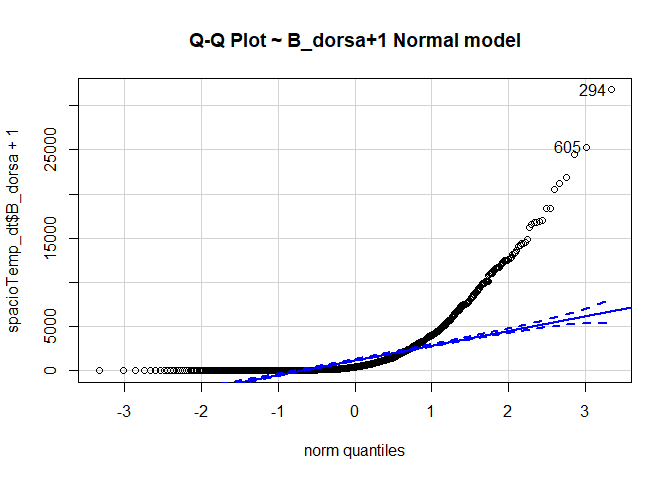<!-- -->

```
## [1] 294 605
```

```r
qqp(spacioTemp_dt$B_dorsa+1, "lnorm", main="Q-Q Plot ~ B_dorsa+1 LogNormal model") #lnorm is lognormal
```

<!-- -->

```
## [1] 294 605
```

```r
qqp(spacioTemp_dt$B_dorsa+1, "exp", main="Q-Q Plot ~ B_dorsa+1 Exponential model")
```

<!-- -->

```
## [1] 294 605
```

```r
#qqp requires estimates of the parameters of the negative binomial, Poisson
# and gamma distributions. You can generate estimates using the fitdistr function.

#negative binomial and gamma distributions can only handle positive numbers.

#Poisson distribution can only handle positive whole numbers.

#Binomial and Poisson distributions are different from the others because they are 
#discrete rather than continuous, which means they quantify distinct,
#countable events or the probability of these events


nbinom <- fitdistr(spacioTemp_dt$B_dorsa+1, "Negative Binomial")
qqp(spacioTemp_dt$B_dorsa+1, "nbinom", size = nbinom$estimate[[1]], mu =
nbinom$estimate[[2]], main="Q-Q Plot ~ B_dorsa+1 Negative Binomial model")
```

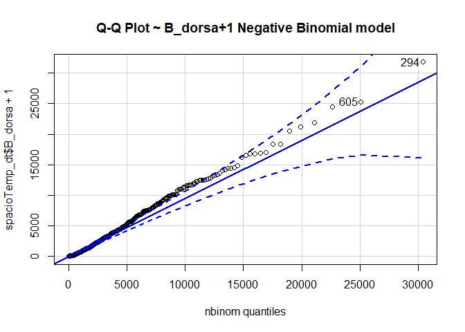<!-- -->

```
## [1] 294 605
```

```r
pois <- fitdistr(spacioTemp_dt$B_dorsa+1, "Poisson")
qqp(spacioTemp_dt$B_dorsa+1, "pois", lambda=pois$estimate, main="Q-Q Plot ~ B_dorsa+1 Poisson model")
```

<!-- -->

```
## [1] 294 605
```

```r
gamma <- fitdistr(spacioTemp_dt$B_dorsa+1, "gamma", 
                  list(shape = 1, rate = 0.1), lower = 0.4)
qqp(spacioTemp_dt$B_dorsa+1, "gamma", shape = gamma$estimate[[1]], rate =
gamma$estimate[[2]], main="Q-Q Plot ~ B_dorsa+1 Gamma model")
```

<!-- -->

```
## [1] 294 605
```

```r
weibull <- fitdistr(spacioTemp_dt$B_dorsa+1, "weibull")
qqp(spacioTemp_dt$B_dorsa+1, "weibull", shape = weibull$estimate[[1]], 
    scale=weibull$estimate[[2]], main="Q-Q Plot ~ B_dorsa+1 Weibull model")
```

<!-- -->

```
## [1] 294 605
```

```r
hist(spacioTemp_dt$B_dorsa, prob=TRUE)

# Estimate an gamma proba
paraw <- fitdistr(spacioTemp_dt$B_dorsa[spacioTemp_dt$B_dorsa!=0],densfun="gamma",
                  list(shape = 1, rate = 0.1), lower = 0.4)
curve(dgamma(x, paraw$estimate[1], paraw$estimate[2]), 0,15900, add=TRUE, col="blue")
ks.test(spacioTemp_dt$B_dorsa, "pgamma", paraw$estimate[1], paraw$estimate[2])
```

```
## 
## 	One-sample Kolmogorov-Smirnov test
## 
## data:  spacioTemp_dt$B_dorsa
## D = 0.48437, p-value < 2.2e-16
## alternative hypothesis: two-sided
```

```r
# Estimate a weilbull proba
paraw <- fitdistr(spacioTemp_dt$B_dorsa[spacioTemp_dt$B_dorsa!=0],densfun="weibull")
curve(dweibull(x, paraw$estimate[1], paraw$estimate[2]), 0,15900, add=TRUE, col="red")
```

<!-- -->

```r
ks.test(spacioTemp_dt$B_dorsa, "pweibull", paraw$estimate[1], paraw$estimate[2])
```

```
## 
## 	One-sample Kolmogorov-Smirnov test
## 
## data:  spacioTemp_dt$B_dorsa
## D = 0.086266, p-value = 5.809e-08
## alternative hypothesis: two-sided
```


## fitting the Poison model


```r
spacioTemp_dt <- spacioTemp_dt%>%
 mutate(Agro_ecology = factor(Agro_ecology, levels = c("SGS","FSM","NGS"), 
                               labels = c("1","2","3")))%>%
mutate(Season = factor(Season, levels = c("Dry","Rainy"), 
                               labels = c("1","2")))
```


Model to be used in the modelling of seasonal abundance of Bactrocera dorsalis in Benin
is the Poisson regression model since the abundance of Bactrocera dorsalis is discrete count data. 


```r
Dorsa.output <-glm(formula = B_dorsa ~  Rainfall + Tempmean + RHmean + Agro_ecology + 
                     Season, data = spacioTemp_dt, family = poisson)
summary(Dorsa.output)
```

```
## 
## Call:
## glm(formula = B_dorsa ~ Rainfall + Tempmean + RHmean + Agro_ecology + 
##     Season, family = poisson, data = spacioTemp_dt)
## 
## Deviance Residuals: 
##    Min      1Q  Median      3Q     Max  
## -90.50  -26.99  -15.62    2.29  269.63  
## 
## Coefficients:
##                 Estimate Std. Error z value Pr(>|z|)    
## (Intercept)    1.654e+00  2.192e-02   75.47   <2e-16 ***
## Rainfall       7.899e-04  8.536e-06   92.54   <2e-16 ***
## Tempmean       1.233e-01  6.386e-04  193.03   <2e-16 ***
## RHmean         8.581e-03  9.939e-05   86.34   <2e-16 ***
## Agro_ecology2  2.174e-01  1.703e-03  127.70   <2e-16 ***
## Agro_ecology3 -3.729e-01  1.613e-03 -231.18   <2e-16 ***
## Season2        2.593e+00  3.024e-03  857.59   <2e-16 ***
## ---
## Signif. codes:  0 '***' 0.001 '**' 0.01 '*' 0.05 '.' 0.1 ' ' 1
## 
## (Dispersion parameter for poisson family taken to be 1)
## 
##     Null deviance: 4771651  on 1165  degrees of freedom
## Residual deviance: 2429048  on 1159  degrees of freedom
## AIC: 2437912
## 
## Number of Fisher Scoring iterations: 6
```
All coefficient estimates are highly significant. The Wald test results might be too optimistic due to a misspecification of the likelihood.

We see that the model obviously doesn't fit the data. The five-percent critical value for 
a chi-squared with 1159 d.f. is


```r
df.residual(Dorsa.output)
```

```
## [1] 1159
```

```r
qchisq(0.95, df.residual(Dorsa.output))
```

```
## [1] 1239.313
```

```r
deviance(Dorsa.output)
```

```
## [1] 2429048
```

```r
pr <- residuals(Dorsa.output,"pearson")

sum(pr^2)
```

```
## [1] 3520646
```

and the deviance and Pearson's chi-squared are both high.


## Poisson model (the robust or sandwich estimator of the standard errors)

As over-dispersion is present in this data set, we re-compute the Wald tests using sandwich 
standard errors.


```r
library(sandwich)
library(lmtest)

coeftest(Dorsa.output, vcov = sandwich)
```

```
## 
## z test of coefficients:
## 
##                  Estimate  Std. Error z value  Pr(>|z|)    
## (Intercept)    1.65429914  1.29610089  1.2764 0.2018262    
## Rainfall       0.00078992  0.00054950  1.4375 0.1505706    
## Tempmean       0.12326785  0.03587155  3.4364 0.0005896 ***
## RHmean         0.00858109  0.00673473  1.2742 0.2026081    
## Agro_ecology2  0.21743516  0.10941651  1.9872 0.0468975 *  
## Agro_ecology3 -0.37294806  0.10937354 -3.4099 0.0006500 ***
## Season2        2.59312140  0.16117342 16.0890 < 2.2e-16 ***
## ---
## Signif. codes:  0 '***' 0.001 '**' 0.01 '*' 0.05 '.' 0.1 ' ' 1
```

```r
coef(Dorsa.output, vcov = sandwich)
```

```
##   (Intercept)      Rainfall      Tempmean        RHmean Agro_ecology2 
##  1.6542991400  0.0007899193  0.1232678546  0.0085810934  0.2174351574 
## Agro_ecology3       Season2 
## -0.3729480641  2.5931213970
```


Cameron and Trivedi (2009) recommended using robust standard errors for the parameter estimates to control for mild violation of the distribution assumption that the variance 
equals the mean. 

We obtain the robust standard errors and calculated the p-values accordingly. Together with the p-values, we can also calculate the 95% confidence interval using the parameter estimates and their robust standard errors.


```r
cov.Dorsa.output <- vcovHC(Dorsa.output, type="HC0")
std.err <- sqrt(diag(cov.Dorsa.output))

  cbind(Estimate= coef(Dorsa.output), "Robust SE" = std.err, 
        "z value" = coef(Dorsa.output)/std.err, 
"Pr(>|z|)" = 2 * pnorm(abs(coef(Dorsa.output)/std.err), lower.tail=FALSE),
LL = coef(Dorsa.output) - 1.96 * std.err,
UL = coef(Dorsa.output) + 1.96 * std.err)
```

```
##                    Estimate    Robust SE   z value     Pr(>|z|)            LL
## (Intercept)    1.6542991400 1.2961008875  1.276366 2.018262e-01 -0.8860585995
## Rainfall       0.0007899193 0.0005495019  1.437519 1.505706e-01 -0.0002871043
## Tempmean       0.1232678546 0.0358715517  3.436368 5.895694e-04  0.0529596134
## RHmean         0.0085810934 0.0067347276  1.274156 2.026081e-01 -0.0046189728
## Agro_ecology2  0.2174351574 0.1094165128  1.987224 4.689754e-02  0.0029787923
## Agro_ecology3 -0.3729480641 0.1093735428 -3.409856 6.499712e-04 -0.5873202079
## Season2        2.5931213970 0.1611734193 16.089014 3.046506e-58  2.2772214953
##                         UL
## (Intercept)    4.194656879
## Rainfall       0.001866943
## Tempmean       0.193576096
## RHmean         0.021781159
## Agro_ecology2  0.431891523
## Agro_ecology3 -0.158575920
## Season2        2.909021299
```

Tempmean, Agro_ecologyNGS, Agro_ecologySGS and SeasonDry are still significant but the standard errors seem to be more appropriate. Rainfall and RHmean are not significant


## Quasi-Poisson Model


Another way of dealing with over-dispersion (and excess zeros) is to use the mean regression function and the variance function from the Poisson GLM but to leave the dispersion parameter unrestricted.

Thus, dispersion parameter is not assumed to be fixed at 1 but is estimated from the data. This strategy leads to the same coefficient estimates as the standard Poisson model but inference is adjusted for over-dispersion.


We now assume that the variance is proportional rather than equal to the mean, and estimate the scale parameter  dividing Pearson's chi-squared by its d.f.:


```r
phi <- sum(pr^2)/df.residual(Dorsa.output)

round(c(phi,sqrt(phi)),4)
```

```
## [1] 3037.659   55.115
```

This means that we should adjust the standard errors multiplying by 55.115, the square root of 3037.659

R can do this calculation for us if we use the quasipoisson family


```r
Dorsa.output1 <-glm(formula = B_dorsa ~  Rainfall + Tempmean + RHmean + Agro_ecology + 
                     Season, data = spacioTemp_dt, family = quasipoisson)
summary(Dorsa.output1)
```

```
## 
## Call:
## glm(formula = B_dorsa ~ Rainfall + Tempmean + RHmean + Agro_ecology + 
##     Season, family = quasipoisson, data = spacioTemp_dt)
## 
## Deviance Residuals: 
##    Min      1Q  Median      3Q     Max  
## -90.50  -26.99  -15.62    2.29  269.63  
## 
## Coefficients:
##                 Estimate Std. Error t value Pr(>|t|)    
## (Intercept)    1.6542991  1.2080788   1.369 0.171151    
## Rainfall       0.0007899  0.0004705   1.679 0.093426 .  
## Tempmean       0.1232679  0.0351956   3.502 0.000479 ***
## RHmean         0.0085811  0.0054780   1.566 0.117514    
## Agro_ecology2  0.2174352  0.0938478   2.317 0.020683 *  
## Agro_ecology3 -0.3729481  0.0889143  -4.194 2.94e-05 ***
## Season2        2.5931214  0.1666529  15.560  < 2e-16 ***
## ---
## Signif. codes:  0 '***' 0.001 '**' 0.01 '*' 0.05 '.' 0.1 ' ' 1
## 
## (Dispersion parameter for quasipoisson family taken to be 3037.686)
## 
##     Null deviance: 4771651  on 1165  degrees of freedom
## Residual deviance: 2429048  on 1159  degrees of freedom
## AIC: NA
## 
## Number of Fisher Scoring iterations: 6
```

The model leads to an estimated dispersion parameter of 3037.686 which is clearly larger than 1
confirming that over-dispersion is present in the data.

The estimates are exactly the same as before, but the standard errors are larger by 55.115. We can verify this fact easily. First we write a useful function to extract standard errors and then use it on our fits:


```r
se <- function(model) sqrt(diag(vcov(model)))

round(cbind("p" = coef(Dorsa.output), "q" =coef(Dorsa.output1),
   "se.p" = se(Dorsa.output), "se.q" = se(Dorsa.output1),
    "ratio" = se(Dorsa.output1)/se(Dorsa.output)), 4)
```

```
##                     p       q   se.p   se.q   ratio
## (Intercept)    1.6543  1.6543 0.0219 1.2081 55.1152
## Rainfall       0.0008  0.0008 0.0000 0.0005 55.1152
## Tempmean       0.1233  0.1233 0.0006 0.0352 55.1152
## RHmean         0.0086  0.0086 0.0001 0.0055 55.1152
## Agro_ecology2  0.2174  0.2174 0.0017 0.0938 55.1152
## Agro_ecology3 -0.3729 -0.3729 0.0016 0.0889 55.1152
## Season2        2.5931  2.5931 0.0030 0.1667 55.1152
```


## Negative binomial Model

If Theta is not known but to be estimated from the data, the negative binomial model is not a
special case of the general GLMhowever, an ML fit can easily be computed re-using GLM methodology by iterating estimation of Beta given Theta and vice versa. This leads to ML estimates for both Beta and Theta which can be computed.

We now fit a negative binomial model with the same predictors. To do this we need the glm.nb() function in the MASS package.


```r
Dorsa.output2 <-glm.nb(formula = B_dorsa ~  Rainfall + Tempmean + RHmean + Agro_ecology + 
                     Season, data = spacioTemp_dt)
summary(Dorsa.output2)
```

```
## 
## Call:
## glm.nb(formula = B_dorsa ~ Rainfall + Tempmean + RHmean + Agro_ecology + 
##     Season, data = spacioTemp_dt, init.theta = 0.6069331912, 
##     link = log)
## 
## Deviance Residuals: 
##     Min       1Q   Median       3Q      Max  
## -2.7140  -1.1294  -0.5689   0.0688   5.2074  
## 
## Coefficients:
##                 Estimate Std. Error z value Pr(>|z|)    
## (Intercept)    7.0238828  0.8680953   8.091 5.91e-16 ***
## Rainfall       0.0028067  0.0005844   4.803 1.56e-06 ***
## Tempmean      -0.0715832  0.0280214  -2.555   0.0106 *  
## RHmean         0.0090754  0.0035430   2.561   0.0104 *  
## Agro_ecology2  0.6411248  0.1115308   5.748 9.01e-09 ***
## Agro_ecology3 -0.5878060  0.0853128  -6.890 5.58e-12 ***
## Season2        2.1583099  0.1180833  18.278  < 2e-16 ***
## ---
## Signif. codes:  0 '***' 0.001 '**' 0.01 '*' 0.05 '.' 0.1 ' ' 1
## 
## (Dispersion parameter for Negative Binomial(0.6069) family taken to be 1)
## 
##     Null deviance: 2591.9  on 1165  degrees of freedom
## Residual deviance: 1430.0  on 1159  degrees of freedom
## AIC: 17926
## 
## Number of Fisher Scoring iterations: 1
## 
## 
##               Theta:  0.6069 
##           Std. Err.:  0.0218 
## 
##  2 x log-likelihood:  -17910.0980
```

R's theta is the precision of the multiplicative random effect, and corresponds to 1/2 in the notes.


```r
1/Dorsa.output2$theta
```

```
## [1] 1.647628
```

The estimate corresponds to an estimated variance of 1.65 and is highly significant.


```r
-2*(logLik(Dorsa.output)-logLik(Dorsa.output2))
```

```
## 'log Lik.' 2419988 (df=7)
```

```r
2*(logLik(Dorsa.output2)-logLik(Dorsa.output))
```

```
## 'log Lik.' 2419988 (df=8)
```

To test the significance of this parameter you may think of computing twice the difference in log-likelihoods between this model and the Poisson model, 2419988, and treating it as a chi-squared with one d.f.


```r
pchisq(-2*(logLik(Dorsa.output)-logLik(Dorsa.output2)), 1, lower.tail = FALSE)
```

```
## 'log Lik.' 0 (df=7)
```

```r
pchisq(2 * (logLik(Dorsa.output2) - logLik(Dorsa.output)), df = 1, lower.tail = FALSE)
```

```
## 'log Lik.' 0 (df=8)
```


For testing hypotheses about the regression coefficients we can use either Wald tests or likelihood ratio tests, which are possible because we have made full distributional assumptions.

over-dispersion can be confirmed by comparison of the log-likelihoods of the Poisson and negative binomial model

Negative binomial models assume the conditional means are not equal to the conditional variances. 
This inequality is captured by estimating a dispersion parameter (not shown in the output) that is 
held constant in a Poisson model. Thus, the Poisson model is actually nested in the negative binomial model. We can then use a likelihood ratio test to compare these two and test this model assumption.


```r
logLik(Dorsa.output)
```

```
## 'log Lik.' -1218949 (df=7)
```

```r
logLik(Dorsa.output2)
```

```
## 'log Lik.' -8955.049 (df=8)
```

```r
#LR test
lrtest(Dorsa.output, Dorsa.output2)
```

```
## Likelihood ratio test
## 
## Model 1: B_dorsa ~ Rainfall + Tempmean + RHmean + Agro_ecology + Season
## Model 2: B_dorsa ~ Rainfall + Tempmean + RHmean + Agro_ecology + Season
##   #Df   LogLik Df   Chisq Pr(>Chisq)    
## 1   7 -1218949                          
## 2   8    -8955  1 2419988  < 2.2e-16 ***
## ---
## Signif. codes:  0 '***' 0.001 '**' 0.01 '*' 0.05 '.' 0.1 ' ' 1
```

The p value is significant. This strongly suggests the negative binomial model, estimating the dispersion parameter, is more appropriate than the Poisson model.


We can assess the goodness of fit of the negative binomial model using the deviance


```r
df.residual(Dorsa.output2)
```

```
## [1] 1159
```

```r
qchisq(0.95, df.residual(Dorsa.output2))
```

```
## [1] 1239.313
```

```r
deviance(Dorsa.output2)
```

```
## [1] 1430.006
```

```r
pr2 <- residuals(Dorsa.output2,"pearson")

sum(pr2^2)
```

```
## [1] 2202.806
```

The negative binomial model fits better than the Poisson, but still has a deviance (1430.006) above the five percent critical value of 1239.313.

We conclude that the negative binomial model provides a better description of the data than the over-dispersed Poisson model.


## Zero-inflated Poisson Model

A frequent occurrence with count data is an excess of zeroes compared to what's expected under a Poisson model. This is actually a problem with our data:


```r
count(spacioTemp_dt$B_dorsa == 0)
```

```
## n_TRUE 
##     30
```

```r
sum(spacioTemp_dt$B_dorsa == 0)
```

```
## [1] 30
```

```r
table(spacioTemp_dt$B_dorsa == 0)
```

```
## 
## FALSE  TRUE 
##  1136    30
```

```r
table(spacioTemp_dt$B_dorsa > 0)
```

```
## 
## FALSE  TRUE 
##    30  1136
```

```r
mean(spacioTemp_dt$B_dorsa == 0)
```

```
## [1] 0.02572899
```

```r
mean(spacioTemp_dt$B_dorsa != 0)
```

```
## [1] 0.974271
```

```r
round(sum(dpois(0, fitted(Dorsa.output))),0)
```

```
## [1] 0
```

```r
round(sum(dpois(0, exp(predict(Dorsa.output)))),0)
```

```
## [1] 0
```

```r
round(mean(dpois(0, fitted(Dorsa.output))),4)
```

```
## [1] 0
```

```r
round(mean(dpois(0, exp(predict(Dorsa.output)))),4)
```

```
## [1] 0
```

We see that 2.57% (n=30) of the sites in the sample had no abundance of Bactrocera dorsalis in the crops. Poisson model predicts that 0% of sites would have no abundance of Bactrocera dorsalis. Clearly the model underestimates the probability of zero counts.

One way to model this type of situation is to assume that the data come from a mixture of two populations, one where the counts is always zero, and another where the count has a Poisson distribution with mean . In this model zero counts can come from either population, while positive counts come only from the second one.

The distribution of the outcome can then be modeled in terms of two parameters,  the probability of 'always zero', and , the mean number for those not in the 'always zero' group. A natural way to introduce covariates is to model the logit of the probability  of always zero and the log of the mean  for those not in the always zero class.

This type of model can be fit in R using the zeroinfl() function in the pscl package. The model formula can be specified as usual if the same variables are to be included in both equations. Otherwise one can provide two sets of predictors separated by a vertical bar.


```r
library(pscl)

Dorsa.output3 <- zeroinfl(formula = B_dorsa ~  Rainfall + Tempmean + RHmean + Agro_ecology + 
                     Season | Rainfall + Tempmean + RHmean + Agro_ecology + 
                     Season, data = spacioTemp_dt, method="BFGS")

#Nelder-Mead, BFGS, CG, L-BFGS-B, SANN, Brent
summary(Dorsa.output3)
```

```
## 
## Call:
## zeroinfl(formula = B_dorsa ~ Rainfall + Tempmean + RHmean + Agro_ecology + 
##     Season | Rainfall + Tempmean + RHmean + Agro_ecology + Season, data = spacioTemp_dt, 
##     method = "BFGS")
## 
## Pearson residuals:
##     Min      1Q  Median      3Q     Max 
## -65.513 -20.607  -6.368   1.557 423.574 
## 
## Count model coefficients (poisson with log link):
##                 Estimate Std. Error z value Pr(>|z|)
## (Intercept)    1.7326166         NA      NA       NA
## Rainfall       0.0007757         NA      NA       NA
## Tempmean       0.1231369         NA      NA       NA
## RHmean         0.0078931         NA      NA       NA
## Agro_ecology2  0.2196480         NA      NA       NA
## Agro_ecology3 -0.3629122         NA      NA       NA
## Season2        2.5704457         NA      NA       NA
## 
## Zero-inflation model coefficients (binomial with logit link):
##                 Estimate Std. Error z value Pr(>|z|)
## (Intercept)   -18.160359         NA      NA       NA
## Rainfall       -0.006313         NA      NA       NA
## Tempmean        0.541499         NA      NA       NA
## RHmean         -0.066412         NA      NA       NA
## Agro_ecology2 -14.171004         NA      NA       NA
## Agro_ecology3   3.337713         NA      NA       NA
## Season2       -14.963704         NA      NA       NA
## 
## Number of iterations in BFGS optimization: 1 
## Log-likelihood: -1.212e+06 on 14 Df
```

To verify that the model solves the problem of excess zeroes we predict  and , and calculate the combined probability of no no abundance of Bactrocera dorsalis. There are options in the predict() function called "zero" and "count" to obtain these. There's also an option "prob" to compute the predicted density, but this is overkill as we only want the probability of zero.


```r
round(sum(predict(Dorsa.output3,type="prob")[,1]),0)
```

```
## [1] 30
```

```r
round(mean(predict(Dorsa.output3,type="prob")[,1]), 4)
```

```
## [1] 0.0257
```

So the model solves the problem of excess zeroes, predicting that 2.57% (n=30) of the sites in the sample will have no abundance of Bactrocera dorsalis in the crops, same as the observed value of 2.57% (n=30).

We can assess the goodness of fit of the Zero-inflated Poisson Model using the deviance


```r
df.residual(Dorsa.output3)
```

```
## [1] 1152
```

```r
qchisq(0.95, df.residual(Dorsa.output3))
```

```
## [1] 1232.074
```

```r
deviance(Dorsa.output3)
```

```
## NULL
```

```r
pr3 <- residuals(Dorsa.output3,"pearson")

sum(pr3^2)
```

```
## [1] 3288193
```

There's also a zero-inflated negative binomial model, which uses a negative binomial for the count in the 'not always zero' class. This model can be fit using zeroinfl() with the dist="negbin" parameter. Alternative links for the inflate equation include the probit, which can be specified using link="probit".


## Zero-inflated Negative Binomial Model


```r
round(sum(dnbinom(0, mu = fitted(Dorsa.output2), size = Dorsa.output2$theta)),0)
```

```
## [1] 21
```

```r
round(sum(dnbinom(0, mu = exp(predict(Dorsa.output2)), size = Dorsa.output2$theta)),0)
```

```
## [1] 21
```

```r
round(mean(dnbinom(0, mu = fitted(Dorsa.output2), size = Dorsa.output2$theta)),4)
```

```
## [1] 0.0178
```

```r
round(mean(dnbinom(0, mu = exp(predict(Dorsa.output2)), size = Dorsa.output2$theta)),4)
```

```
## [1] 0.0178
```

The negative binomial model predicts that 1.78% (n=21) of the sites in the sample will have no abundance of Bactrocera dorsalis in the crops to the observed value of 2.57% (n=30). Clearly with this data, the model underestimates the probability of zero counts.


Augmenting the negative binomial count model with additional probability weight for zero counts. A simple inflation model (no regressors for zero component) where all zero counts have the same probability of belonging to the zero component can by specified by the formula y ~ x1 + x2 | 1 

inflation with regressors for zero component formula y ~ x1 + x2 | x1 + x2


```r
Dorsa.output4 <- zeroinfl(formula = B_dorsa ~  Rainfall + Tempmean + RHmean + Agro_ecology + 
                     Season | Rainfall + Tempmean + RHmean + Agro_ecology + 
                     Season , data = spacioTemp_dt,  dist = "negbin", method="L-BFGS-B")

#Nelder-Mead, BFGS, CG, L-BFGS-B, SANN, Brent
summary(Dorsa.output4)
```

```
## 
## Call:
## zeroinfl(formula = B_dorsa ~ Rainfall + Tempmean + RHmean + Agro_ecology + 
##     Season | Rainfall + Tempmean + RHmean + Agro_ecology + Season, data = spacioTemp_dt, 
##     dist = "negbin", method = "L-BFGS-B")
## 
## Pearson residuals:
##      Min       1Q   Median       3Q      Max 
## -0.80973 -0.67207 -0.46246  0.07394 21.86544 
## 
## Count model coefficients (negbin with log link):
##                 Estimate Std. Error z value Pr(>|z|)    
## (Intercept)    8.0470921  0.9353386   8.603  < 2e-16 ***
## Rainfall       0.0026138  0.0005407   4.834 1.34e-06 ***
## Tempmean      -0.0994949  0.0304598  -3.266  0.00109 ** 
## RHmean         0.0062414  0.0029724   2.100  0.03575 *  
## Agro_ecology2  0.6413383  0.1062156   6.038 1.56e-09 ***
## Agro_ecology3 -0.5757769  0.0874547  -6.584 4.59e-11 ***
## Season2        2.1276110  0.1034439  20.568  < 2e-16 ***
## Log(theta)    -0.4190009  0.0370603 -11.306  < 2e-16 ***
## 
## Zero-inflation model coefficients (binomial with logit link):
##                 Estimate Std. Error z value Pr(>|z|)    
## (Intercept)   -1.816e+01  4.842e+00  -3.750 0.000177 ***
## Rainfall      -7.461e-03  1.463e-02  -0.510 0.610162    
## Tempmean       5.582e-01  1.688e-01   3.307 0.000942 ***
## RHmean        -8.488e-02  2.604e-02  -3.260 0.001115 ** 
## Agro_ecology2 -1.417e+01  3.999e+03  -0.004 0.997173    
## Agro_ecology3  3.339e+00  1.258e+00   2.654 0.007957 ** 
## Season2       -1.496e+01  2.118e+03  -0.007 0.994364    
## ---
## Signif. codes:  0 '***' 0.001 '**' 0.01 '*' 0.05 '.' 0.1 ' ' 1 
## 
## Theta = 0.6577 
## Number of iterations in L-BFGS-B optimization: 30 
## Log-likelihood: -8929 on 15 Df
```


```r
round(sum(predict(Dorsa.output4,type="prob")[,1]),0)
```

```
## [1] 38
```

```r
round(mean(predict(Dorsa.output4,type="prob")[,1]), 4)
```

```
## [1] 0.0329
```

So the model over predicts that 3.29% (n=38) of the sites in the sample will have no abundance of Bactrocera dorsalis in the crops to the observed value of 2.57% (n=30).

We can assess the goodness of fit of the Zero-inflated Negative Binomial using the deviance


```r
df.residual(Dorsa.output4)
```

```
## [1] 1151
```

```r
qchisq(0.95, df.residual(Dorsa.output4))
```

```
## [1] 1231.039
```

```r
deviance(Dorsa.output4)
```

```
## NULL
```

```r
pr4 <- residuals(Dorsa.output4,"pearson")

sum(pr4^2)
```

```
## [1] 2302.781
```


```r
Dorsa.output4h <- zeroinfl(formula = B_dorsa ~  Tempmean + RHmean | Tempmean + RHmean ,
                           data = spacioTemp_dt,  dist = "negbin", method="L-BFGS-B")

#comparing to the full model in a Wald test

waldtest(Dorsa.output4, Dorsa.output4h)
```

```
## Wald test
## 
## Model 1: B_dorsa ~ Rainfall + Tempmean + RHmean + Agro_ecology + Season | 
##     Rainfall + Tempmean + RHmean + Agro_ecology + Season
## Model 2: B_dorsa ~ Tempmean + RHmean | Tempmean + RHmean
##   Res.Df Df  Chisq Pr(>Chisq)    
## 1   1151                         
## 2   1159 -8 686.69  < 2.2e-16 ***
## ---
## Signif. codes:  0 '***' 0.001 '**' 0.01 '*' 0.05 '.' 0.1 ' ' 1
```

```r
#or an LR test
lrtest(Dorsa.output4, Dorsa.output4h)
```

```
## Likelihood ratio test
## 
## Model 1: B_dorsa ~ Rainfall + Tempmean + RHmean + Agro_ecology + Season | 
##     Rainfall + Tempmean + RHmean + Agro_ecology + Season
## Model 2: B_dorsa ~ Tempmean + RHmean | Tempmean + RHmean
##   #Df  LogLik Df Chisq Pr(>Chisq)    
## 1  15 -8929.4                        
## 2   7 -9199.9 -8   541  < 2.2e-16 ***
## ---
## Signif. codes:  0 '***' 0.001 '**' 0.01 '*' 0.05 '.' 0.1 ' ' 1
```

By omitting Rainfall, Agro_ecology and Season variables, the fit changes significantly.


## Hurdle Poisson Model

An alternative approach to excess of zeroes is to use a two-stage process, with a logit model to distinguish between zero and positive counts and then a zero-truncated Poisson or negative binomial model for the positive counts. These models are often called hurdle models. They can be fitted in R using the separate logit and zero-truncated Poisson or negative binomial models and simply adding the log-likelihoods, or using the hurdle() function in the pscl package.


```r
Dorsa.output5 <-hurdle(formula = B_dorsa ~  Rainfall + Tempmean + RHmean + Agro_ecology + 
                     Season | Rainfall + Tempmean + RHmean + Agro_ecology + 
                     Season , data = spacioTemp_dt)

summary(Dorsa.output5)
```

```
## 
## Call:
## hurdle(formula = B_dorsa ~ Rainfall + Tempmean + RHmean + Agro_ecology + 
##     Season | Rainfall + Tempmean + RHmean + Agro_ecology + Season, data = spacioTemp_dt)
## 
## Pearson residuals:
##     Min      1Q  Median      3Q     Max 
## -65.513 -20.607  -6.368   1.557 423.574 
## 
## Count model coefficients (truncated poisson with log link):
##                 Estimate Std. Error z value Pr(>|z|)    
## (Intercept)    1.733e+00  2.183e-02   79.35   <2e-16 ***
## Rainfall       7.757e-04  8.472e-06   91.57   <2e-16 ***
## Tempmean       1.231e-01  6.372e-04  193.26   <2e-16 ***
## RHmean         7.893e-03  9.847e-05   80.16   <2e-16 ***
## Agro_ecology2  2.196e-01  1.702e-03  129.03   <2e-16 ***
## Agro_ecology3 -3.629e-01  1.614e-03 -224.87   <2e-16 ***
## Season2        2.570e+00  3.001e-03  856.59   <2e-16 ***
## Zero hurdle model coefficients (binomial with logit link):
##                 Estimate Std. Error z value Pr(>|z|)    
## (Intercept)    1.816e+01  4.038e+00   4.498 6.87e-06 ***
## Rainfall       6.313e-03  9.782e-03   0.645  0.51871    
## Tempmean      -5.415e-01  1.374e-01  -3.942 8.08e-05 ***
## RHmean         6.641e-02  2.018e-02   3.290  0.00100 ** 
## Agro_ecology2  1.417e+01  3.035e+03   0.005  0.99627    
## Agro_ecology3 -3.338e+00  1.029e+00  -3.242  0.00119 ** 
## Season2        1.496e+01  1.699e+03   0.009  0.99297    
## ---
## Signif. codes:  0 '***' 0.001 '**' 0.01 '*' 0.05 '.' 0.1 ' ' 1 
## 
## Number of iterations in BFGS optimization: 11 
## Log-likelihood: -1.212e+06 on 14 Df
```


```r
round(sum(predict(Dorsa.output5,type="prob")[,1]),0)
```

```
## [1] 30
```

```r
round(mean(predict(Dorsa.output5,type="prob")[,1]), 4)
```

```
## [1] 0.0257
```

So Hurdle Poisson Model predicts that 2.57% (n=30) of the sites in the sample will have no abundance of Bactrocera dorsalis in the crops, same as the observed value of 2.57% (n=30).


We can assess the goodness of fit of the Hurdle Poisson Model using the deviance


```r
df.residual(Dorsa.output5)
```

```
## [1] 1152
```

```r
qchisq(0.95, df.residual(Dorsa.output5))
```

```
## [1] 1232.074
```

```r
deviance(Dorsa.output5)
```

```
## NULL
```

```r
pr5 <- residuals(Dorsa.output5,"pearson")

sum(pr5^2)
```

```
## [1] 3288200
```


## Hurdle Negative Binomial Model

The exploratory analysis conveyed the impression that there might be more zero observations than explained by the basic count data distributions, hence a negative binomial hurdle model is fitted
"y ~ ." is the same as "y ~ . | ."


```r
Dorsa.output6 <-hurdle(formula = B_dorsa ~  Rainfall + Tempmean + RHmean + Agro_ecology + 
                     Season | Rainfall + Tempmean + RHmean + Agro_ecology + 
                     Season , data = spacioTemp_dt,  dist = "negbin")
summary(Dorsa.output6)
```

```
## 
## Call:
## hurdle(formula = B_dorsa ~ Rainfall + Tempmean + RHmean + Agro_ecology + 
##     Season | Rainfall + Tempmean + RHmean + Agro_ecology + Season, data = spacioTemp_dt, 
##     dist = "negbin")
## 
## Pearson residuals:
##      Min       1Q   Median       3Q      Max 
## -0.80426 -0.65683 -0.45072  0.06684 19.63759 
## 
## Count model coefficients (truncated negbin with log link):
##                 Estimate Std. Error z value Pr(>|z|)    
## (Intercept)    6.4356910  0.9498182   6.776 1.24e-11 ***
## Rainfall       0.0027446  0.0005498   4.992 5.99e-07 ***
## Tempmean      -0.0486049  0.0311973  -1.558  0.11924    
## RHmean         0.0076842  0.0029603   2.596  0.00944 ** 
## Agro_ecology2  0.6427327  0.1091455   5.889 3.89e-09 ***
## Agro_ecology3 -0.5080704  0.0890946  -5.703 1.18e-08 ***
## Season2        2.2023052  0.1055372  20.868  < 2e-16 ***
## Log(theta)    -0.4706418  0.0416690 -11.295  < 2e-16 ***
## Zero hurdle model coefficients (binomial with logit link):
##                 Estimate Std. Error z value Pr(>|z|)    
## (Intercept)    1.816e+01  4.038e+00   4.498 6.87e-06 ***
## Rainfall       6.313e-03  9.782e-03   0.645  0.51871    
## Tempmean      -5.415e-01  1.374e-01  -3.942 8.08e-05 ***
## RHmean         6.641e-02  2.018e-02   3.290  0.00100 ** 
## Agro_ecology2  1.417e+01  3.035e+03   0.005  0.99627    
## Agro_ecology3 -3.338e+00  1.029e+00  -3.242  0.00119 ** 
## Season2        1.496e+01  1.699e+03   0.009  0.99297    
## ---
## Signif. codes:  0 '***' 0.001 '**' 0.01 '*' 0.05 '.' 0.1 ' ' 1 
## 
## Theta: count = 0.6246
## Number of iterations in BFGS optimization: 15 
## Log-likelihood: -8921 on 15 Df
```
The increase in the log-likelihood from -8954.9715(NB); -8929(ZI-NB) to -8921 conveys that the Hurdle negative binomial model has improved by including the hurdle component.


```r
round(sum(predict(Dorsa.output6,type="prob")[,1]),0)
```

```
## [1] 30
```

```r
round(mean(predict(Dorsa.output6,type="prob")[,1]), 4)
```

```
## [1] 0.0257
```

So Hurdle negative binomial Model predicts that 2.57% (n=30) of the sites in the sample will have no abundance of Bactrocera dorsalis in the crops, same as the observed value of 2.57% (n=30).


We can assess the goodness of fit of the Hurdle negative binomial Model using the deviance


```r
df.residual(Dorsa.output6)
```

```
## [1] 1151
```

```r
qchisq(0.95, df.residual(Dorsa.output6))
```

```
## [1] 1231.039
```

```r
deviance(Dorsa.output6)
```

```
## NULL
```

```r
pr6 <- residuals(Dorsa.output6,"pearson")

sum(pr6^2)
```

```
## [1] 2163.243
```


```r
Dorsa.output6h <-hurdle(formula = B_dorsa ~ Tempmean + RHmean | Tempmean + RHmean
                        , data = spacioTemp_dt,  dist = "negbin")

#comparing to the full model in a Wald test

waldtest(Dorsa.output6, Dorsa.output6h)
```

```
## Wald test
## 
## Model 1: B_dorsa ~ Rainfall + Tempmean + RHmean + Agro_ecology + Season | 
##     Rainfall + Tempmean + RHmean + Agro_ecology + Season
## Model 2: B_dorsa ~ Tempmean + RHmean | Tempmean + RHmean
##   Res.Df Df  Chisq Pr(>Chisq)    
## 1   1151                         
## 2   1159 -8 682.86  < 2.2e-16 ***
## ---
## Signif. codes:  0 '***' 0.001 '**' 0.01 '*' 0.05 '.' 0.1 ' ' 1
```

```r
#or an LR test
lrtest(Dorsa.output6, Dorsa.output6h)
```

```
## Likelihood ratio test
## 
## Model 1: B_dorsa ~ Rainfall + Tempmean + RHmean + Agro_ecology + Season | 
##     Rainfall + Tempmean + RHmean + Agro_ecology + Season
## Model 2: B_dorsa ~ Tempmean + RHmean | Tempmean + RHmean
##   #Df  LogLik Df  Chisq Pr(>Chisq)    
## 1  15 -8921.1                         
## 2   7 -9184.5 -8 526.73  < 2.2e-16 ***
## ---
## Signif. codes:  0 '***' 0.001 '**' 0.01 '*' 0.05 '.' 0.1 ' ' 1
```

By omitting Rainfall, Agro_ecology and Season variables, the fit changes significantly.


## Comparison of the Count Models

Having fitted several count data regression models to the abundance of Bactrocera-dorsalis in the spacioTemp data, it is of interest to understand what these models have in common and what their differences are.


### Estimates/Regression coefficients

1st comparison, we inspect the estimated regression coefficients in the count data models


```r
Dorsa.outputa <- coeftest(Dorsa.output, vcov = sandwich)

fm <- list("Pois" = Dorsa.output, "Adj-Pois" = Dorsa.outputa,
            "Quasi-Pois" = Dorsa.output1, "NegBin" = Dorsa.output2,
            "ZI-Pois" = Dorsa.output3, "ZI-NegBin" = Dorsa.output4,
           "Hurdle-Pois" = Dorsa.output5, "Hurdle-NegBin" = Dorsa.output6)

round(sapply(fm, function(x) coef(x)[1:7]), 4)
```

```
##                  Pois Adj-Pois Quasi-Pois  NegBin ZI-Pois ZI-NegBin Hurdle-Pois
## (Intercept)    1.6543   1.6543     1.6543  7.0239  1.7326    8.0471      1.7326
## Rainfall       0.0008   0.0008     0.0008  0.0028  0.0008    0.0026      0.0008
## Tempmean       0.1233   0.1233     0.1233 -0.0716  0.1231   -0.0995      0.1231
## RHmean         0.0086   0.0086     0.0086  0.0091  0.0079    0.0062      0.0079
## Agro_ecology2  0.2174   0.2174     0.2174  0.6411  0.2196    0.6413      0.2196
## Agro_ecology3 -0.3729  -0.3729    -0.3729 -0.5878 -0.3629   -0.5758     -0.3629
## Season2        2.5931   2.5931     2.5931  2.1583  2.5704    2.1276      2.5705
##               Hurdle-NegBin
## (Intercept)          6.4357
## Rainfall             0.0027
## Tempmean            -0.0486
## RHmean               0.0077
## Agro_ecology2        0.6427
## Agro_ecology3       -0.5081
## Season2              2.2023
```

### Standard Errors

2nd comparison the associated estimated standard errors


```r
round(cbind("Pois" = sqrt(diag(vcov(Dorsa.output))), "Adj-Pois" = sqrt(diag(sandwich(Dorsa.output))),
      sapply(fm[-(1:2)], function(x) sqrt(diag(vcov(x)))[1:7])),4)
```

```
##                 Pois Adj-Pois Quasi-Pois NegBin ZI-Pois ZI-NegBin Hurdle-Pois
## (Intercept)   0.0219   1.2961     1.2081 0.8681      NA    0.9353      0.0218
## Rainfall      0.0000   0.0005     0.0005 0.0006      NA    0.0005      0.0000
## Tempmean      0.0006   0.0359     0.0352 0.0280      NA    0.0305      0.0006
## RHmean        0.0001   0.0067     0.0055 0.0035      NA    0.0030      0.0001
## Agro_ecology2 0.0017   0.1094     0.0938 0.1115      NA    0.1062      0.0017
## Agro_ecology3 0.0016   0.1094     0.0889 0.0853      NA    0.0875      0.0016
## Season2       0.0030   0.1612     0.1667 0.1181      NA    0.1034      0.0030
##               Hurdle-NegBin
## (Intercept)          0.9498
## Rainfall             0.0005
## Tempmean             0.0312
## RHmean               0.0030
## Agro_ecology2        0.1091
## Agro_ecology3        0.0891
## Season2              0.1055
```

### Log-Likelihood & AIC

3rd Comparison The differences of the models become obvious if not only the mean but the full likelihood is considered.


```r
rbind(logLik = sapply(fm, function(x) round(logLik(x), digits = 0)),
      Df = sapply(fm, function(x) attr(logLik(x), "df")),
      aic = sapply(fm, function(x) round(AIC(x), digits = 0)))
```

```
##            Pois Adj-Pois Quasi-Pois NegBin  ZI-Pois ZI-NegBin Hurdle-Pois
## logLik -1218949 -1218949         NA  -8955 -1212275     -8929    -1212275
## Df            7        7          7      8       14        15          14
## aic     2437912  2437912         NA  17926  2424577     17889     2424577
##        Hurdle-NegBin
## logLik         -8921
## Df                15
## aic            17872
```

The Poisson model is clearly inferior to all other fits. The quasi-Poisson model is not associated with a fitted likelihood and Akaike's Information Criterion (AIC). 

The negative binomial already improves the fit dramatically but can in turn be improved by 
the zero inflated and hurdle model. 

The over-dispersion in the data is captured better by the negative-binomial-based models than 
the Poisson models.


### df.residual, five-percent critical value of df.residual, deviance & Residuals Pearson's chi-squared

4th comparison


```r
rbind(df_residual = sapply(fm[-2], function(x) round(df.residual(x), digits = 0)),
      criticalvalue = sapply(fm[-2], function(x) round(qchisq(0.95, df.residual(x)), digits = 0)),
      dev = sapply(fm[-2], function(x) deviance(x)),
      resid.Pearson = sapply(fm[-2], function(x) round(sum((residuals(x,"pearson"))^2), 0))
      )
```

```
##               Pois    Quasi-Pois NegBin   ZI-Pois ZI-NegBin Hurdle-Pois
## df_residual   1159    1159       1159     1152    1151      1152       
## criticalvalue 1239    1239       1239     1232    1231      1232       
## dev           2429048 2429048    1430.006 NULL    NULL      NULL       
## resid.Pearson 3520646 3520646    2203     3288193 2303      3288200    
##               Hurdle-NegBin
## df_residual   1151         
## criticalvalue 1231         
## dev           NULL         
## resid.Pearson 2163
```


### zero counts

5thComparison of how the zero counts are captured by the various models. Therefore, the observed zero counts are compared to the expected number of zero counts for the likelihood-based models.


```r
round( cbind("Obs" = sum(spacioTemp_dt$B_dorsa < 1),
"Pois" = sum(dpois(0, fitted(Dorsa.output))),
"NegBin" = sum(dnbinom(0, mu = fitted(Dorsa.output2), size = Dorsa.output2$theta)),
 "ZI-Pois" = sum(predict(Dorsa.output3, type = "prob")[,1]),
 "ZI-NegBin" = sum(predict(Dorsa.output4, type = "prob")[,1]),
"Hurdle-Pois" = sum(predict(Dorsa.output5, type = "prob")[,1]),
"Hurdle-NegBin" = sum(predict(Dorsa.output6, type = "prob")[,1])))
```

```
##      Obs Pois NegBin ZI-Pois ZI-NegBin Hurdle-Pois Hurdle-NegBin
## [1,]  30    0     21      30        38          30            30
```

The plain Poisson model is again not appropriate whereas the negative-binomial-based
models are much better in modeling the zero counts. 

By construction, the expected number of zero counts in the hurdle models and Zero Inflated Poisson model matches the observed number.


### Fitted zero components

6thComparison


```r
t(sapply(fm[5:8], function(x) round(x$coefficients$zero, digits = 3)))
```

```
##               (Intercept) Rainfall Tempmean RHmean Agro_ecology2 Agro_ecology3
## ZI-Pois            -18.16   -0.006    0.541 -0.066       -14.171         3.338
## ZI-NegBin          -18.16   -0.007    0.558 -0.085       -14.171         3.339
## Hurdle-Pois         18.16    0.006   -0.541  0.066        14.171        -3.338
## Hurdle-NegBin       18.16    0.006   -0.541  0.066        14.171        -3.338
##               Season2
## ZI-Pois       -14.964
## ZI-NegBin     -14.964
## Hurdle-Pois    14.964
## Hurdle-NegBin  14.964
```

The absolute values are rather different as they pertain to slightly different ways of modeling zero counts - but the signs of the coefficients match, i.e., are just inversed. 

For the hurdle models, the zero hurdle component describes the probability of observing a positive count whereas, for the Zero Inflated models, the zero-inflation component predicts the 
probability of observing a zero count from the point mass component.

Overall, both models lead to the same qualitative results and very similar model. the hurdle model is slightly preferable because it has the nicer interpretation.

Comparing hurdle and zero-inflated models, the distinction between zero and one or more is clearer with hurdle models, but the interpretation of the mean is clearer with zero-inflated models.


## Count Model Chosen

### Hurdle Negative Binomial Model

The count data B_dorsa almost assumes a negative binomial distribution as shown in q-q plots above.

The Hurdle negative binomial model is the best model to fit the data.


```r
summary(Dorsa.output6)
```

```
## 
## Call:
## hurdle(formula = B_dorsa ~ Rainfall + Tempmean + RHmean + Agro_ecology + 
##     Season | Rainfall + Tempmean + RHmean + Agro_ecology + Season, data = spacioTemp_dt, 
##     dist = "negbin")
## 
## Pearson residuals:
##      Min       1Q   Median       3Q      Max 
## -0.80426 -0.65683 -0.45072  0.06684 19.63759 
## 
## Count model coefficients (truncated negbin with log link):
##                 Estimate Std. Error z value Pr(>|z|)    
## (Intercept)    6.4356910  0.9498182   6.776 1.24e-11 ***
## Rainfall       0.0027446  0.0005498   4.992 5.99e-07 ***
## Tempmean      -0.0486049  0.0311973  -1.558  0.11924    
## RHmean         0.0076842  0.0029603   2.596  0.00944 ** 
## Agro_ecology2  0.6427327  0.1091455   5.889 3.89e-09 ***
## Agro_ecology3 -0.5080704  0.0890946  -5.703 1.18e-08 ***
## Season2        2.2023052  0.1055372  20.868  < 2e-16 ***
## Log(theta)    -0.4706418  0.0416690 -11.295  < 2e-16 ***
## Zero hurdle model coefficients (binomial with logit link):
##                 Estimate Std. Error z value Pr(>|z|)    
## (Intercept)    1.816e+01  4.038e+00   4.498 6.87e-06 ***
## Rainfall       6.313e-03  9.782e-03   0.645  0.51871    
## Tempmean      -5.415e-01  1.374e-01  -3.942 8.08e-05 ***
## RHmean         6.641e-02  2.018e-02   3.290  0.00100 ** 
## Agro_ecology2  1.417e+01  3.035e+03   0.005  0.99627    
## Agro_ecology3 -3.338e+00  1.029e+00  -3.242  0.00119 ** 
## Season2        1.496e+01  1.699e+03   0.009  0.99297    
## ---
## Signif. codes:  0 '***' 0.001 '**' 0.01 '*' 0.05 '.' 0.1 ' ' 1 
## 
## Theta: count = 0.6246
## Number of iterations in BFGS optimization: 15 
## Log-likelihood: -8921 on 15 Df
```

We can get the confidence intervals for the coefficients by profiling the likelihood function.


```r
(est <- cbind(Estimate = coef(Dorsa.output6), confint(Dorsa.output6)))
```

```
##                         Estimate         2.5 %        97.5 %
## count_(Intercept)    6.435690985  4.574082e+00  8.297300e+00
## count_Rainfall       0.002744640  1.666956e-03  3.822325e-03
## count_Tempmean      -0.048604929 -1.097505e-01  1.254065e-02
## count_RHmean         0.007684164  1.881996e-03  1.348633e-02
## count_Agro_ecology2  0.642732709  4.288114e-01  8.566540e-01
## count_Agro_ecology3 -0.508070393 -6.826925e-01 -3.334483e-01
## count_Season2        2.202305162  1.995456e+00  2.409154e+00
## zero_(Intercept)    18.160358851  1.024642e+01  2.607430e+01
## zero_Rainfall        0.006312733 -1.285998e-02  2.548544e-02
## zero_Tempmean       -0.541499312 -8.107376e-01 -2.722610e-01
## zero_RHmean          0.066411711  2.685145e-02  1.059720e-01
## zero_Agro_ecology2  14.171004036 -5.933698e+03  5.962040e+03
## zero_Agro_ecology3  -3.337712634 -5.355386e+00 -1.320039e+00
## zero_Season2        14.963704472 -3.314310e+03  3.344237e+03
```


We can be interested in looking at incident rate ratios rather than coefficients. To do this, we
exponentiate our model coefficients. The same applies to the confidence intervals.


```r
exp(est)
```

```
##                         Estimate        2.5 %       97.5 %
## count_(Intercept)   6.237134e+02 9.693896e+01 4.013024e+03
## count_Rainfall      1.002748e+00 1.001668e+00 1.003830e+00
## count_Tempmean      9.525574e-01 8.960577e-01 1.012620e+00
## count_RHmean        1.007714e+00 1.001884e+00 1.013578e+00
## count_Agro_ecology2 1.901670e+00 1.535431e+00 2.355267e+00
## count_Agro_ecology3 6.016554e-01 5.052547e-01 7.164490e-01
## count_Season2       9.045842e+00 7.355557e+00 1.112455e+01
## zero_(Intercept)    7.708034e+07 2.818152e+04 2.108254e+11
## zero_Rainfall       1.006333e+00 9.872224e-01 1.025813e+00
## zero_Tempmean       5.818752e-01 4.445301e-01 7.616554e-01
## zero_RHmean         1.068667e+00 1.027215e+00 1.111791e+00
## zero_Agro_ecology2  1.426885e+06 0.000000e+00          Inf
## zero_Agro_ecology3  3.551811e-02 4.722644e-03 2.671249e-01
## zero_Season2        3.152494e+06 0.000000e+00          Inf
```


### Prediction of Hurdle Negative Binomial model & Negative Binomial Model


```r
#Observed value in data is 7758


#The Negative Binomial model
newdata <- data.frame(Agro_ecology = "2" , Rainfall =0, Tempmean=26.2, RHmean=81.8, Season = "2" )


NB <- predict(Dorsa.output2, newdata, type = "response")
NB
```

```
##        1 
## 5944.383
```

```r
spacioTemp_dt$PredictB_dorsaNB <- round(predict(Dorsa.output2, spacioTemp_dt, type = "response"),0)

#The Hurdle Negative Binomial model

HNB <- predict(Dorsa.output6, newdata, type = "response")
HNB
```

```
##        1 
## 5649.015
```

```r
spacioTemp_dt$PredictB_dorsaHNB <- round(predict(Dorsa.output6, spacioTemp_dt, type = "response"),0)
```


## Mapping the Abundance of B_Dorsa


```r
#library(devtools)
#install_github("ropensci/rnaturalearthhires")

spacioTemp_dtnew <- spacioTemp_dt%>%
mutate(Site = gsub("Alafiarou1", "Alafiarou", Site))%>%
mutate(Site = gsub("Alafiarou2", "Alafiarou", Site))%>%
mutate(Site = gsub("Tchourou1", "Tchourou", Site))%>%
mutate(Site = gsub("Tchourou2", "Tchourou", Site))%>%
mutate(Agro_ecology = factor(Agro_ecology, levels = c("1","2","3"), 
                               labels = c("SGS","FSM","NGS")))%>%
mutate(Season = factor(Season, levels = c("1","2"), 
                               labels = c("Dry","Rainy")))


spacioTemp_dt1 <- spacioTemp_dtnew%>%
  dplyr:: select(Agro_ecology, Site, Season, latitude , longitude, B_dorsa)%>%
  dplyr:: group_by(Agro_ecology, Site, Season, latitude , longitude)%>% 
  dplyr:: summarise(TotalB_dorsa = sum(B_dorsa), .groups = 'drop')


spacioTemp_dt2 <- spacioTemp_dtnew%>%
  dplyr:: select(Agro_ecology, Site, latitude , longitude, B_dorsa)%>%
  dplyr:: group_by(Agro_ecology, Site, latitude , longitude)%>% 
  dplyr:: summarise(TotalB_dorsa = sum(B_dorsa), .groups = 'drop')


spacioTemp_dt3 <- spacioTemp_dtnew%>%
  dplyr:: select(Site, latitude , longitude, B_dorsa)%>%
  dplyr:: group_by(Site, latitude , longitude)%>% 
  dplyr:: summarise(TotalB_dorsa = sum(B_dorsa), .groups = 'drop')

spacioTemp_dt4 <- spacioTemp_dtnew%>%
  dplyr:: select( Site, Season, latitude , longitude, B_dorsa)%>%
  dplyr:: group_by(Site, Season, latitude , longitude)%>% 
  dplyr:: summarise(TotalB_dorsa = sum(B_dorsa), .groups = 'drop')
```


```r
library(rnaturalearth)
library(rnaturalearthdata)
library(rnaturalearthhires)
library(sf)
library(sp)
library(ggrepel)

beninNESW <- ne_countries(country = c("Benin", "Nigeria", "Niger", "Togo", "Burkina Faso" ), returnclass = "sf") 
class(beninNESW)
```

```
## [1] "sf"         "data.frame"
```

```r
ggplot(data = beninNESW) +
geom_sf()+
geom_sf_text(aes(label = name), size = 2, color = "blue")+
  labs(x="longitude", y="latitude")
```

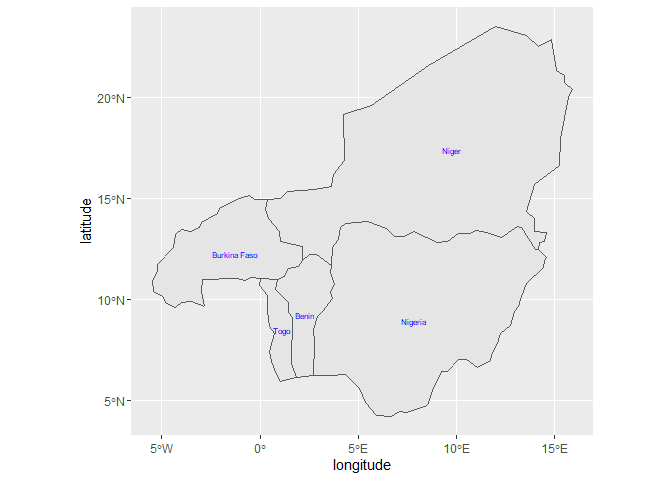<!-- -->

```r
benin1 <- ne_states(country = "Benin", returnclass = "sf") 
class(benin1)
```

```
## [1] "sf"         "data.frame"
```

```r
ggplot(data = benin1) +
geom_sf()+
geom_sf_text(aes(label = name), size = 2, color = "blue")+
  labs(x="longitude", y="latitude") +
  theme(axis.text.x = element_text(size = 8))
```

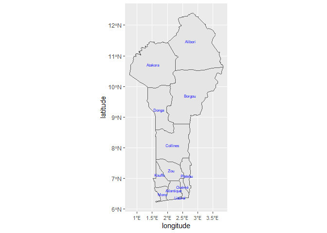<!-- -->

```r
benin <- ne_states(country = "Benin", returnclass = "sf") 
class(benin)
```

```
## [1] "sf"         "data.frame"
```


```r
ggplot(data = benin) +
geom_sf()+
ggtitle("Site Abundance of Bactrocera dorsalis") +
geom_point(data=spacioTemp_dt3, aes(x=longitude, y=latitude, colour=TotalB_dorsa), size=2.5) +
theme(legend.position = "right", legend.box = "vertical", legend.text = element_text(size=8),
legend.title = element_text(colour="blue", size=10, face="bold"), 
axis.text.x = element_text(size = 8))+
scale_colour_gradient2(low="green", mid="yellow", high="red", midpoint=191000)+
  geom_text_repel(data=spacioTemp_dt3, aes(x=longitude, y=latitude,label=Site, vjust = -0.8),
                  size=2.2, point.padding = NA)
```

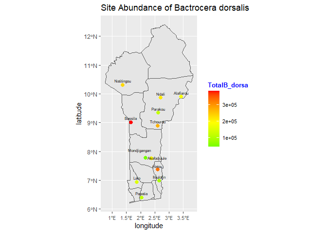<!-- -->

```r
ggplot(data = benin) +
geom_sf()+
ggtitle("Site Abundance of Bactrocera dorsalis") +
geom_point(data=spacioTemp_dt3, aes(x=longitude, y=latitude, size=TotalB_dorsa), colour="red")+
theme(legend.position = "right", legend.box = "vertical", legend.text = element_text(size=8),
legend.title = element_text(colour="blue", size=10, face="bold"), 
axis.text.x = element_text(size = 8))+
  geom_text_repel(data=spacioTemp_dt3, aes(x=longitude, y=latitude,label=Site, vjust = -0.8),
                  size=2.2, point.padding = NA)
```

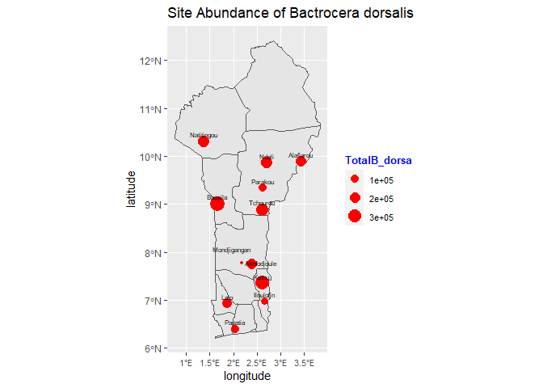<!-- -->

```r
ggplot(data = benin) +
geom_sf()+
ggtitle("Agro ecology Abundance of Bactrocera dorsalis") +
geom_point(data=spacioTemp_dt2, aes(x=longitude, y=latitude, size=TotalB_dorsa, colour=Agro_ecology))+
theme(legend.position = "right", legend.box = "vertical", legend.text = element_text(size=8),
legend.title = element_text(colour="blue", size=10, face="bold"), 
axis.text.x = element_text(size = 8))+
  geom_text_repel(data=spacioTemp_dt2, aes(x=longitude, y=latitude,label=Site, vjust = -0.8),
                  size=2.2, point.padding = NA)
```

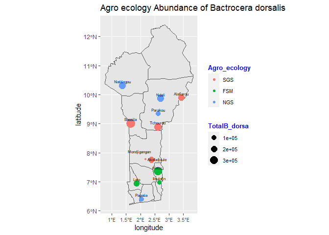<!-- -->


```r
ggplot(data = benin) +
geom_sf()+
ggtitle("Agro ecology Abundance of Bactrocera dorsalis") +
geom_point(data=spacioTemp_dt2, aes(x=longitude, y=latitude, size=TotalB_dorsa, colour=Agro_ecology))+
  facet_wrap(~Agro_ecology) +
theme(legend.position = "right", legend.box = "vertical", legend.text = element_text(size=8),
legend.title = element_text(colour="blue", size=10, face="bold"), 
axis.text.x = element_text(size = 8))+ 
  guides(color = FALSE)+
  geom_text_repel(data=spacioTemp_dt2, aes(x=longitude, y=latitude,label=Site, vjust = -0.8),
                  size=2.2, point.padding = NA)
```

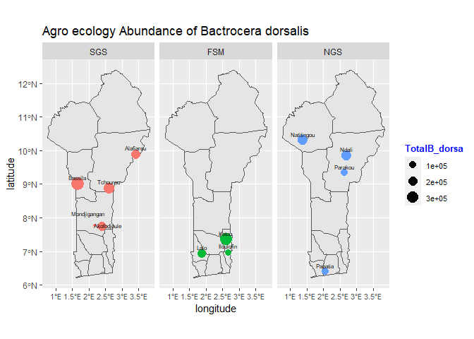<!-- -->

```r
ggplot(data = benin) +
geom_sf()+
ggtitle("Season Abundance of Bactrocera dorsalis") +
geom_point(data=spacioTemp_dt4, aes(x=longitude, y=latitude, size=TotalB_dorsa, colour=Season))+ 
  facet_wrap(~Season) +
theme(legend.position = "right", legend.box = "vertical", legend.text = element_text(size=8),
legend.title = element_text(colour="blue", size=10, face="bold"), 
axis.text.x = element_text(size = 8))+
  guides(color = FALSE)+
  geom_text_repel(data=spacioTemp_dt4, aes(x=longitude, y=latitude,label=Site, vjust = -0.8),
                  size=2.2, point.padding = NA)
```

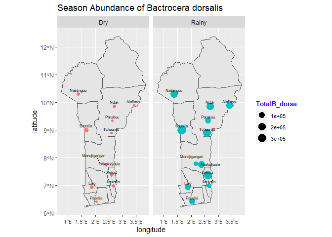<!-- -->

```r
ggplot(data = benin) +
geom_sf()+
ggtitle("Agro Ecology/Season Abundance of Bactrocera dorsalis") +
geom_point(data=spacioTemp_dt1, aes(x=longitude, y=latitude, size=TotalB_dorsa, colour=Agro_ecology))+ 
  facet_grid(Season~Agro_ecology) +
theme(legend.position = "right", legend.box = "vertical", legend.text = element_text(size=8),
legend.title = element_text(colour="blue", size=10, face="bold"), 
axis.text.x = element_text(angle = 90, size = 7))+
  guides(color = FALSE)+
  geom_text_repel(data=spacioTemp_dt1, aes(x=longitude, y=latitude,label=Site, vjust = -0.8),
                  size=2.2, point.padding = NA)
```

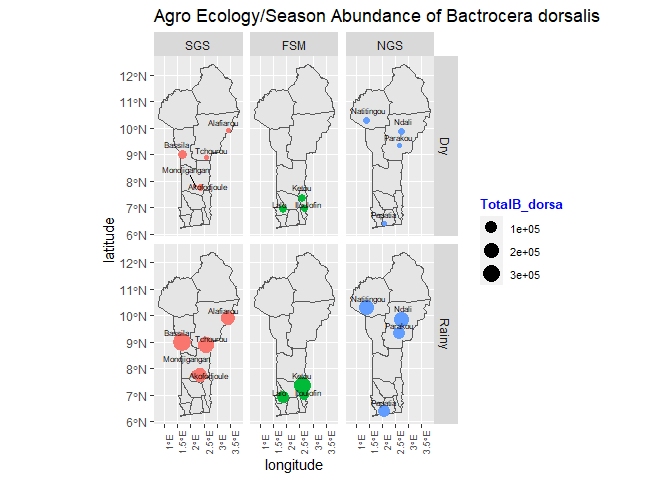<!-- -->


